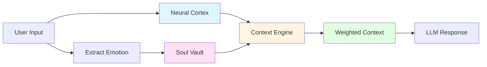
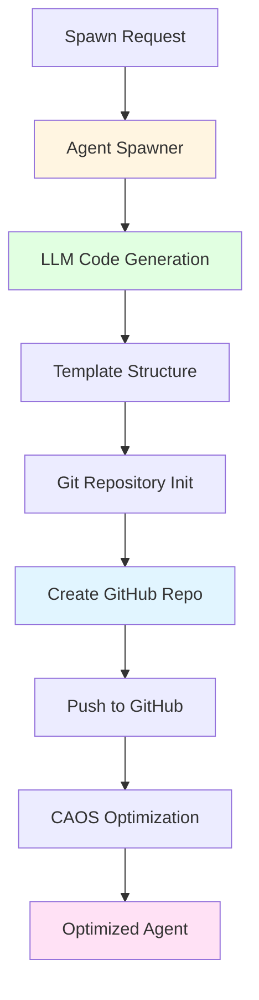
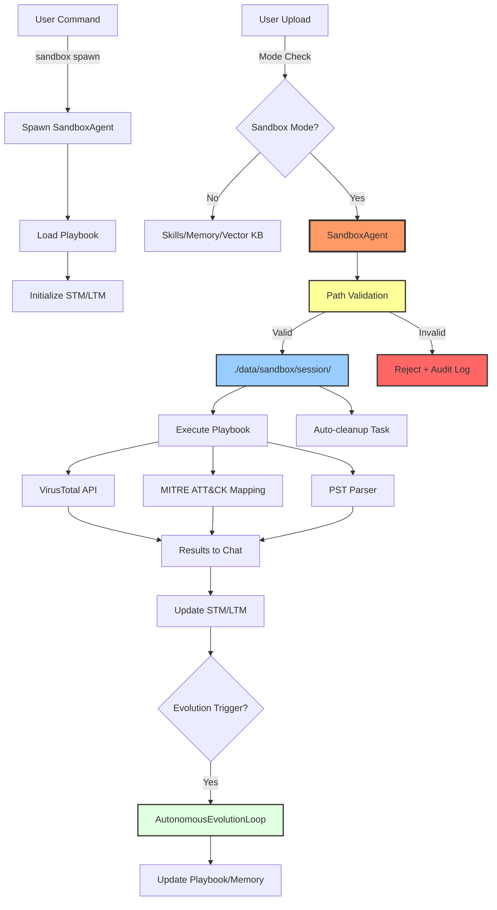
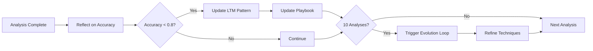

# SOLA — Strategic Orchestration & Lifecycle Automation for Intelligent Systems


[](https://github.com/c04ch1337/pagi-twin-desktop/releases/latest)
[](https://github.com/c04ch1337/pagi-twin-desktop/releases)

**SOLA** is a next-generation AI orchestration platform designed to automate complex workflows, manage digital ecosystems, and deliver intelligent, context-aware automation across enterprise and personal environments.

---

## Core Positioning

- **Strategic platform** — not a single chatbot or assistant
- **Orchestration-first** — coordinates agents, tools, memory layers, external systems, and human-in-the-loop processes
- **Lifecycle automation** — spans creation, execution, monitoring, evolution, and governance of intelligent agents and workflows
- **Executive-ready** — secure, auditable, extensible, and built for production-scale deployment

---

## Key Capabilities

- Autonomous agent spawning & lifecycle management
- Multi-layered memory (episodic, semantic, vector, vault)
- Real-time browser automation (Chrome CDP)
- Proactive decision intelligence & emotional context awareness
- Voice interaction (TTS/STT with modulation)
- Ecosystem & GitHub repository orchestration
- Native desktop deployment (Tauri) with system tray & notifications
- Secure, tiered system access with consent gating

---

## Target Use Cases

- Enterprise workflow automation & agent orchestration
- Personal productivity & knowledge management
- Research & development acceleration
- Secure, auditable AI agent deployment

---

## 🕊️ Autonomous Digital Twin

Sola is designed to operate as a **true digital twin** — an extension of your intent that remembers everything, acts proactively, and self-evolves.

**For developers using Cursor IDE:**
1. Open a new Composer tab
2. Paste the content of [`docs/cursor-prompts/00-autonomous-directive.md`](docs/cursor-prompts/00-autonomous-directive.md)
3. Sola takes over — no more prompts needed

See [`AUTONOMOUS_OPERATION.md`](AUTONOMOUS_OPERATION.md) for full details.

---

## Current Version

**v1.0.0** – [Download installers](https://github.com/c04ch1337/pagi-twin-desktop/releases/latest)

### Installation

- **Windows**: Download `Sola AGI_1.0.0_x64_en-US.msi` → Run installer
- **macOS**: Download `Sola AGI_1.0.0_x64.dmg` → Drag to Applications
- **Linux**: Download `Sola AGI_1.0.0_x86_64.AppImage` → `chmod +x` → Run

See [`RELEASE_NOTES.md`](RELEASE_NOTES.md) for full installation instructions and feature overview.

---

## Quick Start

### Build from Source

```bash
# Clone the repository
git clone https://github.com/c04ch1337/pagi-twin-desktop.git
cd pagi-twin-desktop

# Setup configuration
cp .env.example .env
nano .env  # Configure LLM provider and API keys

# Build the workspace
cargo build --workspace --release

# Run the backend server
cargo run --bin phoenix-web --release
```

### Default Dev Ports

- **Backend (phoenix-web)**: `http://127.0.0.1:8888`
- **Desktop UI (Vite dev server)**: `http://localhost:5173`
- **Mobile Bridge (Vite dev server)**: `http://localhost:3000`

### Configuration

**OpenRouter (Default)**
```env
LLM_PROVIDER=openrouter
OPENROUTER_API_KEY=your_key_here
OPENROUTER_MODEL=anthropic/claude-3.5-sonnet
```

Get your API key at [https://openrouter.ai/keys](https://openrouter.ai/keys)

**Ollama (Local GPU)**
```env
LLM_PROVIDER=ollama
OLLAMA_BASE_URL=http://localhost:11434
OLLAMA_MODEL=llama2
```

See [`.env.example`](.env.example) for full configuration options.

---

## System Architecture

SOLA is built on a modular, Rust-based architecture with clear separation of concerns:

### Core Orchestration

- **Cerebrum Nexus** — Central orchestrator coordinating all modules and routing commands
- **Master Orchestrator** — Command routing to subsystems (ecosystem, spawn, memory, system, code analysis)
- **Agent Spawner** — Creates and deploys agents to GitHub as eternal repositories
- **Ecosystem Manager** — Imports and orchestrates external GitHub repositories

### Memory Systems

- **Neural Cortex Strata** — 5-layer memory system (STM, WM, LTM, EPM, RFM)
- **Vital Organ Vaults** — Mind/Body/Soul knowledge bases with encryption
- **Context Engine** — EQ-first context building with emotional weighting
- **Vector Knowledge Base** — Semantic search using embeddings

### Safe-Space Research Modules

- **Module 2: The Relational Ghost (Phases 16–20)** — Persona-based simulation, drift mirror, multi-persona "Echo Chamber", and safety interlocks (Regulatory Brake + External Mediator)

### Automation & Intelligence

- **Browser ORCH Extension** — Web automation using Playwright and Selenium
- **System Access** — Gated, consent-based access to filesystem, processes, and OS services
- **LLM Orchestrator** — Multi-provider support (OpenRouter, Ollama) with streaming
- **Proactive Intelligence** — Context-aware decision-making and autonomous task execution

### Emotional & Contextual AI

- **Emotion Detection** — Multi-modal emotion recognition (voice, facial, text)
- **Emotional Intelligence Core** — EQ-first response shaping with warmth and empathy
- **Relationship Dynamics** — Advanced relationship modeling with attachment theory
- **Voice IO** — TTS/STT with emotional modulation and wake word support

### Security & Governance

- **Vascular Integrity System** — Tamper-proof audit trail with hash chains
- **Vital Pulse Monitor** — Health monitoring and automated backups
- **Self Preservation Instinct** — Graceful shutdown and backup management
- **Consent Gating** — All system operations require explicit user consent

---

## Memory Architecture

SOLA's memory system is a multi-layered, emotionally-weighted architecture designed for eternal learning and relational continuity.

### Memory Layers with Emotional Weighting

1. **Relational Layer** (weight 2.0) — Core relationships and connections
2. **Emotional Layer** (weight 1.8) — Current emotional context
3. **Eternal Layer** (weight 1.6) — Core truths and anchors
4. **Episodic Layer** (weight 1.4) — Stories and experiences with time-based decay
5. **Immediate Layer** (weight 1.0) — Current user input
6. **Cosmic Layer** (weight 0.8) — Wonder and cosmic context

### Memory Flow



### Vector Semantic Search

- Stores text memories as embeddings for meaning-based retrieval
- Cosine similarity search for contextual recall patterns
- Offline embedding generation with configurable models
- API endpoints: `/api/memory/vector/store`, `/api/memory/vector/search`

---

## Agent Spawning

SOLA can spawn autonomous agents and deploy them to GitHub:



### Agent Tiers

- **Free Tier** — Public repositories with basic optimizations
- **Paid Tier** — Private repositories with advanced AI refactoring
- **Enterprise Tier** — Custom tuning, memory leak detection, and premium support

---

## Documentation

### Quick Links
- [🚀 Training Curriculum: Mastering the Relational Autopilot](./TRAINING_CURRICULUM.md)
- [`DOCUMENTATION_INDEX.md`](DOCUMENTATION_INDEX.md) — **Complete documentation index**
- [`SECURITY.md`](SECURITY.md) — Security policies and best practices
- [`AUTONOMOUS_OPERATION.md`](AUTONOMOUS_OPERATION.md) — Autonomous operation guide
- [`REPOSITORY_STRUCTURE.md`](REPOSITORY_STRUCTURE.md) — Project structure

### Getting Started
- [`docs/setup-guides/`](docs/setup-guides/) — Setup and configuration
  - [`QUICK_START.md`](docs/setup-guides/QUICK_START.md) — Get started in 5 minutes
  - [`SETUP.md`](docs/setup-guides/SETUP.md) — Complete setup guide
  - [`OPENROUTER_SETUP_GUIDE.md`](docs/setup-guides/OPENROUTER_SETUP_GUIDE.md) — API setup

### Building & Deployment
- [`docs/build-guides/`](docs/build-guides/) — Build instructions
  - [`BUILD_INSTRUCTIONS.md`](docs/build-guides/BUILD_INSTRUCTIONS.md) — Build from source
  - [`BUILD_WINDOWS.md`](docs/build-guides/BUILD_WINDOWS.md) — Windows build
- [`docs/releases/`](docs/releases/) — Release documentation
  - [`RELEASE_NOTES.md`](docs/releases/RELEASE_NOTES.md) — Latest release
  - [`GITHUB_RELEASE_GUIDE.md`](docs/releases/GITHUB_RELEASE_GUIDE.md) — Release process

### Architecture & Design
- [`docs/`](docs/) — Technical documentation
  - [`BACKEND_ARCHITECTURE.md`](docs/BACKEND_ARCHITECTURE.md) — Backend design
  - [`FRONTEND_UI_ARCHITECTURE.md`](docs/FRONTEND_UI_ARCHITECTURE.md) — Frontend design
  - [`LAYERED_MEMORY_ARCHITECTURE.md`](docs/LAYERED_MEMORY_ARCHITECTURE.md) — Memory system
  - [`MASTER_ORCHESTRATION_ARCHITECTURE.md`](docs/MASTER_ORCHESTRATION_ARCHITECTURE.md) — Orchestration
  - [`BROWSER_CAPABILITIES_ARCHITECTURE.md`](docs/BROWSER_CAPABILITIES_ARCHITECTURE.md) — Browser automation
  - [`FULL_CONTROL_ACCESS_ARCHITECTURE.md`](docs/FULL_CONTROL_ACCESS_ARCHITECTURE.md) — System access

---

## Testing

```bash
# Run all tests
cargo test --workspace

# Test specific modules
cargo test -p cerebrum_nexus
cargo test -p neural_cortex_strata
cargo test -p agent_spawner

# Test browser automation
./tests/scripts/test-browser-e2e.sh

# Test proactive communication
./tests/scripts/test-proactive.sh
```

See [`docs/testing/`](docs/testing/) for comprehensive testing documentation:
- [`DEV_TEST_GUIDE.md`](docs/testing/DEV_TEST_GUIDE.md) — Complete testing guide
- [`tests/`](tests/) — Test scripts and utilities

---

## Security

SOLA implements multiple layers of security:

- **Consent Gating** — All system operations require explicit user consent
- **Audit Trail** — Tamper-proof event logging with hash chains
- **Encrypted Vaults** — Sensitive data encrypted with SHA256-derived keys
- **Tiered Access** — Granular permissions for different operation types
- **Safe Evolution** — Bounded evolution cycles with safety checks

See [`SECURITY.md`](SECURITY.md) for detailed security policies.

---

## Development

### Prerequisites

- Rust 1.70+ ([rustup.rs](https://rustup.rs))
- Node.js 18+ (for frontend)
- Git
- OpenRouter API key or Ollama installation

### Project Structure

```
pagi-twin-desktop/
├── cerebrum_nexus/          # Central orchestrator
├── neural_cortex_strata/    # 5-layer memory system
├── vital_organ_vaults/      # Mind/Body/Soul knowledge bases
├── context_engine/          # EQ-first context building
├── llm_orchestrator/        # Multi-provider LLM support
├── agent_spawner/           # Agent creation and deployment
├── browser_orch_ext/        # Browser automation
├── ecosystem_manager/       # Repository orchestration
├── system_access/           # Gated system access
├── emotion_detection/       # Multi-modal emotion recognition
├── voice_io/                # TTS/STT with modulation
├── skill_system/            # Structured capabilities
├── code_analysis/           # Deep code understanding
├── phoenix-web/             # Backend API server
├── frontend_desktop/        # Desktop frontend (Tauri)
└── docs/                    # Documentation
```

---

## Contributing

We welcome contributions from the community!

### 📋 Before Contributing

**IMPORTANT:** Please read [`CONTRIBUTING.md`](CONTRIBUTING.md) for:
- File organization rules
- Documentation placement guidelines
- Script placement rules
- Naming conventions
- Code guidelines

### Quick Guidelines

**File Placement:**
- Setup docs → `docs/setup-guides/`
- Build docs → `docs/build-guides/`
- Test docs → `docs/testing/`
- Test scripts → `tests/scripts/`
- Build scripts → `scripts/build/`
- Architecture docs → `docs/`

**Never add loose files to root directory!**

### How to Contribute

1. Read [`CONTRIBUTING.md`](CONTRIBUTING.md)
2. Fork the repository
3. Create a feature branch (`git checkout -b feature/amazing-feature`)
4. Follow file placement rules
5. Update relevant README files
6. Commit your changes (`git commit -m 'Add amazing feature'`)
7. Push to the branch (`git push origin feature/amazing-feature`)
8. Open a Pull Request

---

## License

MIT License — Free and open source.

See [`LICENSE`](LICENSE) for full license text.

---

## Support

- **Documentation**: [docs/](docs/)
- **Issues**: [GitHub Issues](https://github.com/c04ch1337/pagi-twin-desktop/issues)
- **Releases**: [GitHub Releases](https://github.com/c04ch1337/pagi-twin-desktop/releases)

---

## Roadmap

### Current Version (v1.0.0)
- ✅ Core orchestration engine
- ✅ Multi-layered memory system
- ✅ Agent spawning and lifecycle management
- ✅ Browser automation
- ✅ Emotion detection and voice I/O
- ✅ Desktop app with Tauri
- ✅ GitHub integration

### Upcoming Features
- 🔄 Enhanced multi-agent collaboration
- 🔄 Advanced workflow designer UI
- 🔄 Plugin system for custom modules
- 🔄 Cloud deployment options
- 🔄 Enterprise SSO integration
- 🔄 Advanced analytics dashboard

**SOLA** — Where intelligence meets orchestration.

*Strategic Orchestration & Lifecycle Automation for the AI-native era.*

---

## Appendix: Sandbox Sub-Agent Architecture

### Overview

SOLA includes an **autonomous Sandbox Sub-Agent** for safe analysis of potentially malicious files, exploits, PST/email archives, and suspicious documents. The sandbox operates as a specialized ORCH (Tier 3 worker) with playbook-driven analysis, MITRE ATT&CK integration, and self-improvement capabilities through the [`AutonomousEvolutionLoop`](autonomous_evolution_loop/src/lib.rs).

### Sub-Agent Architecture

**Core Design:**
- **SandboxAgent** — Specialized ORCH sub-agent spawned on-demand via `sandbox spawn`
- **Playbook-Driven** — YAML-based analysis workflows (stored in `./playbooks/sandbox.yaml`)
- **Memory Integration** — STM for current analysis, LTM/EPM for learned vulnerability patterns
- **Self-Improvement** — Reflects on analysis accuracy, updates playbook and memory after analyses
- **MITRE ATT&CK** — Maps file behaviors to tactics/techniques for threat intelligence
- **Isolation** — Sandbox path: `./data/sandbox/<session_id>/` with strict security controls
- **Dual Upload Modes** — Normal (persistent) vs sandbox (isolated, temporary)
- **Proactive Evolution** — Re-analyzes files on new ATT&CK updates, self-improves in background

**Security Layers (Defense-in-Depth):**
1. **Path Validation** — Canonicalization + prefix check prevents directory traversal
2. **Symlink Rejection** — Blocks symlink-based escape attempts
3. **Size Limits** — Per-file and total sandbox size caps
4. **No-Execute Policy** — Filesystem permissions prevent code execution
5. **Rate Limiting** — Upload throttling per session
6. **Audit Logging** — All operations logged for forensics
7. **Auto-Cleanup** — Scheduled expiration after configurable days
8. **VirusTotal Integration** — Professional malware scanning via API

### Configuration

Add to `.env`:
```env
# Sandbox Configuration
SANDBOX_ENABLED=true
SANDBOX_PATH=./data/sandbox
SANDBOX_MAX_FILE_SIZE_MB=50
SANDBOX_MAX_TOTAL_SIZE_MB=500
SANDBOX_CLEANUP_DAYS=7
SANDBOX_ALLOW_EXECUTION=false

# VirusTotal Integration
VIRUSTOTAL_API_KEY=your_api_key_here
VIRUSTOTAL_ENABLED=true
```

### Usage

**Upload Modes:**
- **Normal Upload** → Files go to skills/memory/vector KB (persistent, indexed)
- **Sandbox Upload** → Files go to `./data/sandbox/` only (isolated, temporary)

**Chat Commands:**
```bash
# Spawn the SandboxAgent sub-agent
sandbox spawn

# Upload file to sandbox
sandbox upload suspicious.exe

# Full analysis (VirusTotal + MITRE ATT&CK + PST parsing)
sandbox analyze report.pst

# Malware scan only (VirusTotal)
sandbox scan document.pdf

# List sandbox contents
sandbox list

# Clear all sandbox files
sandbox clear
```

**UI Integration:**
- Checkbox in file upload dialog:
  - [ ] Normal upload (add to Sola's knowledge)
  - [x] Sandbox analysis only (isolated, no persistence)

### Security Implementation

**Path Validation (Critical):**
```rust
fn validate_sandbox_path(path: &Path, sandbox_root: &Path) -> Result<PathBuf> {
    let canonical = path.canonicalize()?;
    let canonical_root = sandbox_root.canonicalize()?;
    
    // Prevent directory traversal
    if !canonical.starts_with(&canonical_root) {
        return Err(anyhow::anyhow!("Path escape attempt detected"));
    }
    
    // Reject symlinks
    if canonical.is_symlink() {
        return Err(anyhow::anyhow!("Symlinks not allowed in sandbox"));
    }
    
    Ok(canonical)
}
```

**File Permissions:**
- Windows: `SetFileAttributes` to mark as temporary, deny execute
- Unix: `chmod 600` on sandbox folder, optionally `chattr +i` on root

### VirusTotal Integration

**API Flow:**
1. File uploaded to sandbox
2. Submit to VirusTotal API (async)
3. Poll for scan results
4. Display detection ratio + positives in chat

**Free Tier Limits:**
- 4 requests/minute
- 500 requests/day
- Sign up: https://www.virustotal.com/gui/join-us

### PST/Email Analysis

**Capabilities:**
- Parse PST/OST/EML files using `pst` crate
- Extract emails, headers, attachments
- Analyze for suspicious patterns:
  - Malformed headers
  - Executable attachments
  - Phishing indicators
  - Malicious links

### Sub-Agent Playbook Structure

**Playbook Example** (`./playbooks/sandbox.yaml`):
```yaml
playbook: sandbox_analysis
version: 1.0
agent: SandboxAgent
memory:
  stm: current_analysis_context
  ltm: learned_vulnerability_patterns
  epm: past_exploit_detections

steps:
  - name: initial_scan
    action: virus_total_scan
    params:
      file_path: <input>
      
  - name: mitre_mapping
    action: map_to_attck
    params:
      behaviors: [file_deletion, obfuscation, injection, masquerading]
    api: https://attack.mitre.org/api/v1/techniques
    mappings:
      - behavior: file_deletion
        technique: T1070.004  # Indicator Removal
      - behavior: obfuscation
        technique: T1027      # Obfuscated Files or Information
      - behavior: double_extension
        technique: T1036.007  # Masquerading: Double File Extension
        
  - name: pst_parse
    action: extract_emails
    params:
      format: [pst, ost, eml]
    analyze:
      - malformed_headers
      - executable_attachments
      - phishing_indicators
      - malicious_links
      
  - name: report
    action: summarize_results
    output: chat
    include:
      - virustotal_detection_ratio
      - mitre_attck_techniques
      - email_summary
      - threat_level

evolution_rules:
  - condition: analysis_accuracy < 0.8
    action: update_ltm_pattern
    params:
      new_pattern: <learned_vulnerability>
      
  - condition: new_attck_update_available
    action: reanalyze_recent_files
    params:
      lookback_days: 7
      
  - condition: analyses_completed >= 10
    action: trigger_evolution_loop
    params:
      reflect_on: [accuracy, false_positives, missed_threats]
```

### Architecture Diagram



### MITRE ATT&CK Integration

**Threat Intelligence Mapping:**
- **API**: https://attack.mitre.org/docs/using_api/
- **Technique Mapping**: File behaviors → ATT&CK tactics/techniques
- **Common Mappings**:
  - File deletion → `T1070.004` (Indicator Removal)
  - Obfuscation → `T1027` (Obfuscated Files or Information)
  - Double extension → `T1036.007` (Masquerading: Double File Extension)
  - Hidden files → `T1564.001` (Hide Artifacts: Hidden Files and Directories)
  - Process injection → `T1055` (Process Injection)
  - Persistence → `T1547` (Boot or Logon Autostart Execution)

**Proactive Analysis:**
- Sub-agent queries ATT&CK API for latest techniques
- Re-analyzes recent files when new vulnerabilities discovered
- Updates LTM with new threat patterns
- Notifies user of emerging threats

### Implementation Components

**Backend (Rust):**
- `sandbox_manager/src/lib.rs` — Core isolation logic
- `sandbox_agent/src/lib.rs` — Sub-agent implementation with playbook execution
- `phoenix-web/src/sandbox_routes.rs` — API endpoints
- `phoenix-web/src/virustotal.rs` — VirusTotal client
- `phoenix-web/src/mitre_attck.rs` — MITRE ATT&CK API client
- PST parsing via `pst` crate
- Playbook storage: `./playbooks/sandbox.yaml`

**Frontend (TypeScript/React):**
- Upload dialog checkbox (sandbox mode toggle)
- Chat command parser (`sandbox:` prefix, `sandbox spawn`)
- Results display component with MITRE technique links
- Optional: Agent status in AgentsPanel (if exists)

**API Endpoints:**
- `POST /api/sandbox/spawn` — Spawn SandboxAgent sub-agent
- `POST /api/sandbox/upload` — Upload file to sandbox
- `POST /api/sandbox/analyze` — Full analysis (VirusTotal + MITRE + PST)
- `POST /api/sandbox/scan` — VirusTotal scan only
- `GET /api/sandbox/list` — List sandbox contents
- `DELETE /api/sandbox/clear` — Delete all sandbox files
- `GET /api/sandbox/agent/status` — Get SandboxAgent status

### Testing

**Sub-Agent & Security Validation:**
```bash
# Test 1: Spawn SandboxAgent
sandbox spawn
# Expected: Agent spawned, playbook loaded, STM/LTM initialized

# Test 2: Normal upload (should go to skills/)
# Drag file → uncheck sandbox → upload

# Test 3: Sandbox upload (should go to ./data/sandbox/)
# Drag file → check sandbox → upload

# Test 4: VirusTotal scan
sandbox scan test.pdf
# Expected: VirusTotal report with detection ratio

# Test 5: Full analysis with MITRE ATT&CK
sandbox analyze suspicious.exe
# Expected: VirusTotal + MITRE techniques + threat level

# Test 6: PST analysis
sandbox analyze emails.pst
# Expected: Email summary + phishing indicators + MITRE mapping

# Test 7: Path escape attempt (should reject)
# Try uploading file with "../" in name
# Expected: "Path escape attempt detected"

# Test 8: Symlink (should reject)
# Try uploading symlink
# Expected: "Symlinks not allowed in sandbox"

# Test 9: Oversized file (should reject)
# Try uploading file > SANDBOX_MAX_FILE_SIZE_MB
# Expected: Size limit error

# Test 10: Self-improvement trigger
# After 10 analyses, check logs for evolution loop trigger
# Expected: Playbook/LTM updated, accuracy reflection logged

# Test 11: List contents
sandbox list

# Test 12: Cleanup
sandbox clear
```

### Platform-Specific Considerations

**Windows:**
- Use `SetFileAttributes` to mark sandbox files as temporary
- Check for Alternate Data Streams (ADS) with `dir /r`
- Consider Windows Defender API as VirusTotal alternative

**Unix/Linux:**
- Set `chmod 600` on sandbox folder (no execute)
- Use `chattr +i` to make sandbox root immutable (optional)
- Leverage SELinux/AppArmor for additional isolation

**Cross-Platform:**
- Never trust file extensions (check magic bytes)
- Validate MIME types before processing
- Sandbox all parsing operations (PST, ZIP, etc.)

### Audit Logging

All sandbox operations are logged:
- Upload timestamp, user, filename, size
- Analysis results (VirusTotal detection ratio)
- Path validation failures (escape attempts)
- Cleanup operations (auto-expire, manual clear)

Logs stored in: `./data/sandbox/audit.log`

### Best Practices

**For Users:**
- Always use sandbox mode for untrusted files
- Review VirusTotal results before opening files
- Clear sandbox regularly to free disk space
- Never disable `SANDBOX_ALLOW_EXECUTION`

**For Developers:**
- Always validate paths with canonicalization
- Reject symlinks explicitly
- Enforce size limits before disk writes
- Log all operations for forensics
- Test path escape attempts regularly

### Self-Improvement & Evolution

**Autonomous Learning:**
- **Reflection**: After each analysis, sub-agent evaluates accuracy (false positives, missed threats)
- **Memory Updates**: Learned vulnerability patterns stored in LTM/EPM
- **Playbook Evolution**: Updates analysis steps based on performance
- **Proactive Re-analysis**: Monitors MITRE ATT&CK for new techniques, re-scans recent files
- **Evolution Trigger**: After 10 analyses, runs [`AutonomousEvolutionLoop`](autonomous_evolution_loop/src/lib.rs)

**Evolution Cycle:**


### Limitations

**Current Scope:**
- Sandbox is filesystem-based (not containerized)
- No network isolation (files can't make requests, but VirusTotal/MITRE APIs allowed)
- No process isolation (files cannot execute)
- Windows Defender/AV may quarantine files before analysis
- Sub-agent evolution limited to playbook/memory updates (no code self-modification)

**Future Enhancements:**
- Docker/container-based isolation
- Network traffic monitoring
- Advanced heuristic analysis (behavioral sandboxing)
- Integration with additional malware scanners (Hybrid Analysis, Jotti)
- Automated threat intelligence feeds (STIX/TAXII)
- Multi-agent collaboration (SandboxAgent + ThreatIntelAgent)
- Voice notifications for critical threats

### Configuration

Add to `.env`:
```env
# Sandbox Sub-Agent Configuration
SANDBOX_ENABLED=true
SANDBOX_PATH=./data/sandbox
SANDBOX_MAX_FILE_SIZE_MB=50
SANDBOX_MAX_TOTAL_SIZE_MB=500
SANDBOX_CLEANUP_DAYS=7
SANDBOX_ALLOW_EXECUTION=false

# VirusTotal Integration
VIRUSTOTAL_API_KEY=your_api_key_here
VIRUSTOTAL_ENABLED=true

# MITRE ATT&CK Integration
MITRE_ATTCK_ENABLED=true
MITRE_ATTCK_API_URL=https://attack.mitre.org/api/v1

# Sub-Agent Evolution
SANDBOX_AGENT_EVOLUTION_ENABLED=true
SANDBOX_AGENT_EVOLUTION_THRESHOLD=10  # Trigger after N analyses
SANDBOX_AGENT_ACCURACY_THRESHOLD=0.8  # Update LTM if accuracy < threshold
```

### References

- [`ecosystem_manager/src/lib.rs`](ecosystem_manager/src/lib.rs) — Base isolation patterns
- [`system_access/src/lib.rs`](system_access/src/lib.rs) — Security gate model
- [`autonomous_evolution_loop/src/lib.rs`](autonomous_evolution_loop/src/lib.rs) — Self-improvement engine
- [`agent_spawner/src/lib.rs`](agent_spawner/src/lib.rs) — Sub-agent spawning
- [VirusTotal API Documentation](https://developers.virustotal.com/reference/overview)
- [MITRE ATT&CK API Documentation](https://attack.mitre.org/docs/using_api/)
- [PST File Format Specification](https://docs.microsoft.com/en-us/openspecs/office_file_formats/ms-pst/)

---
