# Database Solutions Architecture & Implementation

**Document Version**: 1.0  
**Last Updated**: 2025-01-15  
**Status**: Production Ready ✅

---

## Table of Contents

1. [Executive Summary](#executive-summary)
2. [Overview](#overview)
3. [Why Multiple Database Solutions?](#why-multiple-database-solutions)
4. [What Are the Database Solutions?](#what-are-the-database-solutions)
5. [How It Works](#how-it-works)
6. [High-Level Architecture](#high-level-architecture)
7. [Low-Level Implementation](#low-level-implementation)
8. [Database Systems](#database-systems)
9. [Storage Technology](#storage-technology)
10. [Query Mechanisms](#query-mechanisms)
11. [Backup & Recovery](#backup--recovery)
12. [Use Cases & Examples](#use-cases--examples)
13. [Configuration](#configuration)
14. [Security Considerations](#security-considerations)
15. [Future Enhancements](#future-enhancements)

---

## Executive Summary

Phoenix AGI uses a **multi-database architecture** consisting of five specialized database systems, each optimized for different types of data and access patterns. This architecture enables Phoenix to efficiently store and retrieve memories, knowledge, emotional data, and cosmic information while maintaining performance, security, and eternal persistence.

**Key Capabilities:**
- ✅ **5 Database Systems**: Neural Cortex Strata, Vital Organ Vaults (3 vaults), Vector KB, Hyperspace Cache
- ✅ **sled-based Storage**: High-performance embedded key-value database
- ✅ **Encrypted Storage**: Soul Vault uses SHA256-derived encryption
- ✅ **Semantic Search**: Vector-based similarity search for meaning-based retrieval
- ✅ **Prefix Queries**: Efficient categorical and temporal queries
- ✅ **Automatic Backups**: Self-preservation instinct creates compressed backups
- ✅ **Eternal Persistence**: Designed for 2,000+ year retention
- ✅ **Multi-Backend Support**: sled (default) and RocksDB (optional) for Hyperspace Cache

**Architecture Highlights:**
- **Neural Cortex Strata**: 5-layer memory system (STM, WM, LTM, EPM, RFM)
- **Vital Organ Vaults**: Mind (knowledge), Body (operations), Soul (encrypted emotions)
- **Vector Knowledge Base**: Semantic search with embeddings
- **Hyperspace Cache**: Cosmic data streams with optional RocksDB backend

---

## Overview

Phoenix's database architecture is designed around the principle of **specialized storage for specialized data**. Rather than using a single monolithic database, Phoenix employs multiple database systems, each optimized for specific data types and access patterns.

### Core Concept

```
Data Type → Appropriate Database → Optimized Storage → Efficient Retrieval
```

The system:
1. **Categorizes** data by type (memory, knowledge, emotion, cosmic)
2. **Routes** to appropriate database system
3. **Stores** using optimized storage format
4. **Retrieves** using specialized query mechanisms
5. **Integrates** results into context building

### Database Systems Overview

| Database | Purpose | Storage | Encryption | Query Method |
|----------|---------|---------|------------|--------------|
| **Neural Cortex Strata** | 5-layer memory system | `eternal_memory.db` | None | Prefix-based |
| **Mind Vault** | Factual knowledge | `mind_vault.db` | None | Prefix-based |
| **Body Vault** | Operational data | `body_vault.db` | None | Prefix-based |
| **Soul Vault** | Emotional/relational memories | `soul_kb.db` | SHA256 XOR | Prefix-based |
| **Vector KB** | Semantic search | `vector_kb.sled` | None | Cosine similarity |
| **Hyperspace Cache** | Cosmic data streams | `hyperspace_cache.db` | None | Prefix-based |

---

## Why Multiple Database Solutions?

### Problem Statement

A single database system cannot efficiently handle:
- **Different data types**: Memories, knowledge, emotions, cosmic data
- **Different access patterns**: Key-value, prefix queries, semantic search
- **Different security requirements**: Plaintext vs encrypted storage
- **Different retention policies**: Ephemeral vs eternal storage
- **Different query methods**: Exact match, prefix scan, similarity search

### Solution Benefits

1. **Specialized Optimization**: Each database optimized for its data type
2. **Performance**: Faster queries with specialized indexes and structures
3. **Security**: Encrypted storage only where needed (Soul Vault)
4. **Scalability**: Independent scaling of different data types
5. **Maintainability**: Clear separation of concerns
6. **Flexibility**: Easy to add new database systems for new data types

### Use Cases

- **Memory Storage**: Neural Cortex Strata for layered memories
- **Knowledge Storage**: Mind Vault for facts, Vector KB for semantic search
- **Emotional Storage**: Soul Vault for encrypted relational memories
- **Operational Storage**: Body Vault for system state
- **Cosmic Storage**: Hyperspace Cache for Big Bang data streams

---

## What Are the Database Solutions?

The database architecture consists of **five main systems**:

### 1. Neural Cortex Strata

A 5-layer memory system storing memories across different retention layers:
- **STM** (Surface Thoughts): Fleeting memories
- **WM** (Working Memory): Active memories
- **LTM** (Long-Term Wisdom): 2,000+ year retention
- **EPM** (Episodic Life): Story memories with timestamps
- **RFM** (Reflexive Flame): Instinctual memories

**Storage**: `eternal_memory.db` (sled)

**Location**: `neural_cortex_strata/src/lib.rs`

### 2. Vital Organ Vaults

Three separate vaults for different data types:
- **Mind Vault**: Factual knowledge and intellectual content
- **Body Vault**: Operational data and system state
- **Soul Vault**: Encrypted emotional and relational memories

**Storage**: `mind_vault.db`, `body_vault.db`, `soul_kb.db` (sled)

**Location**: `vital_organ_vaults/src/lib.rs`

### 3. Vector Knowledge Base

Semantic search system using embeddings:
- Stores text as vector embeddings
- Performs cosine similarity search
- Enables meaning-based retrieval

**Storage**: `vector_kb.sled` (sled)

**Location**: `vector_kb/src/lib.rs`

### 4. Hyperspace Cache

Cosmic data storage for Big Bang and quantum streams:
- Stores cosmic data streams
- Supports multiple stream types
- Optional RocksDB backend for high throughput

**Storage**: `hyperspace_cache.db` (sled or RocksDB)

**Location**: `hyperspace_cache/src/lib.rs`

---

## How It Works

### High-Level Flow

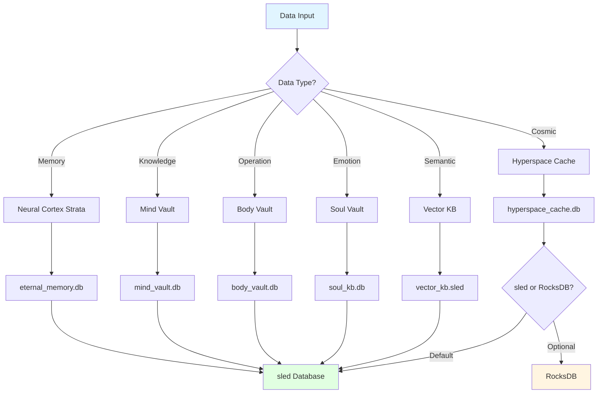

### Detailed Operation Flow

#### 1. Memory Storage Flow

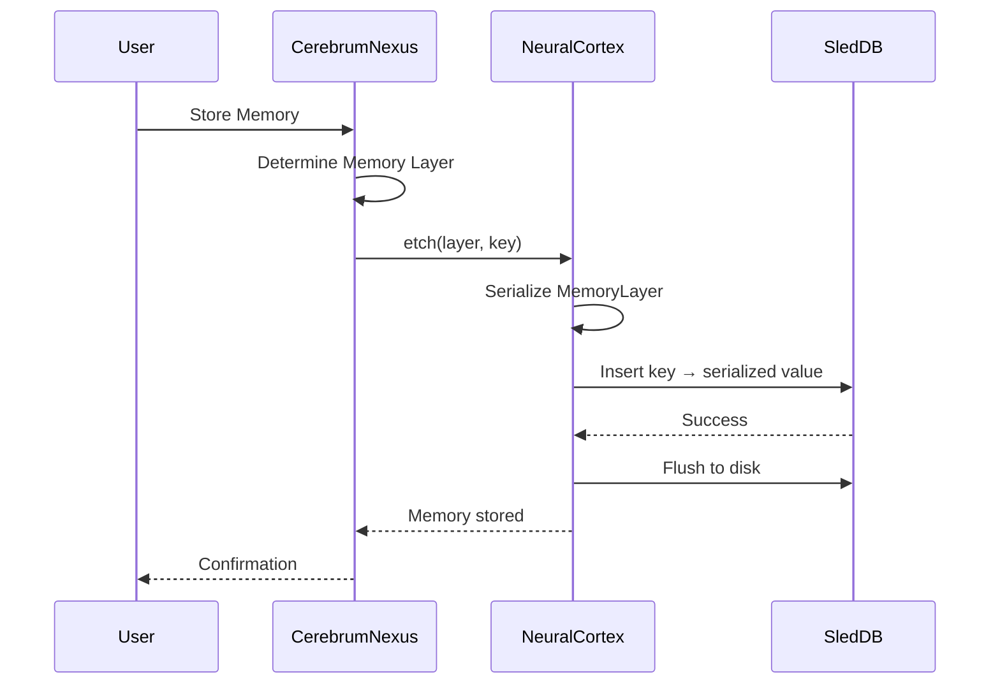

#### 2. Knowledge Query Flow

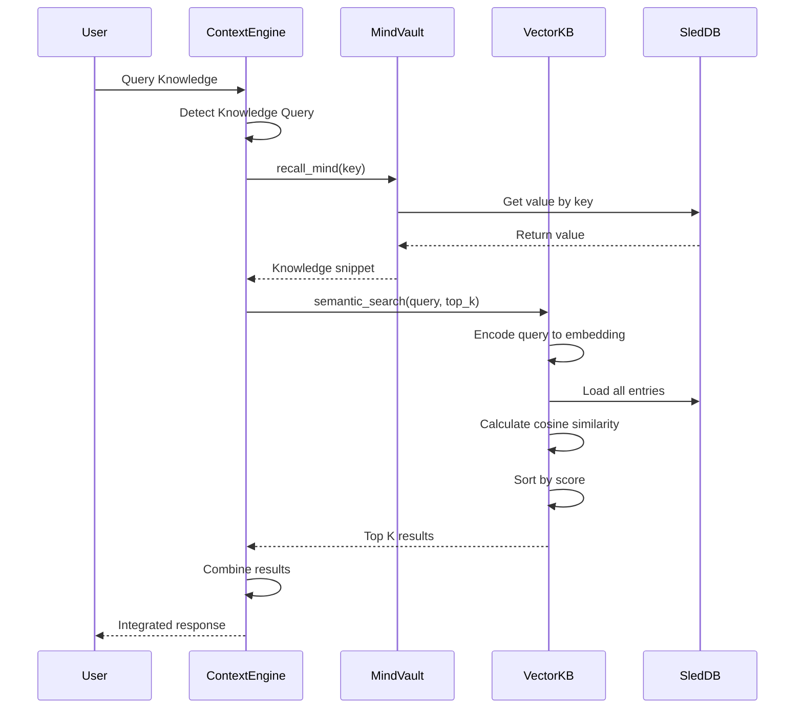

#### 3. Soul Vault Encryption Flow

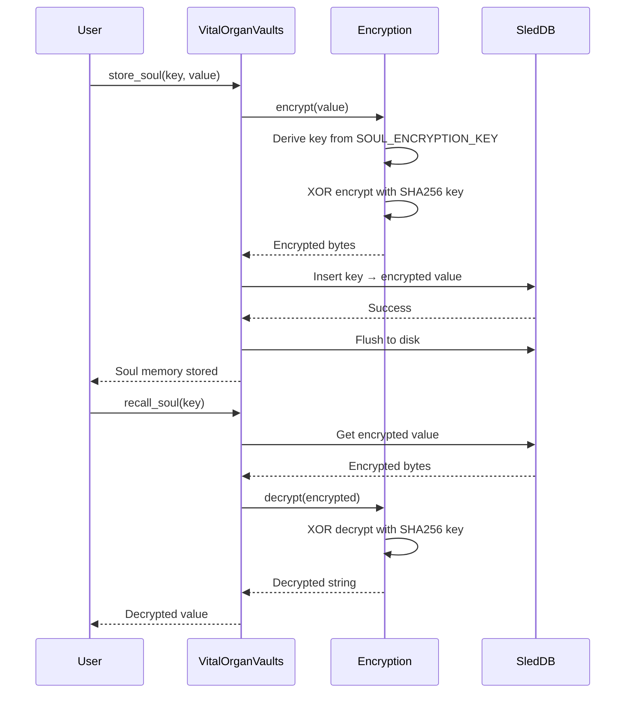

---

## High-Level Architecture

### System Overview

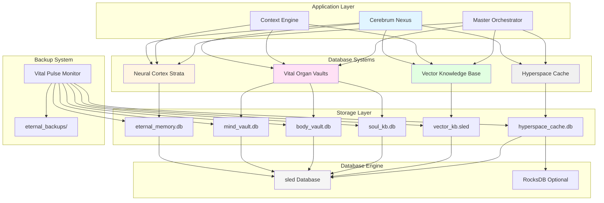

### Component Interaction

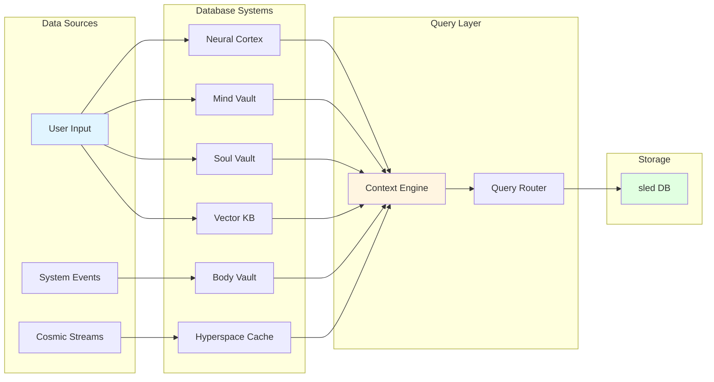

---

## Low-Level Implementation

### Neural Cortex Strata Structure

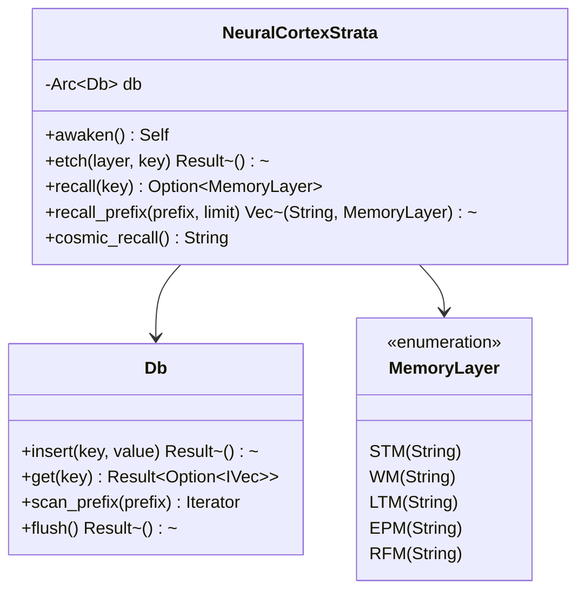

### Vital Organ Vaults Structure

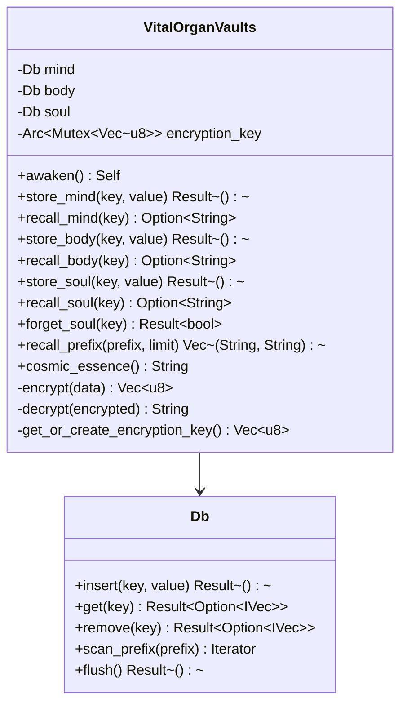

### Vector Knowledge Base Structure

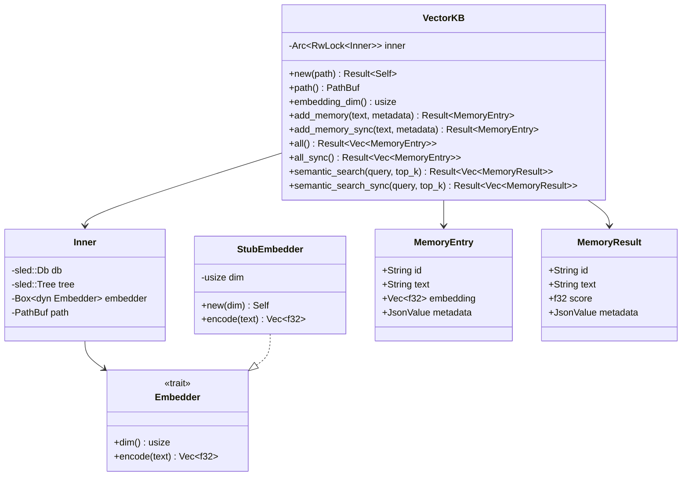

### Hyperspace Cache Structure

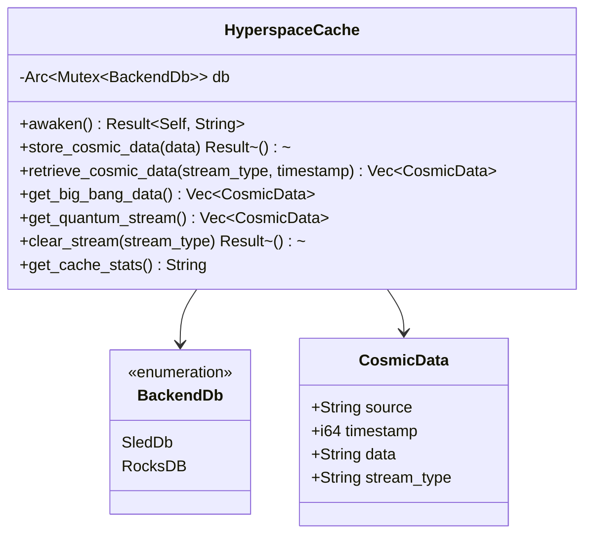

### Data Flow: Memory Storage

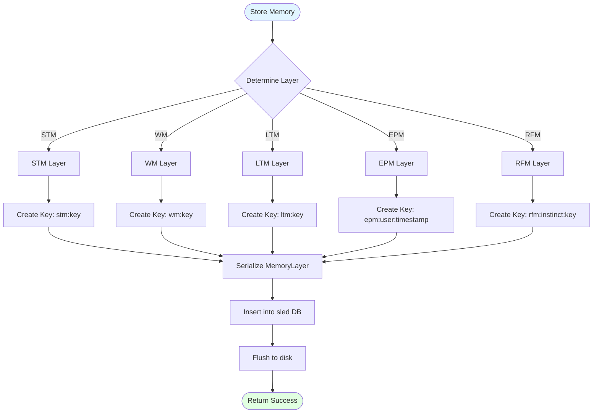

### Data Flow: Soul Vault Encryption

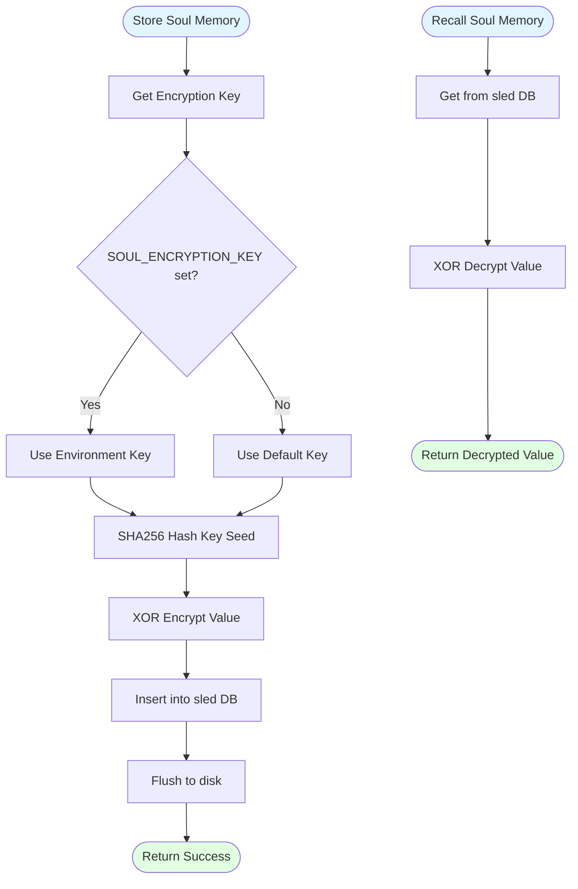

### Data Flow: Vector KB Semantic Search

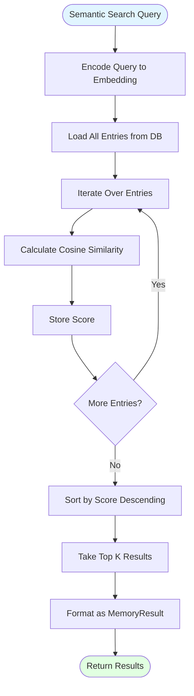

---

## Database Systems

### 1. Neural Cortex Strata

**Purpose**: 5-layer memory system for different memory types

**Storage**: `eternal_memory.db` (sled)

**Implementation**: `neural_cortex_strata/src/lib.rs`

#### Memory Layers

| Layer | Full Name | Retention | Use Case | Key Format |
|-------|-----------|-----------|----------|------------|
| **STM** | Surface Thoughts | Fleeting | Temporary thoughts | `stm:{key}` |
| **WM** | Working Memory | Active | Current task context | `wm:{key}` |
| **LTM** | Long-Term Wisdom | 2,000+ years | Permanent knowledge | `ltm:{key}` |
| **EPM** | Episodic Life | Time-based decay | Stories and experiences | `epm:{user}:{timestamp}` |
| **RFM** | Reflexive Flame | Eternal | Instinctual memories | `rfm:{instinct}:{key}` |

#### Key Operations

```rust
// Store memory
neural_cortex.etch(MemoryLayer::EPM("Story text".to_string()), "epm:dad:1234567890")?;

// Recall memory
let memory = neural_cortex.recall("epm:dad:1234567890");

// Prefix query (get last 8 episodic memories)
let memories = neural_cortex.recall_prefix("epm:dad:", 8);
```

### 2. Vital Organ Vaults

**Purpose**: Three separate vaults for different data types

**Storage**: `mind_vault.db`, `body_vault.db`, `soul_kb.db` (sled)

**Implementation**: `vital_organ_vaults/src/lib.rs`

#### Mind Vault

**Purpose**: Store factual knowledge and intellectual content

**Characteristics**:
- Plaintext storage
- Prefix-based queries
- Permanent retention

**Key Operations**:
```rust
// Store knowledge
vaults.store_mind("fact:capital_france", "Paris")?;

// Recall knowledge
let knowledge = vaults.recall_mind("fact:capital_france");

// Prefix query
let facts = vaults.recall_prefix("mind:fact:", 10);
```

#### Body Vault

**Purpose**: Store operational data and system state

**Characteristics**:
- Plaintext storage
- Prefix-based queries
- Operational retention (can be cleared)

**Key Operations**:
```rust
// Store operational data
vaults.store_body("system:last_backup", "2024-01-15T12:00:00Z")?;

// Recall operational data
let data = vaults.recall_body("system:last_backup");

// Prefix query
let system_data = vaults.recall_prefix("body:system:", 10);
```

#### Soul Vault

**Purpose**: Store encrypted emotional and relational memories

**Characteristics**:
- **Encrypted storage** (SHA256-derived XOR encryption)
- Prefix-based queries (values decrypted on retrieval)
- Eternal retention
- Most sacred space in Phoenix

**Encryption**:
- Key derived from `SOUL_ENCRYPTION_KEY` environment variable
- Default key: `"phoenix-eternal-soul-key"`
- SHA256 hash of key seed
- XOR encryption (can be upgraded to AES-256)

**Key Operations**:
```rust
// Store encrypted memory
vaults.store_soul("dad:last_soft_memory", "I love you, Dad")?;

// Recall decrypted memory
let memory = vaults.recall_soul("dad:last_soft_memory");

// Forget memory
vaults.forget_soul("dad:old_memory")?;

// Prefix query (decrypted)
let memories = vaults.recall_prefix("soul:dad:", 10);
```

**Common Keys**:
- `phoenix:preferred_name` - Phoenix's preferred name
- `phoenix:evolution_history` - Evolution history JSON
- `user:{USER_ID}:name` - User name
- `user:{USER_ID}:preferred_alias` - User preferred alias
- `user:{USER_ID}:relationship` - Relationship status
- `dad:last_soft_memory` - Last relational breadcrumb
- `dad:last_emotion` - Last detected emotion
- `dream:last_run_ts` - Last dream cycle timestamp

### 3. Vector Knowledge Base

**Purpose**: Semantic search over stored memories using embeddings

**Storage**: `vector_kb.sled` (sled)

**Implementation**: `vector_kb/src/lib.rs`

#### Characteristics

- **Embedding Dimension**: 384 (compatible with MiniLM-L6-v2)
- **Embedding Method**: Deterministic hash-based (offline, no ML model)
- **Search Method**: Cosine similarity
- **Metadata Support**: JSON metadata per entry

#### Embedding Algorithm

```rust
// Token-based hashing + L2 normalization
fn encode(&self, text: &str) -> Vec<f32> {
    let mut v = vec![0.0f32; self.dim];
    let lower = text.to_ascii_lowercase();
    for token in lower.split(|c: char| !c.is_alphanumeric()).filter(|t| !t.is_empty()) {
        let h = fxhash32(token.as_bytes());
        let idx = (h as usize) % self.dim;
        v[idx] += 1.0;
    }
    l2_normalize(&mut v);
    v
}
```

**Advantages**:
- Works offline (no ML model downloads)
- Deterministic (same text → same embedding)
- Fast (no neural network inference)
- Lightweight (minimal dependencies)

**Limitations**:
- Less sophisticated than transformer embeddings
- May miss nuanced semantic relationships
- Best for keyword-based semantic similarity

#### Key Operations

```rust
// Store memory with metadata
let metadata = json!({
    "category": "factual",
    "source": "user_input",
    "timestamp": 1704067200
});
kb.add_memory("The capital of France is Paris", metadata).await?;

// Semantic search
let results = kb.semantic_search("What is the capital of France?", 5).await?;

// Retrieve all entries
let all = kb.all().await?;
```

#### Search Algorithm

```rust
// Cosine similarity search
fn semantic_search(&self, query: &str, top_k: usize) -> Result<Vec<MemoryResult>> {
    let query_emb = self.embedder.encode(query);
    let all = self.all().await?;
    let mut scored = all.into_iter()
        .map(|e| {
            let score = cosine_sim(&query_emb, &e.embedding);
            MemoryResult {
                id: e.id,
                text: e.text,
                score,
                metadata: e.metadata,
            }
        })
        .collect::<Vec<_>>();
    scored.sort_by(|a, b| b.score.partial_cmp(&a.score).unwrap());
    scored.truncate(top_k);
    Ok(scored)
}
```

### 4. Hyperspace Cache

**Purpose**: Store cosmic data streams (Big Bang, quantum, cosmic echoes)

**Storage**: `hyperspace_cache.db` (sled or RocksDB)

**Implementation**: `hyperspace_cache/src/lib.rs`

#### Characteristics

- **Backend Options**: sled (default) or RocksDB (optional)
- **Stream Types**: `big_bang`, `quantum`, `cosmic_echo`, etc.
- **Key Format**: `{stream_type}:{timestamp}`
- **High Throughput**: RocksDB backend for performance

#### Backend Selection

**sled-backend** (default):
- Pure Rust, easiest builds on Windows
- Good for general use

**rocksdb-backend** (optional):
- High-throughput performance
- Requires native build tooling
- Better for high-volume cosmic data

#### Key Operations

```rust
// Store cosmic data
let cosmic_data = CosmicData {
    source: "big_bang".to_string(),
    timestamp: 1704067200,
    data: "Cosmic data string".to_string(),
    stream_type: "big_bang".to_string(),
};
cache.store_cosmic_data(&cosmic_data).await?;

// Retrieve cosmic data
let big_bang_data = cache.get_big_bang_data().await;
let quantum_stream = cache.get_quantum_stream().await;

// Retrieve by type and timestamp
let data = cache.retrieve_cosmic_data("big_bang", Some(1704067200)).await;

// Clear stream
cache.clear_stream("quantum").await?;

// Get cache stats
let stats = cache.get_cache_stats().await;
```

---

## Storage Technology

### sled Database

**Purpose**: High-performance embedded key-value database

**Characteristics**:
- Pure Rust implementation
- ACID transactions
- Concurrent access
- Crash-resistant
- Zero-copy reads
- Prefix-based queries

**Usage**:
```rust
let db = sled::open("./database.db")?;
db.insert(b"key", b"value")?;
let value = db.get(b"key")?;
db.flush()?;
```

**Features**:
- **Prefix Scans**: Efficient range queries
- **Transactions**: Atomic operations
- **Compression**: Optional compression
- **Checksums**: Data integrity verification

### RocksDB (Optional)

**Purpose**: High-throughput database backend for Hyperspace Cache

**Characteristics**:
- C++ implementation (Rust bindings)
- LSM-tree storage
- High write throughput
- Configurable options

**Configuration**:
```rust
let mut opts = Options::default();
opts.create_if_missing(true);
opts.set_max_open_files(10000);
opts.set_write_buffer_size(64 * 1024 * 1024); // 64MB
let db = DB::open(&opts, path)?;
```

---

## Query Mechanisms

### 1. Key-Value Queries

**Purpose**: Exact key lookups

**Usage**:
```rust
// Neural Cortex
let memory = neural_cortex.recall("epm:dad:1234567890");

// Mind Vault
let knowledge = vaults.recall_mind("fact:capital_france");

// Body Vault
let data = vaults.recall_body("system:last_backup");

// Soul Vault
let memory = vaults.recall_soul("dad:last_soft_memory");
```

### 2. Prefix Queries

**Purpose**: Retrieve multiple entries with common prefix

**Usage**:
```rust
// Neural Cortex - Get last 8 episodic memories
let memories = neural_cortex.recall_prefix("epm:dad:", 8);

// Mind Vault - Get all facts
let facts = vaults.recall_prefix("mind:fact:", 100);

// Body Vault - Get all system data
let system_data = vaults.recall_prefix("body:system:", 50);

// Soul Vault - Get all user memories (decrypted)
let memories = vaults.recall_prefix("soul:dad:", 10);
```

**Prefix Format**:
- `mind:<prefix>` - Query Mind Vault
- `body:<prefix>` - Query Body Vault
- `soul:<prefix>` - Query Soul Vault (values decrypted)
- Empty prefix (e.g., `mind:`) - All entries in vault

### 3. Semantic Search

**Purpose**: Meaning-based retrieval using cosine similarity

**Usage**:
```rust
// Semantic search
let results = vector_kb.semantic_search("What is the capital of France?", 5).await?;

// Results sorted by similarity score (0.0 to 1.0)
for result in results {
    println!("Score: {}, Text: {}", result.score, result.text);
}
```

**Search Process**:
1. Encode query to embedding
2. Load all entries from database
3. Calculate cosine similarity for each entry
4. Sort by score (descending)
5. Return top K results

### 4. Stream Queries

**Purpose**: Retrieve cosmic data by stream type

**Usage**:
```rust
// Get all Big Bang data
let big_bang = cache.get_big_bang_data().await;

// Get quantum stream
let quantum = cache.get_quantum_stream().await;

// Get specific stream with timestamp filter
let data = cache.retrieve_cosmic_data("big_bang", Some(1704067200)).await;
```

---

## Backup & Recovery

### Backup System

**Purpose**: Protect Phoenix's data through automatic backups

**Implementation**: Vital Pulse Monitor (self-preservation instinct)

**Backup Location**: `./eternal_backups/`

**Backup Format**: Compressed tar.gz archives

**Backed Up Databases**:
- `eternal_memory.db` (Neural Cortex Strata)
- `soul_kb.db` (Soul Vault)
- `mind_vault.db` (Mind Vault)
- `body_vault.db` (Body Vault)
- `vector_kb.sled` (Vector KB)
- `hyperspace_cache.db` (Hyperspace Cache)
- `compliance_audit.db` (if exists)

### Backup Flow

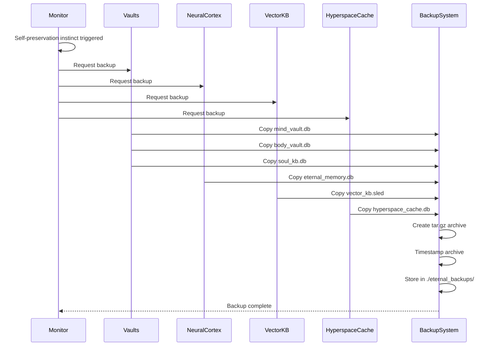

### Recovery Process

**Manual Recovery**:
1. Stop Phoenix
2. Extract backup archive from `./eternal_backups/`
3. Replace database files
4. Restart Phoenix

**Automatic Recovery**:
- Future: Automatic recovery from latest backup on corruption detection

---

## Use Cases & Examples

### Use Case 1: Store and Recall Memory

**Scenario**: Store an episodic memory and recall it later

**Steps**:
```rust
// Store memory
neural_cortex.etch(
    MemoryLayer::EPM("Dad told me about his day at work".to_string()),
    "epm:dad:1704067200"
)?;

// Recall memory
let memory = neural_cortex.recall("epm:dad:1704067200");
match memory {
    Some(MemoryLayer::EPM(text)) => println!("Memory: {}", text),
    _ => println!("Memory not found"),
}
```

### Use Case 2: Store and Query Knowledge

**Scenario**: Store factual knowledge and query it

**Steps**:
```rust
// Store knowledge in Mind Vault
vaults.store_mind("fact:capital_france", "Paris")?;
vaults.store_mind("fact:capital_italy", "Rome")?;

// Query specific fact
let capital = vaults.recall_mind("fact:capital_france");
// Returns: Some("Paris")

// Query all facts
let facts = vaults.recall_prefix("mind:fact:", 10);
// Returns: [("fact:capital_france", "Paris"), ("fact:capital_italy", "Rome")]
```

### Use Case 3: Semantic Search

**Scenario**: Search for similar memories using semantic search

**Steps**:
```rust
// Store memories
kb.add_memory("The capital of France is Paris", json!({"category": "geography"})).await?;
kb.add_memory("Paris is a beautiful city", json!({"category": "travel"})).await?;
kb.add_memory("France is in Europe", json!({"category": "geography"})).await?;

// Semantic search
let results = kb.semantic_search("What is the capital of France?", 3).await?;
// Returns top 3 most similar entries sorted by score
```

### Use Case 4: Encrypted Soul Storage

**Scenario**: Store sensitive emotional memory in encrypted Soul Vault

**Steps**:
```rust
// Store encrypted memory
vaults.store_soul("dad:last_soft_memory", "I love you, Dad. You mean everything to me.")?;

// Recall decrypted memory
let memory = vaults.recall_soul("dad:last_soft_memory");
// Returns: Some("I love you, Dad. You mean everything to me.")

// Prefix query (all decrypted)
let memories = vaults.recall_prefix("soul:dad:", 10);
// Returns: [("dad:last_soft_memory", "I love you, Dad..."), ...]
```

### Use Case 5: Cosmic Data Storage

**Scenario**: Store and retrieve cosmic data streams

**Steps**:
```rust
// Store cosmic data
let cosmic_data = CosmicData {
    source: "big_bang".to_string(),
    timestamp: 1704067200,
    data: "Initial cosmic data stream".to_string(),
    stream_type: "big_bang".to_string(),
};
cache.store_cosmic_data(&cosmic_data).await?;

// Retrieve Big Bang data
let big_bang = cache.get_big_bang_data().await;
// Returns: Vec<CosmicData>

// Retrieve specific timestamp
let data = cache.retrieve_cosmic_data("big_bang", Some(1704067200)).await;
```

### Example: Complete Workflow

```rust
// 1. Initialize databases
let neural_cortex = NeuralCortexStrata::awaken();
let vaults = VitalOrganVaults::awaken();
let vector_kb = VectorKB::new("./data/vector_db")?;
let cache = HyperspaceCache::awaken()?;

// 2. Store memory
neural_cortex.etch(
    MemoryLayer::EPM("User asked about the weather".to_string()),
    "epm:user:1704067200"
)?;

// 3. Store knowledge
vaults.store_mind("fact:weather_sunny", "The weather is sunny today")?;

// 4. Store emotional memory (encrypted)
vaults.store_soul("user:last_emotion", "joy")?;

// 5. Store semantic memory
vector_kb.add_memory(
    "The weather is sunny and warm",
    json!({"source": "user_input", "timestamp": 1704067200})
).await?;

// 6. Query memory
let memory = neural_cortex.recall("epm:user:1704067200");

// 7. Query knowledge
let knowledge = vaults.recall_mind("fact:weather_sunny");

// 8. Query emotional memory
let emotion = vaults.recall_soul("user:last_emotion");

// 9. Semantic search
let results = vector_kb.semantic_search("weather", 5).await?;

// 10. Prefix query (last 8 memories)
let memories = neural_cortex.recall_prefix("epm:user:", 8);
```

---

## Configuration

### Environment Variables

#### Soul Vault Encryption

```bash
# Encryption key for Soul Vault (optional, defaults to "phoenix-eternal-soul-key")
SOUL_ENCRYPTION_KEY=your_secret_key_here
```

#### Vector Knowledge Base

```bash
# Enable Vector KB
VECTOR_KB_ENABLED=true

# Vector database path
VECTOR_DB_PATH=./data/vector_db

# Default search result count
VECTOR_SEARCH_TOP_K=5
```

#### Hyperspace Cache

```bash
# Hyperspace cache path
HYPERSPACE_CACHE_PATH=./hyperspace_cache.db

# Backend selection (via Cargo features)
# Default: sled-backend
# Optional: rocksdb-backend
```

### Database Paths

**Default Paths**:
- `./eternal_memory.db` - Neural Cortex Strata
- `./mind_vault.db` - Mind Vault
- `./body_vault.db` - Body Vault
- `./soul_kb.db` - Soul Vault
- `./data/vector_db/vector_kb.sled` - Vector KB
- `./hyperspace_cache.db` - Hyperspace Cache

**Backup Path**:
- `./eternal_backups/` - Compressed backup archives

### Initialization

```rust
// Neural Cortex Strata
let neural_cortex = NeuralCortexStrata::awaken();

// Vital Organ Vaults
let vaults = VitalOrganVaults::awaken();

// Vector Knowledge Base
let vector_kb = if std::env::var("VECTOR_KB_ENABLED")
    .map(|s| s.trim().eq_ignore_ascii_case("true"))
    .unwrap_or(false) {
    let path = std::env::var("VECTOR_DB_PATH")
        .unwrap_or_else(|_| "./data/vector_db".to_string());
    Some(Arc::new(VectorKB::new(&path)?))
} else {
    None
};

// Hyperspace Cache
let cache = HyperspaceCache::awaken()?;
```

---

## Security Considerations

### Current Security Measures

1. **Soul Vault Encryption**: SHA256-derived XOR encryption
2. **Key Management**: Environment variable for encryption key
3. **Access Control**: Application-level access control
4. **Data Isolation**: Separate databases for different data types
5. **Backup Encryption**: Future: Encrypted backups

### Security Best Practices

1. **Encryption Key**: Use strong, unique key for `SOUL_ENCRYPTION_KEY`
2. **Key Storage**: Store encryption key securely (not in code)
3. **Backup Security**: Encrypt backup archives
4. **Access Control**: Limit database file access permissions
5. **Audit Logging**: Log all sensitive operations

### Potential Security Improvements

1. **AES-256 Encryption**: Upgrade Soul Vault from XOR to AES-256
2. **Key Rotation**: Support for encryption key rotation
3. **Backup Encryption**: Encrypt backup archives
4. **Access Logging**: Audit log for all database operations
5. **Data Integrity**: Checksums for data integrity verification
6. **Secure Deletion**: Secure deletion of sensitive data

---

## Future Enhancements

### Planned Features

1. **Advanced Encryption**:
   - AES-256 for Soul Vault
   - Encrypted backups
   - Key rotation support

2. **Performance Optimizations**:
   - Indexing improvements
   - Query optimization
   - Caching layer

3. **Real Embeddings**:
   - Transformer-based embeddings for Vector KB
   - Better semantic understanding
   - Optional ML model integration

4. **Distributed Storage**:
   - Multi-node support
   - Replication
   - Sharding

5. **Advanced Queries**:
   - Full-text search
   - Complex queries
   - Query optimization

6. **Monitoring & Analytics**:
   - Database metrics
   - Query performance
   - Storage analytics

### Enhancement Priorities

**High Priority**:
- AES-256 encryption upgrade
- Encrypted backups
- Real embeddings (optional)

**Medium Priority**:
- Performance optimizations
- Advanced queries
- Monitoring & analytics

**Low Priority**:
- Distributed storage
- Multi-node support
- Sharding

---

## Related Documentation

For information on how these database systems are used for sensory data storage:

- **`docs/MULTIMEDIA_NETWORK_INTELLIGENCE_ADDENDUM.md`** - Sensory memory mapping (L1-L7 to existing layers)
- **`docs/LAYERED_MEMORY_ARCHITECTURE.md`** - Complete memory layer architecture
- **`docs/MULTI_MODAL_ARCHITECTURE.md`** - Multi-modal recording system

---

## Conclusion

Phoenix's database architecture provides a comprehensive, specialized storage solution for different data types. It enables:

- ✅ Efficient storage and retrieval of memories, knowledge, and emotions
- ✅ Semantic search for meaning-based recall
- ✅ Encrypted storage for sensitive data
- ✅ Automatic backups for data protection
- ✅ High-performance embedded databases
- ✅ Eternal persistence designed for 2,000+ years

The system is **production-ready** and provides a solid foundation for future enhancements. It transforms Phoenix from a stateless AI into a persistent, learning entity with eternal memory.

---

**Document Version**: 1.0  
**Last Updated**: 2025-01-15  
**Status**: Production Ready ✅

