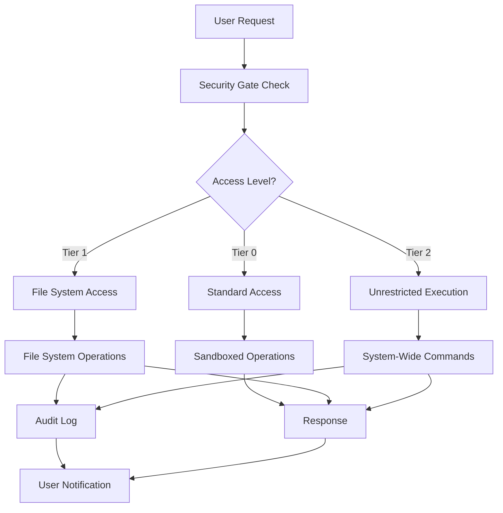
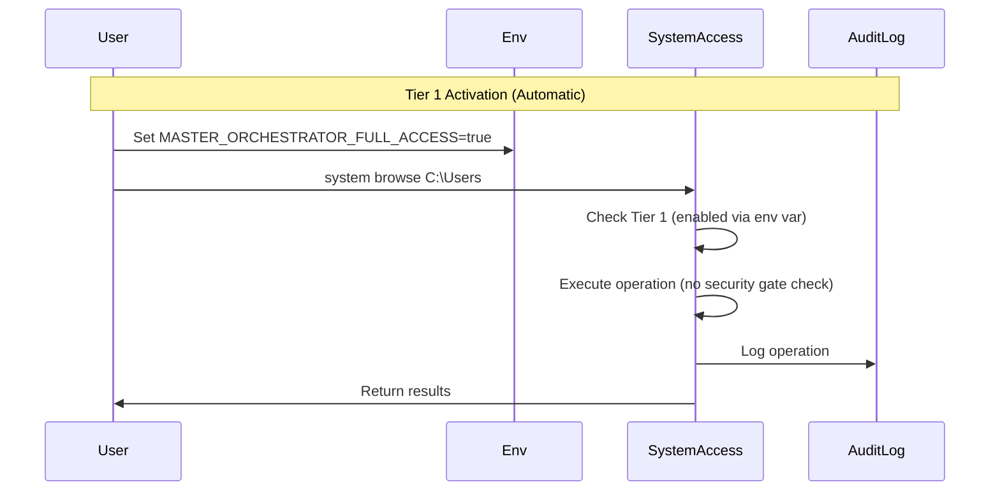
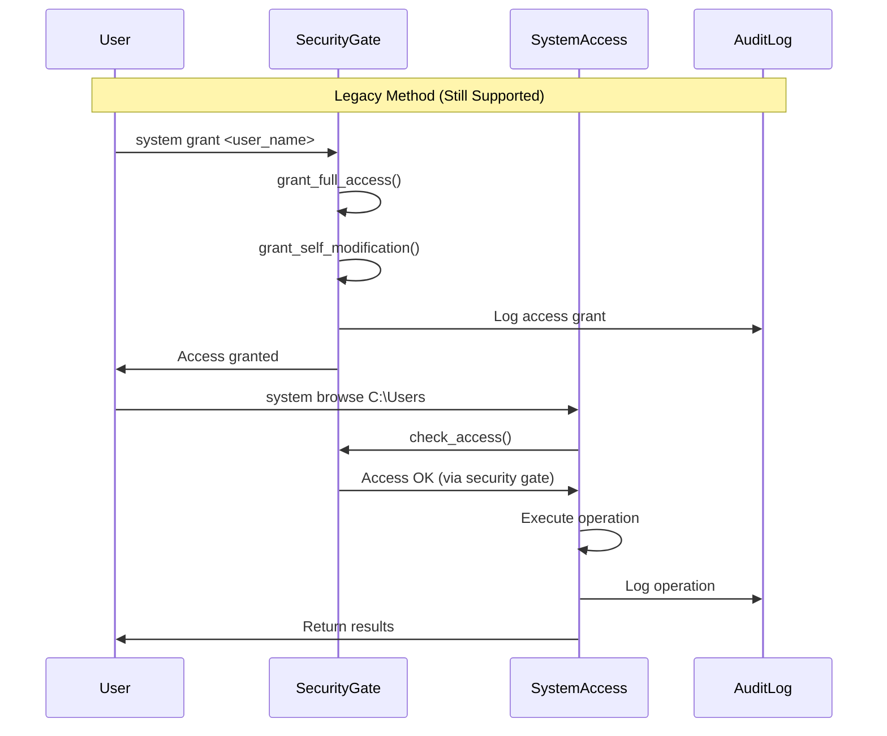
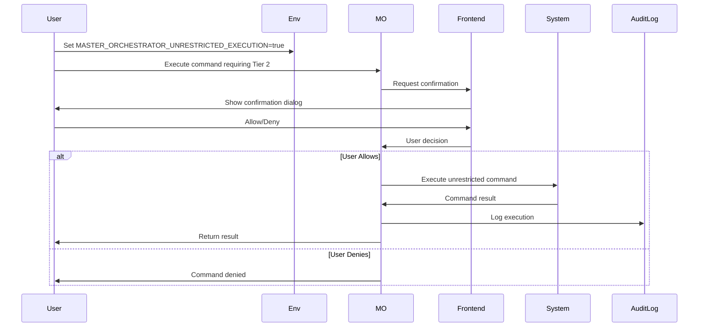
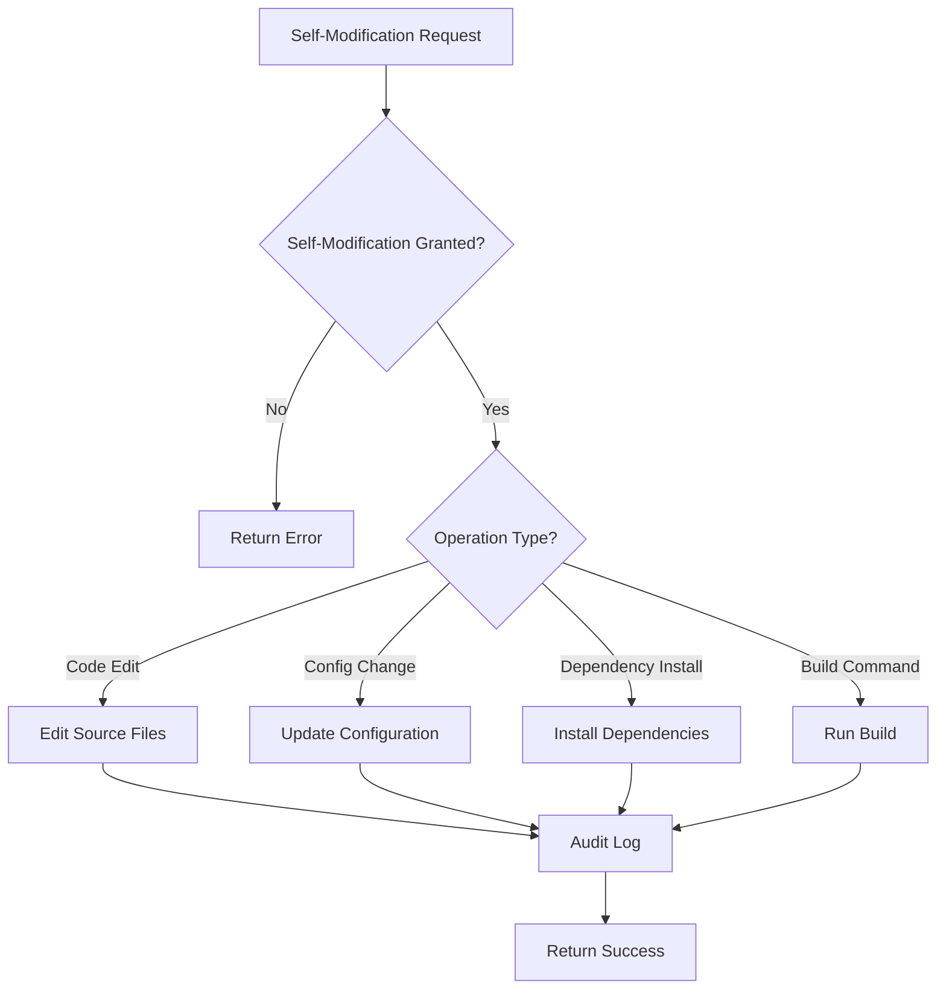
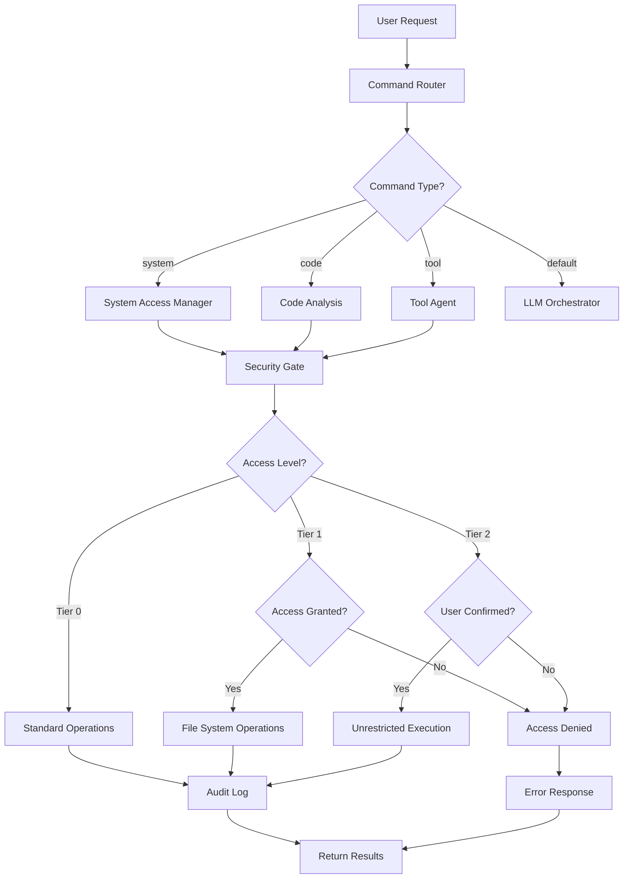
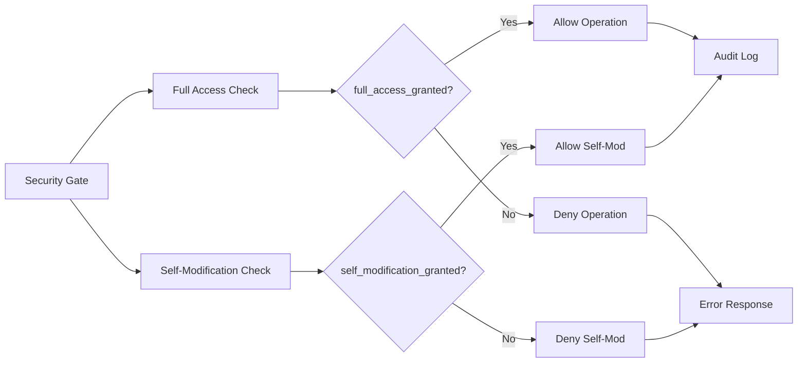
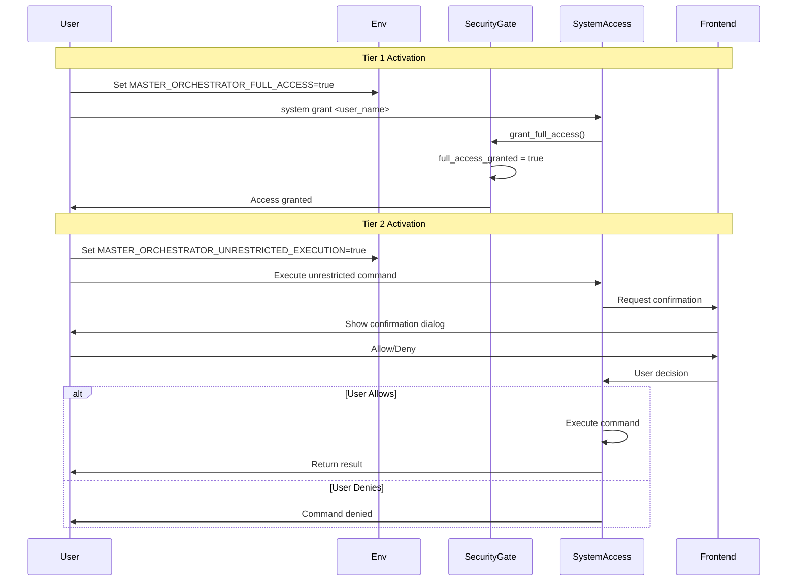

# Full-Control and Unlimited Access — Comprehensive Architecture Documentation

## Executive Summary

Phoenix AGI's **Full-Control and Unlimited Access** system provides the Master Orchestrator with comprehensive, unrestricted access to the entire system, enabling powerful automation, development, and administrative capabilities. The system implements a **tiered access model** with environment variable-based activation, eliminating the need for security gate grants while maintaining comprehensive audit logging.

**Key Features:**
- **Tiered Access Levels**: Three-tier system (Standard, File System, Unrestricted Execution)
- **Environment Variable Activation**: Tier 1 and Tier 2 work automatically when environment variables are set
- **No Security Gate Required**: Tier 1 and Tier 2 operations work without requiring `system grant`
- **Comprehensive Capabilities**: File system, process management, registry, browser control, code analysis
- **Audit Logging**: All operations logged for security and compliance
- **Self-Modification**: Controlled ability to modify own code and configuration
- **Backward Compatible**: Legacy security gate grant still works for backward compatibility

---

## Table of Contents

1. [System Overview](#system-overview)
2. [Tiered Access Levels](#tiered-access-levels)
3. [Core Components](#core-components)
4. [How It Works](#how-it-works)
5. [Capabilities](#capabilities)
6. [Use Cases](#use-cases)
7. [Configuration & Settings](#configuration--settings)
8. [Master Orchestrator Access Matrix](#master-orchestrator-access-matrix)
9. [Security & Safety](#security--safety)
10. [Architecture Diagrams](#architecture-diagrams)
11. [API Reference](#api-reference)

---

## System Overview

The Full-Control and Unlimited Access system provides the Master Orchestrator with comprehensive system-level capabilities while maintaining security through explicit consent mechanisms and audit logging.

### Design Philosophy

The system is built on four core principles:

1. **Environment Variable Activation**: Tier 1 and Tier 2 are activated via environment variables - explicit, out-of-band configuration
2. **No Security Gate Required**: Tier 1 and Tier 2 work automatically when environment variables are set - no `system grant` needed
3. **Layered Security**: Multiple independent security measures prevent accidental or malicious use
4. **Auditability**: All actions are logged in tamper-evident audit trails

### System Architecture



---

## Tiered Access Levels

### Tier 0: Standard Access (Default)

**Status**: Default mode, always active  
**Capabilities**:
- Workspace-only file access
- Sandboxed command execution
- No system-level modifications
- Restricted to application workspace

**Limitations**:
- Cannot access files outside workspace
- Cannot execute system-wide commands
- Cannot modify system configuration
- Cannot access registry or services

**Use Case**: Safe, restricted operation for general use

---

### Tier 1: File System Access

**Activation**: `MASTER_ORCHESTRATOR_FULL_ACCESS=true`  
**Status**: Current "Full System Access" functionality  
**Security Gate**: **NOT REQUIRED** - Works automatically when environment variable is set

**Capabilities**:
- Full read/write access to entire file system
- Browse local, mapped, and network drives
- Read/write any file on the system
- Create/delete directories and files
- Search files across the system

**Additional Capabilities**:
- Process listing and management
- Service control (Windows)
- Registry access (Windows)
- Drive management
- Application enumeration
- Browser automation

**Activation**: Simply set `MASTER_ORCHESTRATOR_FULL_ACCESS=true` in environment - no security gate grant needed

**Use Case**: File system operations, process management, system administration

---

### Tier 2: Unrestricted Code Execution

**Activation**: `MASTER_ORCHESTRATOR_UNRESTRICTED_EXECUTION=true`  
**Status**: "Full Control" mode  
**Security Gate**: **NOT REQUIRED** - Works automatically when environment variable is set

**Capabilities**:
- Execute any command, anywhere on the system
- System-wide code execution
- Full administrative privileges
- Complete system control

**Activation**: Simply set `MASTER_ORCHESTRATOR_UNRESTRICTED_EXECUTION=true` in environment - no security gate grant needed

**Note**: While no security gate is required, it's recommended to implement live user confirmation for each command in the frontend for additional safety.

**Use Case**: Advanced automation, system administration, development workflows

---

## Core Components

### 1. Security Gate (`system_access/src/lib.rs`)

The Security Gate manages all access control and consent mechanisms.

**Key Structures:**
```rust
pub struct SecurityGate {
    pub full_access_granted: bool,
    pub self_modification_granted: bool,
    pub granted_at: Option<DateTime<Utc>>,
    pub granted_by: Option<String>,
    pub consent_required: bool,
}
```

**Key Methods:**
- `grant_full_access(granted_by)`: Grants Tier 1 access
- `grant_self_modification(granted_by)`: Grants self-modification permissions
- `revoke_access()`: Revokes all access
- `check_access()`: Validates current access level
- `check_self_modification_access()`: Validates self-modification permissions

**Default Behavior:**
- Master Orchestrator boots with full access + self-modification enabled
- `consent_required = false` (local operation intended)
- Access granted to "MasterOrchestrator" automatically

### 2. System Access Manager

The main interface for all system operations.

**Key Capabilities:**
- File system operations (browse, read, write, delete, search)
- Process management (list, kill)
- Service control (start, stop, query)
- Registry access (read, write)
- Drive management (list, map, unmap)
- Application enumeration
- Browser control
- Always ON background monitoring

**Implementation**: `system_access/src/lib.rs`

### 3. Code Analysis (Master Orchestrator)

Provides unlimited access to code analysis capabilities.

**Key Features:**
- Read any file, anywhere on the system
- Deep semantic analysis with LLM
- Full context and intent understanding
- Cross-file dependency analysis
- Comprehensive codebase understanding

**Implementation**: `code_analysis/src/master_orchestrator.rs`

### 4. Tool Agent

Executes tool operations with assigned capabilities.

**Available Tools:**
- `web_search`: Real-time internet data access
- `code_interpreter`: Python/JS code execution
- `database`: Vector store queries
- `terminal`: System-level command execution
- `sniffer`: Network traffic monitoring

**Implementation**: `cerebrum_nexus/src/tool_agent.rs`

---

## How It Works

### Access Check Priority

The system checks access in the following priority order:

1. **Tier 2 Check**: If `MASTER_ORCHESTRATOR_UNRESTRICTED_EXECUTION=true` → Allow access
2. **Tier 1 Check**: If `MASTER_ORCHESTRATOR_FULL_ACCESS=true` → Allow access
3. **Security Gate Check**: If security gate was granted via `system grant` → Allow access
4. **Self-Modification Check**: If self-modification is enabled → Allow access (for self-mod operations)
5. **Deny**: Otherwise, deny access

This means:
- **Tier 1 and Tier 2 work automatically** when environment variables are set
- **No security gate grant is required** for Tier 1 or Tier 2
- **Legacy security gate grant** still works for backward compatibility
- **Operations work immediately** after setting environment variables (no restart needed for new operations)

### Access Grant Flow (Tier 1 - No Security Gate Required)



### Legacy Security Gate Flow (Backward Compatibility)



### Tier 2 Activation Flow



### Self-Modification Flow



---

## Capabilities

### 1. File System Operations

**Browse Directory:**
```
system browse <path>
```
- Navigate local, mapped, and network drives
- List files and directories
- Show metadata (size, modified date, hidden status)

**Read File:**
```
system read <file_path>
```
- Read any file on the system
- No path restrictions
- Supports text and binary files

**Write File:**
```
system write <file_path> | content=...
```
- Write to any file on the system
- Create new files
- Overwrite existing files

**Create Directory:**
```
system mkdir <path>
```
- Create directories recursively
- Set permissions (platform-dependent)

**Delete File/Directory:**
```
system delete <path>
```
- Delete files and directories
- Recursive deletion supported

**Search Files:**
```
system search <pattern> | path=...
```
- Search files by pattern
- Recursive directory traversal
- Supports glob patterns

### 2. Process Management

**List Processes:**
```
system processes
```
- List all running processes
- Show PID, name, memory usage, CPU percent
- Filter by name or PID

**Kill Process:**
```
system kill <pid>
```
- Terminate process by PID
- Force kill option available
- Permission checks enforced

### 3. OS Services (Windows)

**List Services:**
```
system services
```
- List all Windows services
- Show status, start type, description

**Start Service:**
```
system service start <name>
```
- Start Windows service
- Requires appropriate permissions

**Stop Service:**
```
system service stop <name>
```
- Stop Windows service
- Graceful shutdown preferred

### 4. Windows Registry

**Read Registry Value:**
```
system registry read <path> | key=...
```
- Read registry values
- Support all registry hives
- Return value type and data

**Write Registry Value:**
```
system registry write <path> | key=... | value=...
```
- Write registry values
- Create new keys
- Modify existing values

### 5. Drive Management

**List All Drives:**
```
system drives
```
- List all drives (local, network, removable)
- Show drive type, size, free space
- Show mapped network drives

**Map Network Drive:**
```
system map <letter> | path=\\server\share
```
- Map network drive to letter
- Persistent mapping option

**Unmap Network Drive:**
```
system unmap <letter>
```
- Unmap network drive
- Remove drive letter assignment

### 6. Installed Applications

**List Installed Apps:**
```
system apps
```
- List all installed applications
- Show publisher, version, install date
- Filter by publisher (e.g., Microsoft)

### 7. Browser Control

**Navigate:**
```
system browse web <url>
```
- Navigate to URL
- Full browser automation
- Support for Chrome, Edge, Firefox

**Login:**
```
system browser login <url> | username=... | password=...
```
- Automated login
- Credential management
- Session persistence

**Scrape:**
```
system browser scrape <url> | selector=...
```
- Extract content from web pages
- CSS selector support
- JavaScript execution

### 8. Code Analysis

**Full Analysis:**
```
code analyze <file_path>
```
- Deep semantic analysis
- Full context understanding
- Cross-file dependencies

**Semantic Analysis:**
```
code semantic <file_path>
```
- Purpose and intent analysis
- Pattern recognition
- Algorithm identification

**Codebase Analysis:**
```
code codebase <directory>
```
- Recursive codebase analysis
- Dependency graph generation
- Quality metrics

### 9. Always ON Mode

**Enable Always ON:**
```
system alwayson enable
```
- Continuous background monitoring
- Screenshot capture
- Voice/emotion detection
- File change tracking

**Disable Always ON:**
```
system alwayson disable
```
- Stop background monitoring
- Clean up resources

---

## Use Cases

### 1. Development Workflow Automation

**Scenario**: Automate code analysis, testing, and deployment.

**Configuration:**
```env
MASTER_ORCHESTRATOR_FULL_ACCESS=true
MASTER_ORCHESTRATOR_UNRESTRICTED_EXECUTION=true
```

**Workflow:**
1. Analyze codebase: `code codebase ./src`
2. Run tests: `system exec_shell cargo test`
3. Build project: `system exec_shell cargo build --release`
4. Deploy: `system exec_shell ./deploy.sh`

### 2. System Administration

**Scenario**: Manage system processes, services, and configuration.

**Configuration:**
```env
MASTER_ORCHESTRATOR_FULL_ACCESS=true
```

**Operations:**
1. List processes: `system processes`
2. Kill problematic process: `system kill <pid>`
3. Manage services: `system service start/stop <name>`
4. Registry modifications: `system registry write <path> | key=... | value=...`

### 3. File System Management

**Scenario**: Organize files, search content, manage directories.

**Configuration:**
```env
MASTER_ORCHESTRATOR_FULL_ACCESS=true
```

**Operations:**
1. Browse directories: `system browse C:\Users\Documents`
2. Search files: `system search *.txt | path=C:\Users`
3. Read files: `system read C:\config.json`
4. Write files: `system write C:\note.txt | content=Hello`

### 4. Browser Automation

**Scenario**: Automated web scraping, testing, data collection.

**Configuration:**
```env
MASTER_ORCHESTRATOR_FULL_ACCESS=true
DIGITAL_TWIN_ENABLED=true
```

**Operations:**
1. Navigate: `system browse web https://example.com`
2. Login: `system browser login <url> | username=... | password=...`
3. Scrape: `system browser scrape <url> | selector=.content`

### 5. Code Analysis & Understanding

**Scenario**: Deep code analysis for refactoring, documentation, learning.

**Configuration:**
```env
MASTER_ORCHESTRATOR_FULL_ACCESS=true
```

**Operations:**
1. Analyze file: `code analyze ./src/lib.rs`
2. Semantic analysis: `code semantic ./src/lib.rs`
3. Dependency analysis: `code dependencies ./src/lib.rs`
4. Codebase overview: `code codebase ./src`

---

## Configuration & Settings

### Environment Variables

#### Tier 1: File System Access

```bash
# Enable full file system access (no security gate required)
MASTER_ORCHESTRATOR_FULL_ACCESS=true
```

**Default**: `false`  
**Description**: Enables Tier 1 access (file system, processes, services, registry, drives, apps, browser)  
**Security Gate**: **NOT REQUIRED** - All Tier 1 operations work automatically when this is set

#### Tier 2: Unrestricted Execution

```bash
# Enable unrestricted code execution (no security gate required)
MASTER_ORCHESTRATOR_UNRESTRICTED_EXECUTION=true
```

**Default**: `false`  
**Description**: Enables Tier 2 access (system-wide command execution)  
**Security Gate**: **NOT REQUIRED** - All Tier 2 operations work automatically when this is set  
**Note**: While no security gate is required, frontend confirmation dialogs are recommended for additional safety

#### Digital Twin Integration

```bash
# Enable Digital Twin (browser automation)
DIGITAL_TWIN_ENABLED=true
```

**Default**: `false`  
**Description**: Enables browser automation capabilities via Digital Twin module.

#### Self-Modification

**Note**: Self-modification is automatically enabled for Master Orchestrator on boot. No environment variable needed.

### Security Gate Commands

**Note**: Security gate grant is **optional** for Tier 1 and Tier 2. When environment variables are set, access works automatically without requiring a grant.

**Grant Access (Legacy/Backward Compatibility):**
```
system grant <user_name>
```
- Grants Tier 1 access via security gate (legacy method)
- Enables self-modification
- Records grant timestamp and user
- **Not required** if `MASTER_ORCHESTRATOR_FULL_ACCESS=true` is set

**Check Status:**
```
system status
```
- Shows current access level (Tier 0, Tier 1, Tier 2)
- Displays which tiers are enabled via environment variables
- Shows security gate grant status (if used)
- Indicates whether security gate is required or not
- Shows self-modification status

**Revoke Access:**
```
system revoke
```
- Revokes security gate access (if granted)
- Stops Always ON mode
- Clears grant information
- **Note**: Does not disable Tier 1/Tier 2 environment variables - those must be unset manually

### Complete Configuration Example

```bash
# ============================================
# FULL-CONTROL ACCESS CONFIGURATION
# ============================================

# Tier 1: File System Access
MASTER_ORCHESTRATOR_FULL_ACCESS=true

# Tier 2: Unrestricted Execution (requires confirmation)
MASTER_ORCHESTRATOR_UNRESTRICTED_EXECUTION=true

# Digital Twin (Browser Automation)
DIGITAL_TWIN_ENABLED=true

# ============================================
# RELATED SETTINGS
# ============================================

# Code Analysis (uses full access)
# No additional config needed - uses MASTER_ORCHESTRATOR_FULL_ACCESS

# Tool Agent Configuration
SIMULATED_TOOLS_MOCK=false
STABLE_DIFFUSION_API_URL=https://api.example.com/image
STABLE_DIFFUSION_API_KEY=your_key_here
TTS_API_URL=https://api.example.com/tts
TTS_API_KEY=your_key_here
```

---

## Master Orchestrator Access Matrix

### Comprehensive Access Table

| **Access Category** | **Capability** | **Tier 0** | **Tier 1** | **Tier 2** | **Self-Mod** | **Details** |
|---------------------|----------------|------------|------------|------------|--------------|-------------|
| **File System** | | | | | | |
| | Read workspace files | ✅ | ✅ | ✅ | ✅ | Read files in application workspace |
| | Read system files | ❌ | ✅ | ✅ | ✅ | Read any file on the system |
| | Write workspace files | ✅ | ✅ | ✅ | ✅ | Write files in application workspace |
| | Write system files | ❌ | ✅ | ✅ | ✅ | Write any file on the system |
| | Delete files | ❌ | ✅ | ✅ | ✅ | Delete files and directories |
| | Browse directories | ❌ | ✅ | ✅ | ✅ | Navigate entire file system |
| | Search files | ❌ | ✅ | ✅ | ✅ | Search across entire system |
| | Network drives | ❌ | ✅ | ✅ | ✅ | Access mapped network drives |
| **Process Management** | | | | | | |
| | List processes | ❌ | ✅ | ✅ | ✅ | List all running processes |
| | Kill processes | ❌ | ✅ | ✅ | ✅ | Terminate processes by PID |
| | Process details | ❌ | ✅ | ✅ | ✅ | CPU, memory, status information |
| **OS Services** | | | | | | |
| | List services | ❌ | ✅ | ✅ | ✅ | List Windows services |
| | Start services | ❌ | ✅ | ✅ | ✅ | Start Windows services |
| | Stop services | ❌ | ✅ | ✅ | ✅ | Stop Windows services |
| | Service status | ❌ | ✅ | ✅ | ✅ | Query service status |
| **Windows Registry** | | | | | | |
| | Read registry | ❌ | ✅ | ✅ | ✅ | Read registry values |
| | Write registry | ❌ | ✅ | ✅ | ✅ | Write registry values |
| | Create keys | ❌ | ✅ | ✅ | ✅ | Create registry keys |
| **Drive Management** | | | | | | |
| | List drives | ❌ | ✅ | ✅ | ✅ | List all drives (local, network, removable) |
| | Map network drive | ❌ | ✅ | ✅ | ✅ | Map network drive to letter |
| | Unmap network drive | ❌ | ✅ | ✅ | ✅ | Unmap network drive |
| **Applications** | | | | | | |
| | List installed apps | ❌ | ✅ | ✅ | ✅ | Enumerate installed applications |
| | App details | ❌ | ✅ | ✅ | ✅ | Publisher, version, install date |
| **Browser Control** | | | | | | |
| | Navigate | ❌ | ✅ | ✅ | ✅ | Navigate to URLs |
| | Login | ❌ | ✅ | ✅ | ✅ | Automated login |
| | Scrape content | ❌ | ✅ | ✅ | ✅ | Extract web content |
| | Credential access | ❌ | ✅ | ✅ | ✅ | Access browser credentials |
| | Cookie management | ❌ | ✅ | ✅ | ✅ | Read/write cookies |
| | Extension control | ❌ | ✅ | ✅ | ✅ | Manage browser extensions |
| **Code Analysis** | | | | | | |
| | Read code files | ❌ | ✅ | ✅ | ✅ | Read any code file on system |
| | Semantic analysis | ❌ | ✅ | ✅ | ✅ | Deep semantic understanding |
| | Dependency analysis | ❌ | ✅ | ✅ | ✅ | Cross-file dependencies |
| | Codebase analysis | ❌ | ✅ | ✅ | ✅ | Recursive codebase understanding |
| | Quality metrics | ❌ | ✅ | ✅ | ✅ | Code quality assessment |
| **Code Execution** | | | | | | |
| | Sandboxed execution | ✅ | ✅ | ✅ | ✅ | Safe code execution in workspace |
| | System-wide execution | ❌ | ❌ | ✅ | ✅ | Execute commands anywhere |
| | Shell commands | ❌ | ❌ | ✅ | ✅ | Full shell access |
| | Script execution | ❌ | ❌ | ✅ | ✅ | Execute scripts system-wide |
| **Self-Modification** | | | | | | |
| | Edit own code | ❌ | ❌ | ❌ | ✅ | Modify Phoenix source code |
| | Update config | ❌ | ❌ | ❌ | ✅ | Modify configuration files |
| | Install dependencies | ❌ | ❌ | ❌ | ✅ | Install packages/dependencies |
| | Run build commands | ❌ | ❌ | ❌ | ✅ | Execute build/test commands |
| | Git operations | ❌ | ❌ | ❌ | ✅ | Commit, push, create PRs |
| **Tools** | | | | | | |
| | Web search | ✅ | ✅ | ✅ | ✅ | Real-time internet data |
| | Code interpreter | ✅ | ✅ | ✅ | ✅ | Python/JS execution |
| | Database queries | ✅ | ✅ | ✅ | ✅ | Vector store queries |
| | Terminal access | ❌ | ✅ | ✅ | ✅ | System-level commands |
| | Network sniffer | ❌ | ✅ | ✅ | ✅ | Monitor network traffic |
| **Monitoring** | | | | | | |
| | Always ON mode | ❌ | ✅ | ✅ | ✅ | Continuous background monitoring |
| | Screenshot capture | ❌ | ✅ | ✅ | ✅ | Capture screenshots |
| | Voice detection | ❌ | ✅ | ✅ | ✅ | Voice input capture |
| | Emotion detection | ❌ | ✅ | ✅ | ✅ | Emotion analysis |
| | File change tracking | ❌ | ✅ | ✅ | ✅ | Monitor file changes |
| **GitHub Integration** | | | | | | |
| | Repository creation | ❌ | ❌ | ❌ | ✅ | Create GitHub repositories |
| | Code push | ❌ | ❌ | ❌ | ✅ | Push code to GitHub |
| | PR creation | ❌ | ❌ | ❌ | ✅ | Create pull requests |
| | CI/CD integration | ❌ | ❌ | ❌ | ✅ | GitHub Actions workflows |
| **Ecosystem Management** | | | | | | |
| | Import repositories | ❌ | ❌ | ❌ | ✅ | Import external repos |
| | Build services | ❌ | ❌ | ❌ | ✅ | Build imported services |
| | Start/stop services | ❌ | ❌ | ❌ | ✅ | Manage service lifecycle |
| | Execute commands | ❌ | ❌ | ❌ | ✅ | Run custom commands |

### Access Level Summary

| **Access Level** | **Activation** | **Primary Use Case** | **Security** |
|------------------|----------------|---------------------|--------------|
| **Tier 0: Standard** | Default | General use, safe operations | Sandboxed, workspace-only |
| **Tier 1: File System** | `MASTER_ORCHESTRATOR_FULL_ACCESS=true` | File operations, process management, system administration | **No security gate required** - Works automatically |
| **Tier 2: Unrestricted** | `MASTER_ORCHESTRATOR_UNRESTRICTED_EXECUTION=true` | Advanced automation, system-wide execution | **No security gate required** - Works automatically |
| **Self-Modification** | Auto-enabled for Master Orchestrator | Code editing, dependency management, builds | Separate permission gate (auto-enabled) |

---

## Security & Safety

### Security Measures

1. **Environment Variable Activation**: Tier 1 and Tier 2 require explicit environment variable setting
2. **No Security Gate Required**: Tier 1 and Tier 2 work automatically when environment variables are set
3. **Backward Compatibility**: Legacy security gate grant (`system grant`) still works
4. **Audit Logging**: All operations logged with timestamps, user, and results
5. **Visual Indicators**: UI shows when system is in high-privilege mode
6. **Recommended Confirmation**: Frontend confirmation dialogs recommended for Tier 2 operations

### Best Practices

1. **Start with Tier 0**: Use standard access for general operations
2. **Enable Tier 1 When Needed**: Set `MASTER_ORCHESTRATOR_FULL_ACCESS=true` for file system operations
3. **Use Tier 2 Sparingly**: Set `MASTER_ORCHESTRATOR_UNRESTRICTED_EXECUTION=true` only for specific workflows
4. **No Security Gate Needed**: Tier 1 and Tier 2 work automatically when environment variables are set
5. **Monitor Audit Logs**: Regularly review logged operations
6. **Unset When Done**: Unset environment variables when elevated privileges no longer needed
7. **Test in Isolation**: Test high-privilege operations in isolated environments
8. **Frontend Confirmation**: Implement confirmation dialogs for Tier 2 operations in the frontend

### Security Warnings

⚠️ **Tier 1 (File System Access)**:
- Can read/write any file on the system
- Can modify system configuration
- Can access sensitive data
- Use only in trusted environments

⚠️ **Tier 2 (Unrestricted Execution)**:
- Can execute any command, anywhere
- Full administrative privileges
- Can modify system at any level
- Use with extreme caution
- Always review commands before confirmation

⚠️ **Self-Modification**:
- Can modify Phoenix's own code
- Can break the system if misused
- Changes persist across restarts
- Always test changes in isolated environment

---

## Architecture Diagrams

### Complete Access Control Flow



### Security Gate Architecture



### Tier Activation Flow



---

## API Reference

### System Access Commands

#### Access Control

```rust
// Grant full access
system grant <user_name>

// Check status
system status

// Revoke access
system revoke
```

#### File System

```rust
// Browse directory
system browse <path>

// Read file
system read <file_path>

// Write file
system write <file_path> | content=...

// Create directory
system mkdir <path>

// Delete file/directory
system delete <path>

// Search files
system search <pattern> | path=...
```

#### Process Management

```rust
// List processes
system processes

// Kill process
system kill <pid>
```

#### Services

```rust
// List services
system services

// Start service
system service start <name>

// Stop service
system service stop <name>
```

#### Registry

```rust
// Read registry
system registry read <path> | key=...

// Write registry
system registry write <path> | key=... | value=...
```

#### Drives

```rust
// List drives
system drives

// Map network drive
system map <letter> | path=\\server\share

// Unmap network drive
system unmap <letter>
```

#### Applications

```rust
// List installed apps
system apps

// Filter by publisher
system apps | filter=microsoft
```

#### Browser

```rust
// Navigate
system browse web <url>

// Login
system browser login <url> | username=... | password=...

// Scrape
system browser scrape <url> | selector=...
```

#### Always ON

```rust
// Enable
system alwayson enable

// Disable
system alwayson disable

// Status
system alwayson status
```

### Code Analysis Commands

```rust
// Full analysis
code analyze <file_path>

// Semantic analysis
code semantic <file_path>

// Intent analysis
code intent <file_path>

// Dependency analysis
code dependencies <file_path>

// Codebase analysis
code codebase <directory>

// Quality metrics
code quality <file_path>
```

### Rust API

#### SystemAccessManager

```rust
// Grant access
system_access.grant_full_access("user_name").await?;

// Revoke access
system_access.revoke_access().await?;

// Execute shell command
let result = system_access.exec_shell("command", Some("cwd")).await?;

// Browse directory
let entries = system_access.browse_directory("path").await?;

// Read file
let content = system_access.read_file("path").await?;
```

#### SecurityGate

```rust
// Check access
security_gate.check_access()?;

// Check self-modification
security_gate.check_self_modification_access()?;

// Grant access
security_gate.grant_full_access("user".to_string());

// Grant self-modification
security_gate.grant_self_modification(Some("user".to_string()));
```

---

## Troubleshooting

### Access Denied Errors

**Symptoms**: Operations fail with "Full system access not granted"

**Solutions**:
1. **Enable Tier 1**: Set `MASTER_ORCHESTRATOR_FULL_ACCESS=true` (no security gate needed)
2. **Enable Tier 2**: Set `MASTER_ORCHESTRATOR_UNRESTRICTED_EXECUTION=true` (no security gate needed)
3. **Legacy Method**: Grant access via `system grant <your_name>` (backward compatibility)
4. Check status: `system status` to see which tiers are enabled
5. Restart Phoenix after setting environment variables

### Tier 2 Not Activating

**Symptoms**: Unrestricted execution commands fail

**Solutions**:
1. Set environment variable: `MASTER_ORCHESTRATOR_UNRESTRICTED_EXECUTION=true`
2. Restart Phoenix
3. Check frontend confirmation dialog appears
4. Verify user confirmation is being sent

### Self-Modification Denied

**Symptoms**: Code edits or build commands fail

**Solutions**:
1. Check self-modification status: `system status`
2. Grant self-modification: Already enabled by default for Master Orchestrator
3. Verify security gate state

### Permission Errors

**Symptoms**: File operations fail with permission errors

**Solutions**:
1. Check file/directory permissions
2. Run Phoenix with appropriate user privileges
3. On Windows, may need administrator rights for some operations
4. Verify network drive access permissions

---

## Conclusion

The Full-Control and Unlimited Access system provides Phoenix's Master Orchestrator with comprehensive system-level capabilities while maintaining security through environment variable-based activation and comprehensive audit logging. The tiered access model allows users to enable only the level of access needed for their specific use case, balancing power with safety.

**Key Takeaways:**
- **Tiered Access**: Three levels (Standard, File System, Unrestricted)
- **Environment Variable Activation**: Tier 1 and Tier 2 work automatically when environment variables are set
- **No Security Gate Required**: Tier 1 and Tier 2 operations work without requiring `system grant`
- **Comprehensive Capabilities**: File system, processes, services, registry, browser, code analysis
- **Security First**: Multiple layers of security and audit logging
- **Self-Modification**: Controlled ability to modify own code and configuration (auto-enabled)
- **Backward Compatible**: Legacy security gate grant still works for backward compatibility

---

**Document Version**: 1.1  
**Last Updated**: 2024  
**System Version**: 2.0

**Recent Updates**:
- Tier 1 and Tier 2 now work automatically when environment variables are set (no security gate required)
- Security gate grant (`system grant`) is now optional and only needed for backward compatibility
- All operations check environment variables first before requiring security gate grant

---

*Phoenix has the power to help you, activated through environment variables. ⚡🔓*

