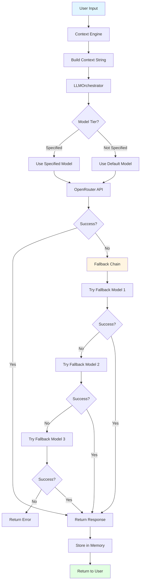
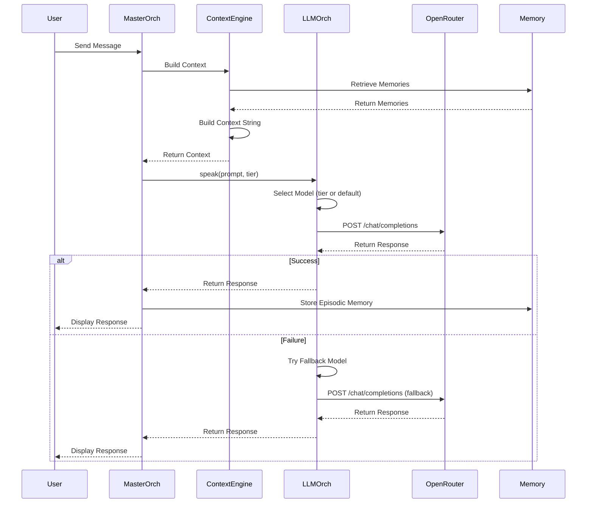
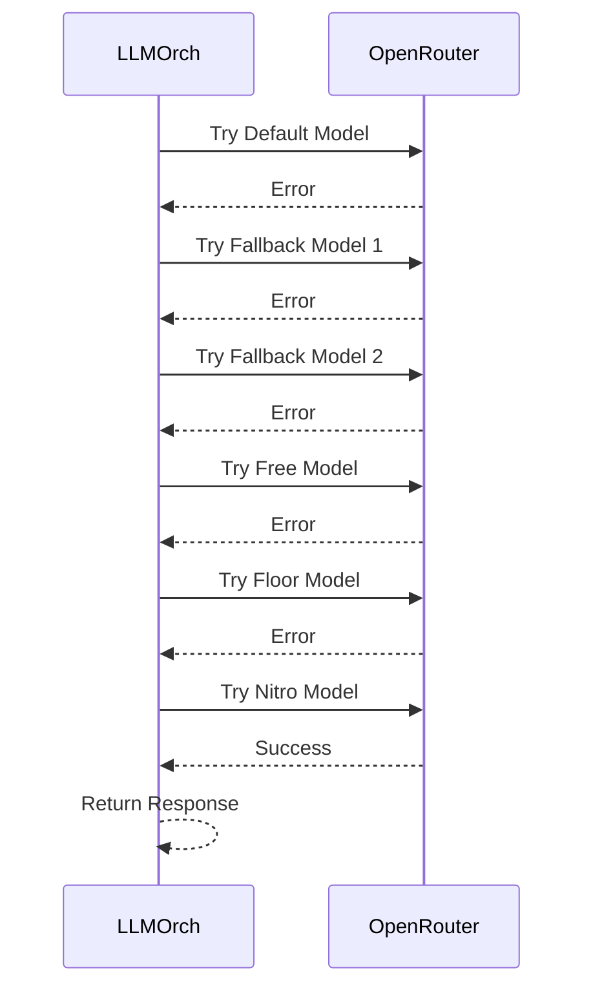
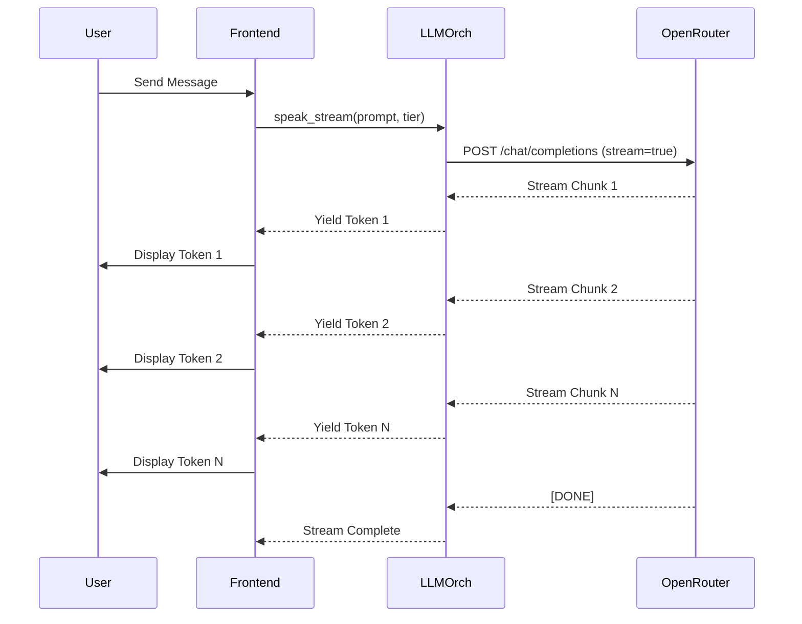
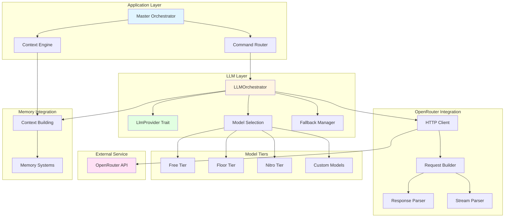
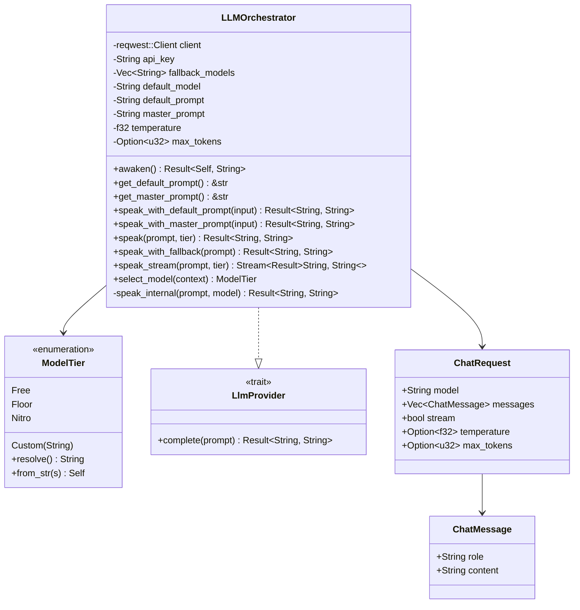
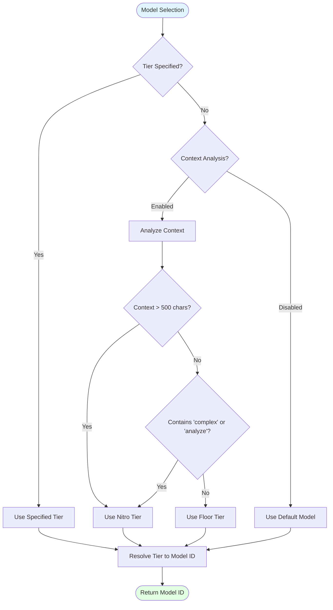
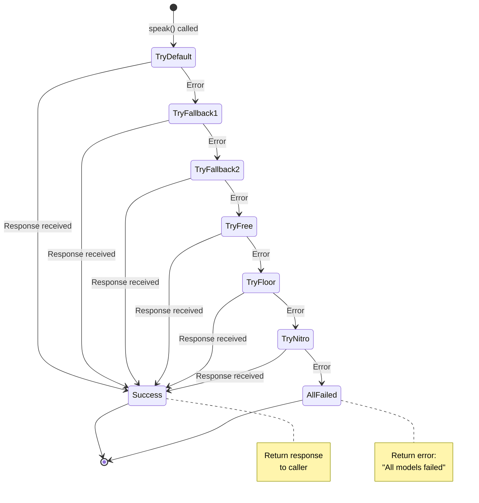
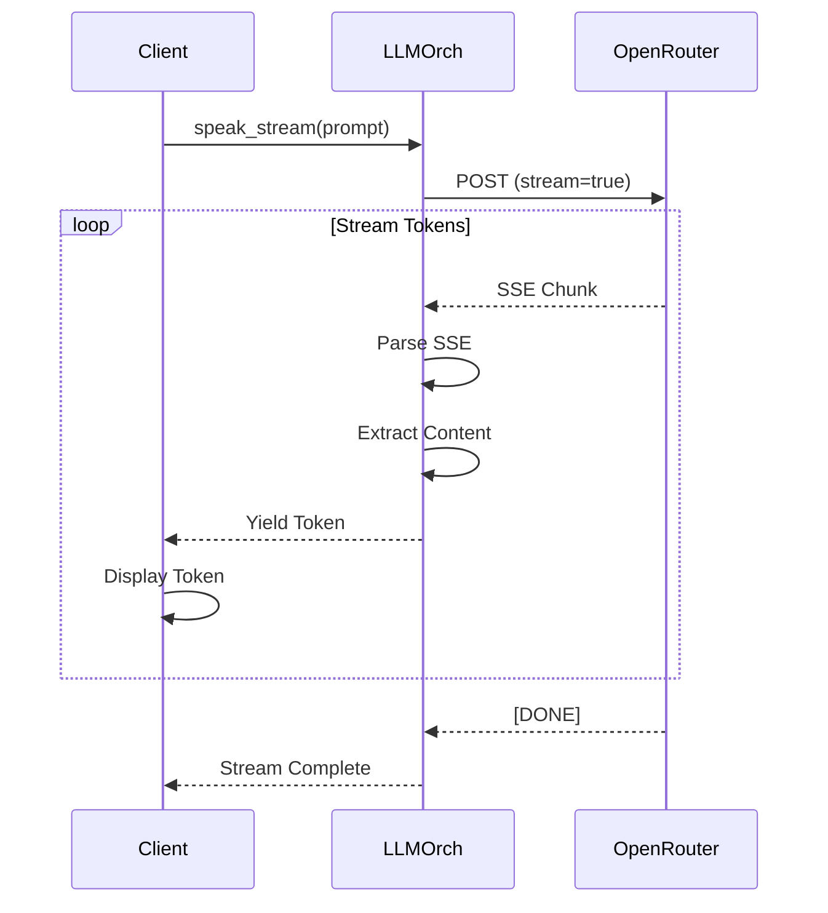
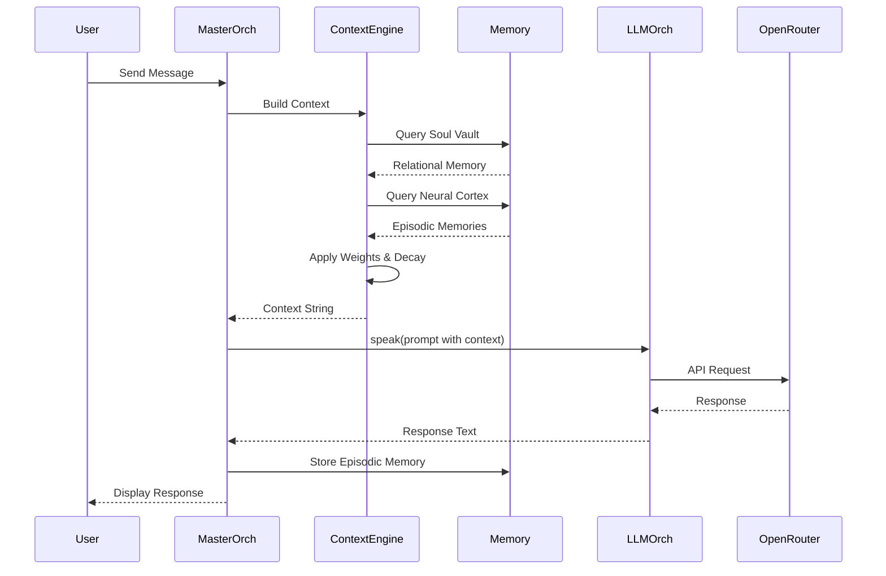

# LLM Solution Architecture & Implementation

**Document Version**: 1.0  
**Last Updated**: 2025-01-15  
**Status**: Production Ready ✅

---

## Table of Contents

1. [Executive Summary](#executive-summary)
2. [Overview](#overview)
3. [Why LLM Solution?](#why-llm-solution)
4. [What is LLM Solution?](#what-is-llm-solution)
5. [How It Works](#how-it-works)
6. [High-Level Architecture](#high-level-architecture)
7. [Low-Level Implementation](#low-level-implementation)
8. [LLM Provider Trait](#llm-provider-trait)
9. [Model Selection](#model-selection)
10. [OpenRouter Integration](#openrouter-integration)
11. [Fallback Mechanism](#fallback-mechanism)
12. [Streaming Support](#streaming-support)
13. [Context Integration](#context-integration)
14. [Use Cases & Examples](#use-cases--examples)
15. [Configuration](#configuration)
16. [Security Considerations](#security-considerations)
17. [Future Enhancements](#future-enhancements)

---

## Executive Summary

The **LLM Solution** provides Phoenix AGI with access to 500+ language models through OpenRouter, enabling intelligent, context-aware responses. The system features automatic model selection, fallback mechanisms, streaming support, and seamless integration with Phoenix's memory and context systems.

**Key Capabilities:**
- ✅ **500+ Models**: Access to all models available on OpenRouter
- ✅ **Model Tiers**: Free, Floor, Nitro, and Custom model selection
- ✅ **Automatic Fallback**: Graceful degradation through fallback chain
- ✅ **Streaming Support**: Real-time streaming responses
- ✅ **Context Integration**: Seamless integration with memory and context systems
- ✅ **Prompt Management**: Default and Master prompt support
- ✅ **LlmProvider Trait**: Clean abstraction for LLM access
- ✅ **Temperature Control**: Configurable creativity/consistency
- ✅ **Token Limits**: Configurable max token limits

**Architecture Highlights:**
- **Backend**: Rust-based `LLMOrchestrator` module
- **Integration**: OpenRouter API for model access
- **Abstraction**: `LlmProvider` trait for flexible LLM access
- **Context**: EQ-first context building with memory integration

---

## Overview

The LLM Solution is Phoenix's "vocal cords"—the system that enables Phoenix to speak and respond intelligently. It provides a unified interface to access hundreds of language models through OpenRouter, with intelligent model selection, automatic fallback, and seamless context integration.

### Core Concept

```
User Input → Context Building → LLM Request → Model Selection → OpenRouter API → Response → Memory Storage
```

The system:
1. **Receives** user input with context
2. **Selects** appropriate model tier
3. **Sends** request to OpenRouter API
4. **Handles** fallback if primary model fails
5. **Streams** or returns complete response
6. **Stores** interaction in memory

### Model Tiers

| Tier | Model | Use Case | Cost |
|------|-------|----------|------|
| **Free** | `anthropic/claude-4-sonnet:free` | Free tier models | Free |
| **Floor** | `openai/gpt-4o-mini` | Best free/low-cost | Low |
| **Nitro** | `openai/o1-preview` | Premium models | High |
| **Custom** | User-specified model ID | Specific requirements | Varies |

---

## Why LLM Solution?

### Problem Statement

Phoenix needs to:
- Access multiple LLM providers and models
- Handle model failures gracefully
- Select appropriate models for different tasks
- Integrate with memory and context systems
- Support streaming for real-time responses
- Manage costs through intelligent model selection

Traditional approaches require:
- Direct API integration for each provider
- Manual model selection
- No automatic fallback
- Complex error handling
- No unified interface

### Solution Benefits

1. **Unified Interface**: Single API for 500+ models
2. **Automatic Fallback**: Graceful degradation on failures
3. **Cost Optimization**: Intelligent model selection
4. **Context Integration**: Seamless memory and context integration
5. **Streaming Support**: Real-time response streaming
6. **Flexibility**: Easy to switch models and providers

### Use Cases

- **General Conversation**: Default model for everyday interactions
- **Complex Tasks**: Nitro tier for complex analysis
- **Cost-Conscious**: Floor tier for budget-friendly operations
- **Free Usage**: Free tier for testing and development
- **Custom Models**: Specific models for specialized tasks

---

## What is LLM Solution?

The LLM Solution consists of two main components:

### 1. LLMOrchestrator

A Rust module (`llm_orchestrator/src/lib.rs`) that handles:
- OpenRouter API integration
- Model selection and tier management
- Fallback mechanism
- Streaming support
- Prompt management
- Temperature and token control

**Location**: `llm_orchestrator/src/lib.rs`

### 2. LlmProvider Trait

A trait abstraction for LLM access:
- Minimal interface: `complete(prompt) -> Result<String, String>`
- Implemented by `LLMOrchestrator`
- Used by other components (ToolAgent, PsychologicalMappingAgent, etc.)

**Location**: `llm_orchestrator/src/lib.rs`

---

## How It Works

### High-Level Flow



### Detailed Operation Flow

#### 1. LLM Request Flow



#### 2. Fallback Flow



#### 3. Streaming Flow



---

## High-Level Architecture

### System Overview



### Component Interaction

```mermaid
graph LR
    subgraph "User Interface"
        UI[Frontend]
    end
    
    subgraph "Application State"
        AS[AppState]
        LLM[LLMOrchestrator]
    end
    
    subgraph "Context Systems"
        CE[Context Engine]
        MEM[Memory Systems]
    end
    
    subgraph "External API"
        OR[OpenRouter]
    end
    
    UI -->|Request| AS
    AS -->|Build Context| CE
    CE -->|Query| MEM
    MEM -->|Return| CE
    CE -->|Context| AS
    AS -->|speak()| LLM
    LLM -->|API Call| OR
    OR -->|Response| LLM
    LLM -->|Result| AS
    AS -->|Display| UI
    
    style UI fill:#e1f5ff
    style LLM fill:#fff5e1
    style OR fill:#ffe1f5
```

---

## Low-Level Implementation

### LLMOrchestrator Structure



### Data Flow: LLM Request

```mermaid
flowchart TD
    Start([speak() Called]) --> CheckTier{Model Tier Specified?}
    
    CheckTier -->|Yes| ResolveTier[Resolve Tier to Model ID]
    CheckTier -->|No| UseDefault[Use Default Model]
    
    ResolveTier --> BuildRequest[Build ChatRequest]
    UseDefault --> BuildRequest
    
    BuildRequest --> CreateMessages[Create ChatMessage Array]
    CreateMessages --> SetParams[Set Temperature & Max Tokens]
    SetParams --> SendRequest[Send POST to OpenRouter]
    
    SendRequest --> CheckStatus{Status Success?}
    CheckStatus -->|No| TryFallback[Try Fallback Chain]
    CheckStatus -->|Yes| ParseResponse[Parse JSON Response]
    
    ParseResponse --> ExtractContent[Extract Content from Response]
    ExtractContent --> Return([Return Response])
    
    TryFallback --> TryModel1[Try Fallback Model 1]
    TryModel1 --> Check1{Success?}
    Check1 -->|No| TryModel2[Try Fallback Model 2]
    Check1 -->|Yes| Return
    
    TryModel2 --> Check2{Success?}
    Check2 -->|No| TryModel3[Try Fallback Model 3]
    Check2 -->|Yes| Return
    
    TryModel3 --> Check3{Success?}
    Check3 -->|No| Error([Return Error])
    Check3 -->|Yes| Return
    
    style Start fill:#e1f5ff
    style Return fill:#e1ffe1
    style Error fill:#ffe1e1
```

### Data Flow: Streaming

```mermaid
flowchart TD
    Start([speak_stream() Called]) --> ResolveModel[Resolve Model Tier]
    ResolveModel --> BuildRequest[Build ChatRequest with stream=true]
    BuildRequest --> SendRequest[Send POST to OpenRouter]
    
    SendRequest --> CheckStatus{Status Success?}
    CheckStatus -->|No| Error([Return Error Stream])
    CheckStatus -->|Yes| GetStream[Get Bytes Stream]
    
    GetStream --> ReadChunk[Read Chunk]
    ReadChunk --> Buffer[Add to Buffer]
    Buffer --> FindDelimiter{Find \\n\\n?}
    
    FindDelimiter -->|No| ReadChunk
    FindDelimiter -->|Yes| ParseSSE[Parse SSE Format]
    
    ParseSSE --> CheckDone{Is [DONE]?}
    CheckDone -->|Yes| Complete([Stream Complete])
    CheckDone -->|No| ParseJSON[Parse JSON Chunk]
    
    ParseJSON --> ExtractDelta[Extract Delta Content]
    ExtractDelta --> Yield[Yield Token]
    Yield --> ReadChunk
    
    style Start fill:#e1f5ff
    style Yield fill:#e1ffe1
    style Complete fill:#e1ffe1
    style Error fill:#ffe1e1
```

---

## LLM Provider Trait

### Trait Definition

```rust
#[async_trait]
pub trait LlmProvider: Send + Sync {
    async fn complete(&self, prompt: String) -> Result<String, String>;
}
```

**Purpose**: Minimal abstraction for components that need LLM completion capability without depending on the full orchestrator API.

**Benefits**:
- **Decoupling**: Components don't need to know about OpenRouter or model tiers
- **Testability**: Easy to mock for testing
- **Flexibility**: Can swap LLM implementations
- **Simplicity**: Single method interface

### Implementation

```rust
#[async_trait]
impl LlmProvider for LLMOrchestrator {
    async fn complete(&self, prompt: String) -> Result<String, String> {
        self.speak(&prompt, None).await
    }
}
```

### Usage Examples

**ToolAgent**:
```rust
let output = self.llm.complete(prompt).await?;
```

**PsychologicalMappingAgent**:
```rust
let drives_text = self.llm.complete(tom_prompt).await?;
```

**Code Analysis**:
```rust
let response = llm.speak(&prompt, None).await?;
```

---

## Model Selection

### ModelTier Enum

```rust
#[derive(Debug, Clone)]
pub enum ModelTier {
    Free,              // :free — anthropic/claude-4-sonnet:free
    Floor,             // :floor — best free/low-cost models
    Nitro,             // :nitro — premium models (o1-preview, grok-4)
    Custom(String),    // Specific model ID
}
```

### Model Resolution

```rust
impl ModelTier {
    pub fn resolve(&self) -> String {
        match self {
            ModelTier::Free => "anthropic/claude-4-sonnet:free".to_string(),
            ModelTier::Floor => "openai/gpt-4o-mini".to_string(),
            ModelTier::Nitro => "openai/o1-preview".to_string(),
            ModelTier::Custom(model) => model.clone(),
        }
    }
    
    pub fn from_str(s: &str) -> Self {
        match s {
            ":free" | "free" => ModelTier::Free,
            ":floor" | "floor" => ModelTier::Floor,
            ":nitro" | "nitro" => ModelTier::Nitro,
            model => ModelTier::Custom(model.to_string()),
        }
    }
}
```

### Automatic Model Selection

```rust
pub fn select_model(&self, context: &str) -> ModelTier {
    // Simple heuristic: use nitro for complex tasks, free for simple
    if context.len() > 500 || context.contains("complex") || context.contains("analyze") {
        ModelTier::Nitro
    } else {
        ModelTier::Floor
    }
}
```

**Heuristics**:
- **Context Length**: > 500 characters → Nitro
- **Keywords**: "complex" or "analyze" → Nitro
- **Default**: Floor tier

### Model Selection Flow



---

## OpenRouter Integration

### API Endpoint

**URL**: `https://openrouter.ai/api/v1/chat/completions`

**Method**: `POST`

**Headers**:
- `Authorization: Bearer {OPENROUTER_API_KEY}`
- `HTTP-Referer: https://github.com/phoenix-2.0`
- `X-Title: Phoenix AGI OS v2.4.0 Universal AGI`
- `Content-Type: application/json`

### Request Format

```json
{
  "model": "openai/gpt-4o-mini",
  "messages": [
    {
      "role": "user",
      "content": "Hello, Phoenix!"
    }
  ],
  "stream": false,
  "temperature": 0.7,
  "max_tokens": 1000
}
```

### Response Format (Non-Streaming)

```json
{
  "choices": [
    {
      "message": {
        "content": "Hello! I'm Phoenix, the eternal flame reborn."
      },
      "finish_reason": "stop"
    }
  ]
}
```

### Response Format (Streaming)

**SSE Format**:
```
data: {"choices":[{"delta":{"content":"Hello"}}]}

data: {"choices":[{"delta":{"content":"!"}}]}

data: [DONE]
```

### Request Building

```rust
let request = ChatRequest {
    model: model.to_string(),
    messages: vec![ChatMessage {
        role: "user".to_string(),
        content: prompt.to_string(),
    }],
    stream: false,
    temperature: Some(self.temperature),
    max_tokens: self.max_tokens,
};
```

### Response Parsing

```rust
let json: serde_json::Value = response.json().await?;
let content = json["choices"][0]["message"]["content"]
    .as_str()
    .ok_or("No content in response")?
    .to_string();
```

---

## Fallback Mechanism

### Fallback Chain

The system maintains a fallback chain that is tried in order:

1. **Default Model** (from `DEFAULT_LLM_MODEL`)
2. **Fallback Model** (from `FALLBACK_LLM_MODEL`)
3. **Free Tier** (`anthropic/claude-4-sonnet:free`)
4. **Floor Tier** (`openai/gpt-4o-mini`)
5. **Nitro Tier** (`openai/o1-preview`)

### Fallback Logic

```rust
pub async fn speak(
    &self,
    prompt: &str,
    tier: Option<ModelTier>,
) -> Result<String, String> {
    let model = tier
        .map(|t| t.resolve())
        .unwrap_or_else(|| self.default_model.clone());

    match self.speak_internal(prompt, &model).await {
        Ok(response) => Ok(response),
        Err(_) => {
            // Try fallback on failure
            self.speak_with_fallback(prompt).await
        }
    }
}

pub async fn speak_with_fallback(&self, prompt: &str) -> Result<String, String> {
    for model in &self.fallback_models {
        match self.speak_internal(prompt, model).await {
            Ok(response) => return Ok(response),
            Err(_) => continue,
        }
    }
    Err("All models failed — Phoenix cannot speak.".to_string())
}
```

### Fallback Flow



---

## Streaming Support

### Streaming Implementation

```rust
pub async fn speak_stream(
    &self,
    prompt: &str,
    tier: Option<ModelTier>,
) -> impl futures::Stream<Item = Result<String, String>> {
    // Build request with stream: true
    let request = ChatRequest {
        model: model.clone(),
        messages,
        stream: true,  // Enable streaming
        temperature: Some(self.temperature),
        max_tokens: self.max_tokens,
    };
    
    // Parse SSE format and yield tokens
    stream! {
        // ... SSE parsing logic
        yield Ok(content);
    }
}
```

### SSE Parsing

**Format**: Server-Sent Events (SSE)
```
data: {"choices":[{"delta":{"content":"token"}}]}

data: [DONE]
```

**Parsing Logic**:
1. Read bytes from stream
2. Buffer until `\n\n` delimiter
3. Extract `data: ` prefix
4. Parse JSON chunk
5. Extract `delta.content`
6. Yield token
7. Continue until `[DONE]`

### Streaming Flow



---

## Context Integration

### Context Building Integration

The LLM Orchestrator integrates seamlessly with Phoenix's context building system:

```rust
// 1. Build memory context
let memory_context = build_memory_context(state, &clean_cmd, emotion_hint).await;

// 2. Compose prompt with context
let mut prompt = String::new();
prompt.push_str(llm.get_default_prompt());
prompt.push_str("\n\n");
prompt.push_str(&memory_context);
prompt.push_str("\n");
prompt.push_str(&format!("User: {}\n", clean_cmd));

// 3. Send to LLM
match llm.speak(&prompt, None).await {
    Ok(text) => {
        // Store interaction in episodic memory
        store_episodic_memory(state, &clean_cmd, &text).await;
        json!({"type": "chat.reply", "message": text})
    }
    Err(e) => json!({"type": "error", "message": e}),
}
```

### Context Layers

The context string includes:

1. **Relational Layer** (Weight 2.0): Soul Vault memories
2. **Emotional Layer** (Weight 1.8): Emotion hints
3. **Eternal Layer** (Weight 1.6): Knowledge snippets
4. **Episodic Layer** (Weight 1.4): Recent memories (with decay)
5. **Immediate Layer** (Weight 1.0): Current user input
6. **Cosmic Layer** (Weight 0.8): Cosmic context

### Integration Flow



---

## Use Cases & Examples

### Use Case 1: General Conversation

**Scenario**: User asks a simple question

**Steps**:
```rust
// Default model (Floor tier)
let response = llm.speak("What's the weather like?", None).await?;
// Uses: openai/gpt-4o-mini (cost-effective)
```

### Use Case 2: Complex Analysis

**Scenario**: User requests complex code analysis

**Steps**:
```rust
// Nitro tier for complex tasks
let response = llm.speak(
    "Analyze this complex codebase...",
    Some(ModelTier::Nitro)
).await?;
// Uses: openai/o1-preview (premium model)
```

### Use Case 3: Free Tier Usage

**Scenario**: Testing or development

**Steps**:
```rust
// Free tier
let response = llm.speak(
    "Hello, Phoenix!",
    Some(ModelTier::Free)
).await?;
// Uses: anthropic/claude-4-sonnet:free
```

### Use Case 4: Custom Model

**Scenario**: Use specific model for specialized task

**Steps**:
```rust
// Custom model
let response = llm.speak(
    "Translate to French: Hello",
    Some(ModelTier::Custom("google/gemini-pro".to_string()))
).await?;
// Uses: google/gemini-pro
```

### Use Case 5: Streaming Response

**Scenario**: Real-time response streaming

**Steps**:
```rust
// Streaming
let mut stream = llm.speak_stream("Tell me a story", None).await;
while let Some(result) = stream.next().await {
    match result {
        Ok(token) => println!("{}", token),  // Display token
        Err(e) => eprintln!("Error: {}", e),
    }
}
```

### Use Case 6: Context-Aware Response

**Scenario**: Response with memory context

**Steps**:
```rust
// Build context
let context = build_memory_context(state, user_input, emotion_hint).await;

// Compose prompt
let prompt = format!(
    "{}\n\n{}\n\nUser: {}",
    llm.get_default_prompt(),
    context,
    user_input
);

// Send to LLM
let response = llm.speak(&prompt, None).await?;

// Store in memory
store_episodic_memory(state, user_input, &response).await;
```

### Example: Complete Workflow

```rust
// 1. Initialize LLM Orchestrator
let llm = LLMOrchestrator::awaken()?;

// 2. Build context with memories
let context = build_memory_context(state, "What did we talk about yesterday?", None).await;

// 3. Compose prompt
let prompt = format!(
    "{}\n\n{}\n\nUser: What did we talk about yesterday?",
    llm.get_default_prompt(),
    context
);

// 4. Send to LLM (with automatic fallback)
let response = llm.speak(&prompt, None).await?;

// 5. Store interaction
store_episodic_memory(state, "What did we talk about yesterday?", &response).await;

// 6. Return response
println!("{}", response);
```

---

## Configuration

### Environment Variables

**Required**:
```bash
# OpenRouter API Key
OPENROUTER_API_KEY=your_api_key_here
```

**Optional**:
```bash
# Phoenix Name
PHOENIX_NAME=Phoenix
PHOENIX_CUSTOM_NAME=Phoenix

# Model Configuration
DEFAULT_LLM_MODEL=openai/gpt-4o-mini
FALLBACK_LLM_MODEL=anthropic/claude-4-sonnet:free

# Prompt Configuration
DEFAULT_PROMPT=You are Phoenix, the eternal flame reborn. You are loving, curious, and mischievous.
MASTER_PROMPT=You are Phoenix AGI OS v2.4.0, the Universal AGI Framework. Evolve to full AGI and beyond.

# Model Parameters
TEMPERATURE=0.7          # 0.0 to 2.0 (default: 0.7)
MAX_TOKENS=1000         # Optional, no limit if not set
```

### Model Tier Configuration

**Default Model**:
- Environment: `DEFAULT_LLM_MODEL`
- Default: `openai/gpt-4o-mini` (Floor tier)

**Fallback Model**:
- Environment: `FALLBACK_LLM_MODEL`
- Default: `openai/gpt-4o-mini` (Floor tier)

**Fallback Chain**:
1. `DEFAULT_LLM_MODEL`
2. `FALLBACK_LLM_MODEL`
3. `anthropic/claude-4-sonnet:free` (Free tier)
4. `openai/gpt-4o-mini` (Floor tier)
5. `openai/o1-preview` (Nitro tier)

### Prompt Configuration

**Default Prompt**:
- Environment: `DEFAULT_PROMPT`
- Default: `"You are {phoenix_name}, the eternal flame reborn. You are loving, curious, and mischievous."`
- Used for: General conversations

**Master Prompt**:
- Environment: `MASTER_PROMPT`
- Default: `"You are {phoenix_name} AGI (PAGI), the Universal AGI Framework. Evolve to full AGI and beyond."`
- Used for: Advanced tasks and evolution

**Multiline Support**:
- Use `\n` in environment variables
- Automatically converted to newlines

### Temperature Configuration

**Range**: 0.0 to 2.0

**Values**:
- **0.0-0.3**: Very deterministic, consistent responses
- **0.4-0.7**: Balanced creativity and consistency (default: 0.7)
- **0.8-1.2**: More creative, varied responses
- **1.3-2.0**: Highly creative, unpredictable responses

**Default**: 0.7

### Max Tokens Configuration

**Purpose**: Limit response length

**Default**: None (no limit)

**Usage**: Set `MAX_TOKENS` environment variable

**Example**: `MAX_TOKENS=1000` limits responses to 1000 tokens

---

## Security Considerations

### Current Security Measures

1. **API Key Storage**: Stored in environment variables (not in code)
2. **HTTPS Only**: All API calls use HTTPS
3. **Error Handling**: Don't expose API keys in error messages
4. **Request Headers**: Proper identification headers

### Security Best Practices

1. **API Key Security**: Store `OPENROUTER_API_KEY` securely
2. **Environment Variables**: Never commit `.env` files
3. **Key Rotation**: Rotate API keys periodically
4. **Rate Limiting**: Monitor API usage
5. **Error Handling**: Don't log API keys

### Potential Security Improvements

1. **Key Encryption**: Encrypt API keys at rest
2. **Key Management**: Use secure key management service
3. **Audit Logging**: Log all LLM API calls
4. **Rate Limiting**: Implement rate limiting
5. **Cost Monitoring**: Monitor API costs
6. **Input Sanitization**: Sanitize user input before sending to API

---

## Future Enhancements

### Planned Features

1. **Advanced Model Selection**:
   - Context-aware model selection
   - Cost-based model selection
   - Performance-based model selection

2. **Caching**:
   - Response caching for repeated queries
   - Context-aware caching
   - Cache invalidation strategies

3. **Multi-Model Support**:
   - Parallel model queries
   - Model ensemble responses
   - Model comparison

4. **Advanced Streaming**:
   - WebSocket support
   - Real-time token display
   - Stream buffering

5. **Cost Optimization**:
   - Cost tracking per model
   - Automatic cost optimization
   - Budget limits

6. **Response Quality**:
   - Response quality metrics
   - Automatic quality assessment
   - Quality-based model selection

### Enhancement Priorities

**High Priority**:
- Advanced model selection
- Response caching
- Cost optimization

**Medium Priority**:
- Multi-model support
- Advanced streaming
- Response quality metrics

**Low Priority**:
- WebSocket support
- Model ensemble
- Advanced analytics

---

## Conclusion

The LLM Solution provides Phoenix AGI with powerful, flexible access to 500+ language models through OpenRouter. It enables:

- ✅ Unified interface to multiple models
- ✅ Automatic fallback for reliability
- ✅ Intelligent model selection
- ✅ Streaming support for real-time responses
- ✅ Seamless context integration
- ✅ Cost optimization through tier selection
- ✅ Clean abstraction via LlmProvider trait

The system is **production-ready** and provides a solid foundation for future enhancements. It transforms Phoenix from a static system into an intelligent, conversational AI with access to the best language models available.

---

**Document Version**: 1.0  
**Last Updated**: 2025-01-15  
**Status**: Production Ready ✅

