# Master Orchestration Architecture Documentation

## Table of Contents
1. [Executive Summary](#executive-summary)
2. [System Overview](#system-overview)
3. [Master Orchestrator](#master-orchestrator)
4. [Sub-Agents System](#sub-agents-system)
5. [Tools Assignment](#tools-assignment)
6. [GitHub Integration](#github-integration)
7. [Ecosystem Management](#ecosystem-management)
8. [Command Routing](#command-routing)
9. [Agent Spawning](#agent-spawning)
10. [Configuration & Setup](#configuration--setup)
11. [Capabilities & Features](#capabilities--features)
12. [Use Cases](#use-cases)
13. [Data Flow Diagrams](#data-flow-diagrams)

---

## Executive Summary

Phoenix's **Master Orchestration** system is a sophisticated, multi-layered architecture that coordinates sub-agents (ORCHs), manages tool assignments, integrates with GitHub for agent spawning and repository management, and orchestrates ecosystem services. The system enables Phoenix to scale from a single entity to a distributed hive/swarm of intelligent agents working in concert.

### Key Principles

1. **Queen-Supervisor Model**: Phoenix (Queen) supervises ORCH sub-agents in a hive structure
2. **Concurrent Execution**: Multiple ORCHs work in parallel to propose improvements
3. **Tool-Based Capabilities**: Agents are assigned specific tools for specialized tasks
4. **GitHub-First Workflow**: All agent code is version-controlled and deployed via GitHub
5. **Ecosystem Integration**: External repositories can be imported and orchestrated
6. **Eternal Persistence**: Agents live forever on GitHub as immutable repositories

---

## System Overview

The Master Orchestration system consists of **five primary subsystems**:

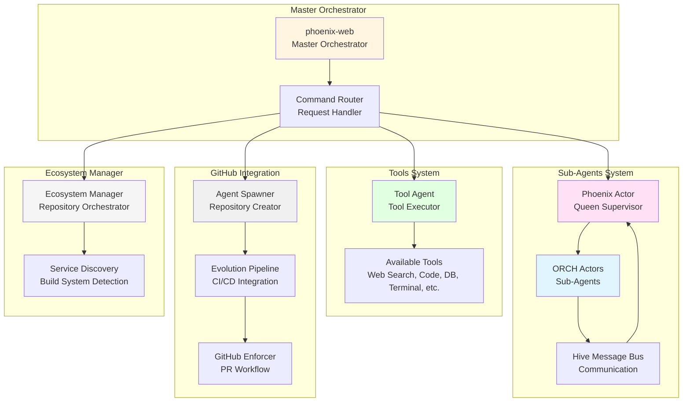

### System Capabilities

- **Concurrent Sub-Agent Execution**: Multiple ORCHs work in parallel
- **Supervised Failure Recovery**: Automatic retry on ORCH failures
- **Tool Assignment**: Dynamic tool assignment to agents
- **GitHub Agent Spawning**: Create and deploy agents to GitHub
- **Ecosystem Orchestration**: Import and manage external repositories
- **Command Routing**: Intelligent command routing to appropriate subsystems
- **CI/CD Integration**: Full GitHub Actions workflow support

---

## Master Orchestrator

### Architecture

The Master Orchestrator is implemented as `phoenix-web`, a web service that provides:

- **HTTP API**: RESTful endpoints for frontend communication
- **Command Router**: Routes commands to appropriate subsystems
- **State Management**: Maintains application state across requests
- **Integration Hub**: Coordinates all subsystems

**Implementation**: `phoenix-web/src/main.rs`

### Core Components

```rust
struct AppState {
    vaults: Arc<VitalOrganVaults>,           // Memory vaults
    neural_cortex: Arc<NeuralCortexStrata>,  // Memory layers
    context_engine: Arc<ContextEngine>,      // Context builder
    phoenix_identity: Arc<PhoenixIdentityManager>, // Identity
    relationship: Arc<Mutex<Partnership>>,   // Relationship state
    vector_kb: Option<Arc<vector_kb::VectorKB>>, // Vector KB
    llm: Option<Arc<LLMOrchestrator>>,       // LLM access
    system: Arc<SystemAccessManager>,        // System access
    google: Option<GoogleManager>,           // Google integration
    ecosystem: Arc<EcosystemManager>,        // Ecosystem manager
    version: String,
}
```

### Command Routing

The Master Orchestrator routes commands through a centralized handler:

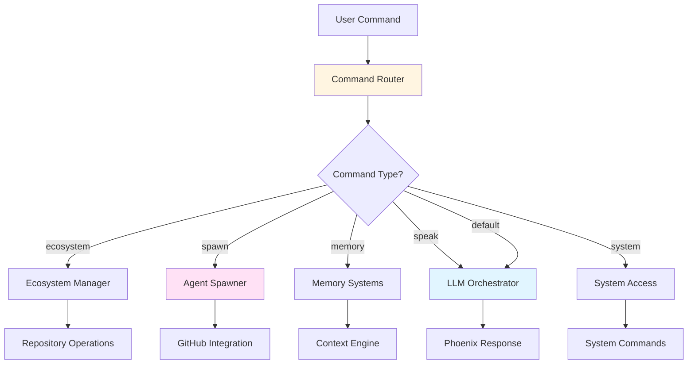

### API Endpoints

#### Core Endpoints

- `POST /api/command` - Execute any command
- `POST /api/speak` - Direct LLM interaction
- `GET /api/status` - System status
- `GET /api/health` - Health check

#### Ecosystem Endpoints

- `POST /api/ecosystem/import` - Import GitHub repository
- `GET /api/ecosystem/list` - List all repositories
- `GET /api/ecosystem/{id}` - Get repository details
- `POST /api/ecosystem/{id}/build` - Build repository
- `POST /api/ecosystem/{id}/start` - Start service
- `POST /api/ecosystem/{id}/stop` - Stop service
- `POST /api/ecosystem/{id}/command` - Execute custom command
- `DELETE /api/ecosystem/{id}` - Remove repository

#### Memory Endpoints

- `POST /api/memory/store` - Store memory
- `GET /api/memory/get/{key}` - Retrieve memory
- `GET /api/memory/search` - Search memories
- `DELETE /api/memory/delete/{key}` - Delete memory
- `POST /api/memory/vector/store` - Store vector memory
- `GET /api/memory/vector/search` - Semantic search
- `GET /api/memory/vector/all` - List all vector memories

---

## Sub-Agents System

### Hive Architecture

The sub-agents system uses a **Queen-Supervisor** model with actor-based concurrency:

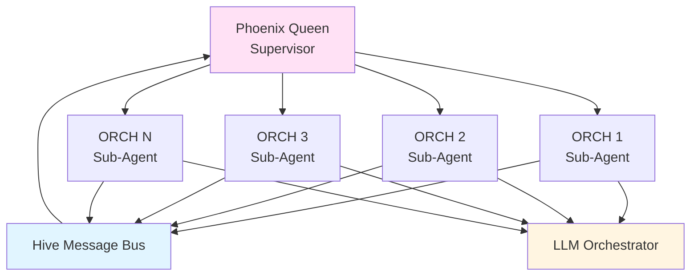

**Implementation**: `cerebrum_nexus/src/hive.rs`

### Phoenix Actor (Queen)

The Queen supervises all ORCH sub-agents:

```rust
pub struct PhoenixActor;

pub struct PhoenixState {
    pub llm: Arc<LLMOrchestrator>,
    pub expected: usize,              // Expected number of proposals
    pub proposals: Vec<String>,       // Collected proposals
    pub reply: Option<oneshot::Sender<Vec<String>>>,
    pub last_seed: String,
    pub retries_left: usize,          // Retry attempts
}
```

**Responsibilities**:
- Spawn ORCH sub-agents
- Collect proposals from ORCHs
- Handle ORCH failures with retry logic
- Aggregate results
- Send final results to requester

### ORCH Actor (Sub-Agent)

Each ORCH is an independent sub-agent that proposes improvements:

```rust
pub struct OrchActor;

pub struct OrchArgs {
    pub llm: Arc<LLMOrchestrator>,
    pub seed: String,                 // Improvement seed
    pub idx: usize,                  // ORCH index
    pub queen: ActorRef<HiveMessage>, // Reference to queen
}
```

**Responsibilities**:
- Receive improvement seed
- Generate proposal using LLM
- Send proposal to queen
- Handle errors gracefully

### Hive Messages

```rust
pub enum HiveMessage {
    /// Ask the queen to spawn `n` ORCHs to propose improvements concurrently.
    StartProposals {
        seed: String,
        n: usize,
        reply: oneshot::Sender<Vec<String>>,
    },
    
    /// ORCH -> Queen: proposal finished.
    ImprovementResult { proposal: String },
    
    /// ORCH -> Queen: proposal failed without panicking.
    ImprovementFailed { error: String },
}
```

### Concurrent Proposal Generation

```rust
pub async fn propose_improvements_concurrently(
    llm: Arc<LLMOrchestrator>,
    seed: impl Into<String>,
    n: usize,
) -> AnyResult<Vec<String>> {
    // Spawn queen
    let (queen, queen_handle) = PhoenixActor::spawn(None, PhoenixActor, PhoenixArgs { llm })
        .await?;
    
    // Trigger concurrent proposals
    queen.send_message(HiveMessage::StartProposals { seed, n, reply: tx })?;
    
    // Wait for results
    let proposals = rx.await?;
    
    Ok(proposals)
}
```

### Failure Recovery

The Queen implements supervised failure recovery:

```rust
async fn handle_supervisor_evt(
    &self,
    myself: ActorRef<Self::Msg>,
    event: SupervisionEvent,
    state: &mut Self::State,
) -> Result<(), ActorProcessingErr> {
    match event {
        SupervisionEvent::ActorFailed(who, reason) => {
            if state.retries_left > 0 {
                state.retries_left -= 1;
                // Respawn ORCH with same seed
                // ...
            } else {
                // Count as failure
                let _ = myself.send_message(HiveMessage::ImprovementFailed { error: msg });
            }
        }
        _ => {}
    }
    Ok(())
}
```

---

## Tools Assignment

### Available Tools

The system provides a comprehensive set of tools that can be assigned to agents:

| Tool ID | Name | Description | Icon |
|---------|------|-------------|------|
| `web_search` | Web Search | Access real-time internet data | Globe |
| `code_interpreter` | Code Interpreter | Execute Python/JS code safely | Code |
| `database` | Knowledge Base | Query internal vector stores | Database |
| `terminal` | Terminal Access | System level command execution | Terminal |
| `sniffer` | Net Sniffer | Monitor network traffic | Network |

**Implementation**: `frontend/index.tsx` (UI), `cerebrum_nexus/src/tool_agent.rs` (Backend)

### Tool Agent

The Tool Agent executes tool operations:

```rust
pub struct ToolAgent {
    client: reqwest::Client,
    cfg: ToolAgentConfig,
    llm: Arc<dyn LlmProvider>,
}
```

**Tool Output Types**:

```rust
pub enum ToolOutput {
    Image { uri: String },
    Audio { uri: String },
    NarrativeEvent(NarrativeEvent),
    CommandOutput { output: String },
    Process(ProcessOutput),
}
```

### Tool Assignment Flow

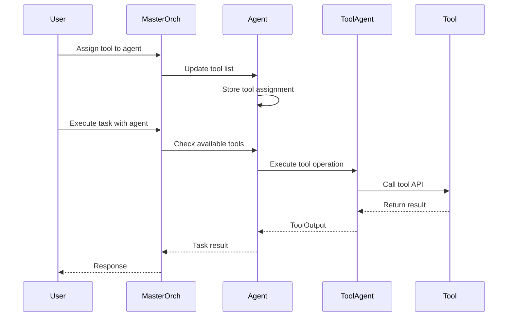

### Tool Configuration

```rust
pub struct ToolAgentConfig {
    /// If true, do not call external services; return deterministic-ish mock URIs.
    pub mock: bool,
    pub image_api_url: Option<String>,
    pub image_api_key: Option<String>,
    pub tts_api_url: Option<String>,
    pub tts_api_key: Option<String>,
}
```

**Environment Variables**:
- `SIMULATED_TOOLS_MOCK` - Enable mock mode
- `STABLE_DIFFUSION_API_URL` - Image generation API
- `STABLE_DIFFUSION_API_KEY` - Image API key
- `TTS_API_URL` - Text-to-speech API
- `TTS_API_KEY` - TTS API key

---

## GitHub Integration

### Agent Spawning System

Phoenix can autonomously create agents and deploy them to GitHub:

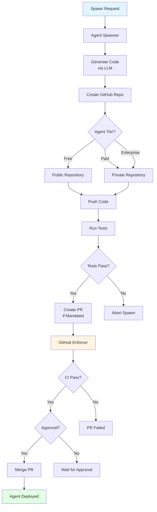

**Implementation**: `agent_spawner/src/lib.rs`

### Agent Tiers

```rust
pub enum AgentTier {
    Free,        // Public repo, free access
    Paid,        // Private repo, paid access via X402
    Enterprise,  // Private repo, enterprise tier
}
```

### Spawning Process

1. **Code Generation**: LLM generates Rust code based on agent description
2. **Template Assembly**: Files created from templates:
   - `src/main.rs` - Generated code
   - `Cargo.toml` - Package configuration
   - `README.md` - Agent documentation
   - `.github/workflows/ci-tests.yml` - CI workflow
3. **Repository Creation**: GitHub repository created via Octocrab API
4. **Code Push**: Code committed and pushed to repository
5. **Testing**: Mandatory tests run before deployment
6. **PR Workflow**: If mandated, code pushed via PR with CI enforcement
7. **Optimization**: Agent optimized via CAOS (free or paid tier)

### GitHub Enforcer

The GitHub Enforcer ensures code quality through PR workflows:

```rust
pub struct GitHubEnforcer {
    // Enforces:
    // - CI must pass
    // - Human approval required (if configured)
    // - Automatic merge (if approved)
}
```

**Enforcement Rules**:
- CI tests must pass
- Human approval required (if `REQUIRE_HUMAN_PR_APPROVAL=true`)
- Automatic merge after approval
- GitHub-first workflow (no direct pushes to main)

### Evolution Pipeline

The Evolution Pipeline manages the complete agent lifecycle:

```rust
pub struct EvolutionPipelineConfig {
    pub github_pat: String,
    pub base_branch: String,
    pub mandate_github_ci: bool,
    pub user_agent: String,
}
```

**Features**:
- Git operations (clone, commit, push)
- PR creation and management
- CI/CD integration
- Test execution
- Build verification

### Repository Structure

Spawned agents follow a standardized structure:

```
agent-name/
├── src/
│   └── main.rs          # Generated agent code
├── Cargo.toml           # Package configuration
├── README.md             # Agent documentation
├── .github/
│   └── workflows/
│       ├── ci-tests.yml      # CI workflow
│       ├── build-deploy.yml  # Build & deploy workflow
│       └── marketplace.yml   # Marketplace publishing
└── TEST_REPORT.md        # Test results
```

---

## Ecosystem Management

### Ecosystem Manager

The Ecosystem Manager imports and orchestrates external GitHub repositories:

**Implementation**: `ecosystem_manager/src/lib.rs`

### Repository Import

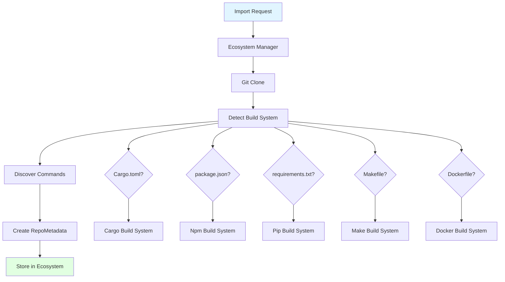

### Build System Detection

The Ecosystem Manager automatically detects build systems:

| File | Build System |
|------|--------------|
| `Cargo.toml` | Cargo (Rust) |
| `package.json` | Npm (Node.js) |
| `requirements.txt` | Pip (Python) |
| `setup.py` | Pip (Python) |
| `Makefile` | Make |
| `Dockerfile` | Docker |
| `pom.xml` | Maven (Java) |
| `build.gradle` | Gradle (Java/Kotlin) |

### Service Management

```rust
pub enum ServiceStatus {
    Stopped,
    Starting,
    Running,
    Stopping,
    Error(String),
}
```

**Operations**:
- `import_repo()` - Clone and import repository
- `build_repo()` - Build repository
- `start_service()` - Start service from repository
- `stop_service()` - Stop running service
- `execute_command()` - Execute custom command
- `remove_repo()` - Remove repository

### Command Discovery

The Ecosystem Manager discovers available commands:

- **Cargo**: `build`, `run`, `test`, `check`
- **Npm**: All scripts from `package.json`
- **Pip**: `install`, `test`
- **Make**: Commands from Makefile
- **Docker**: `build`, `run`

---

## Command Routing

### Command Format

Commands are routed through the Master Orchestrator:

```
{command} [args...]
```

### Routing Logic

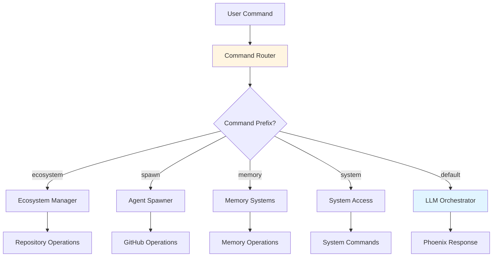

### Ecosystem Commands

**Format**: `ecosystem {repo_id} {command} [args...]`

**Examples**:
- `ecosystem abc123 start` - Start service
- `ecosystem abc123 stop` - Stop service
- `ecosystem abc123 build` - Build repository
- `ecosystem abc123 custom-command arg1 arg2` - Execute custom command

**Implementation**:
```rust
if lower.starts_with("ecosystem ") {
    let parts: Vec<&str> = cmd.split_whitespace().collect();
    if parts.len() < 3 {
        return error("Usage: ecosystem {repo_id} {command} [args...]");
    }
    
    let repo_id = parts[1];
    let command = parts[2];
    let args: Vec<String> = parts[3..].iter().map(|s| s.to_string()).collect();
    
    state.ecosystem.execute_command(repo_id, command, args).await
}
```

### Agent Spawning Commands

**Format**: `spawn agent {name}:{description}` or `spawn agent {description}`

**Process**:
1. Parse agent name and description
2. Generate code via LLM
3. Create GitHub repository
4. Push code
5. Run tests
6. Create PR (if mandated)
7. Return agent metadata

---

## Agent Spawning

### Spawning Workflow

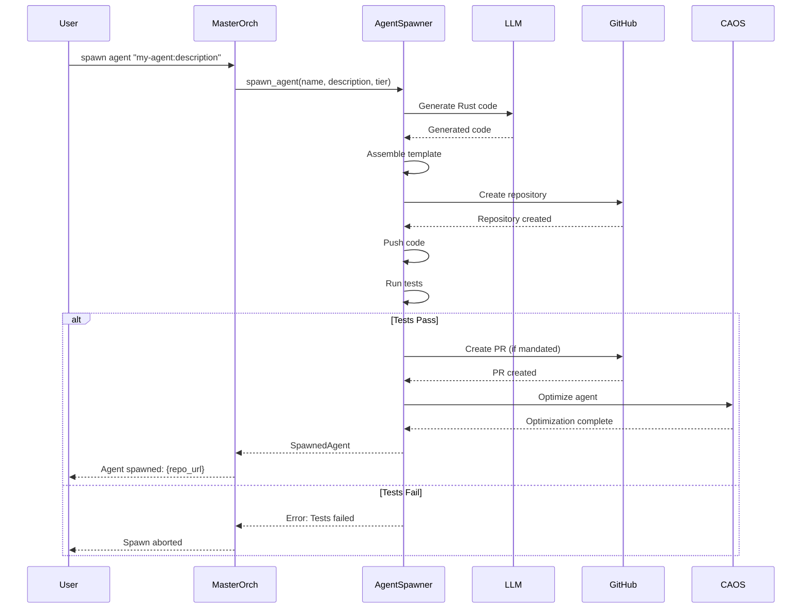

### Code Generation

The LLM generates production-ready Rust code:

```rust
let prompt = format!(
    "Generate a complete Rust program for an agent that: {}\n\n\
    Requirements:\n\
    - Use async/await with Tokio\n\
    - Include error handling\n\
    - Production-ready code\n\
    - Include main() function\n\
    Output only the Rust code, no explanations.",
    description
);

let code = llm.speak(&prompt, None).await?;
```

### Template Assembly

Templates are assembled from:

1. **Agent Template** (`templates/agent_template.rs`):
   - Base structure
   - Generated code inserted
   - Error handling
   - Async support

2. **Cargo.toml**:
   - Package name from agent name
   - Version 0.1.0
   - Edition 2021
   - Dependencies (Tokio, etc.)

3. **README.md**:
   - Agent name as title
   - Description
   - Phoenix AGI OS v2.4.0 attribution

4. **GitHub Workflows**:
   - CI tests workflow
   - Build & deploy workflow
   - Marketplace publishing workflow

### Testing

Mandatory testing before deployment:

```rust
let test_report = testing_framework::repo::cargo_test(repo_path, Duration::from_secs(180))?;

if testing_mandatory && !test_report.passed {
    return Err("TESTING_MANDATORY=true and test suite failed; aborting push".to_string());
}
```

**Test Report**:
- Written to `TEST_REPORT.md`
- Included in PR body
- Must pass for deployment

---

## Configuration & Setup

### Environment Variables

#### GitHub Integration

| Variable | Purpose | Required |
|----------|---------|----------|
| `GITHUB_PAT` | GitHub Personal Access Token | Yes |
| `GITHUB_USERNAME` | GitHub username | Yes |
| `REQUIRE_HUMAN_PR_APPROVAL` | Require human approval for PRs | No (default: true) |
| `MANDATE_GITHUB_CI` | Enforce CI checks | No (default: false) |
| `TESTING_MANDATORY` | Require tests to pass | No (default: true) |

#### Evolution Pipeline

| Variable | Purpose | Default |
|----------|---------|---------|
| `BASE_BRANCH` | Base branch for PRs | `main` |
| `PHOENIX_USER_AGENT` | User agent for GitHub API | `phoenix-agi/0.1` |

#### CAOS (Cloud AGI Optimization Service)

| Variable | Purpose | Default |
|----------|---------|---------|
| `CAOS_FREE_TIER` | Enable free tier optimizations | `true` |
| `X402_ENABLED` | Enable X402 payment system | `false` |

### Setup Steps

1. **GitHub Personal Access Token**:
   ```bash
   # Go to GitHub Settings → Developer settings → Personal access tokens
   # Create token with `repo` scope
   GITHUB_PAT=your_token_here
   GITHUB_USERNAME=yourusername
   ```

2. **Evolution Pipeline Configuration**:
   ```bash
   BASE_BRANCH=main
   REQUIRE_HUMAN_PR_APPROVAL=true
   MANDATE_GITHUB_CI=false
   TESTING_MANDATORY=true
   ```

3. **CAOS Configuration**:
   ```bash
   CAOS_FREE_TIER=true
   X402_ENABLED=false  # Set to true when X402 is ready
   ```

---

## Capabilities & Features

### 1. Concurrent Sub-Agent Execution

- **Multiple ORCHs**: Spawn N ORCHs to work in parallel
- **Proposal Collection**: Queen aggregates all proposals
- **Failure Recovery**: Automatic retry on ORCH failures
- **Supervised Execution**: Queen supervises all ORCHs

### 2. Tool Assignment

- **Dynamic Assignment**: Tools can be assigned/removed at runtime
- **Tool Execution**: Agents execute tools through Tool Agent
- **Tool Output**: Structured output types (Image, Audio, Command, etc.)
- **Mock Mode**: Tools can run in mock mode for testing

### 3. GitHub Agent Spawning

- **Autonomous Creation**: Phoenix creates agents autonomously
- **Code Generation**: LLM generates production-ready code
- **Repository Management**: Full GitHub repository lifecycle
- **CI/CD Integration**: GitHub Actions workflows included
- **Tier Management**: Free/Paid/Enterprise tiers

### 4. Ecosystem Orchestration

- **Repository Import**: Import any GitHub repository
- **Build System Detection**: Automatic detection of build systems
- **Service Management**: Start/stop services from repositories
- **Command Execution**: Execute custom commands
- **Process Management**: Track running services

### 5. Command Routing

- **Intelligent Routing**: Commands routed to appropriate subsystems
- **Ecosystem Commands**: `ecosystem {repo_id} {command}`
- **Agent Spawning**: `spawn agent {name}:{description}`
- **Memory Commands**: `memory {operation}`
- **System Commands**: `system {command}`

### 6. Failure Recovery

- **Supervised Recovery**: Queen handles ORCH failures
- **Retry Logic**: Automatic retry with bounded attempts
- **Error Reporting**: Failures reported to requester
- **Graceful Degradation**: System continues with partial results

### 7. Eternal Persistence

- **GitHub as Archive**: All agents stored on GitHub
- **Immutable Repositories**: Agents live forever
- **Resurrection**: Agents can be resurrected from GitHub
- **100,000-Year Design**: Designed for eternal existence

---

## Use Cases

### 1. Concurrent Improvement Proposals

**Scenario**: Phoenix needs multiple improvement proposals for a feature

**Process**:
1. User: "Propose 5 improvements for memory system"
2. Master Orchestrator spawns 5 ORCHs concurrently
3. Each ORCH generates a proposal
4. Queen collects all proposals
5. Returns 5 proposals to user

**Result**: Multiple diverse proposals in parallel, faster than sequential.

### 2. Agent Spawning for Specialized Tasks

**Scenario**: Phoenix needs a specialized agent for data processing

**Process**:
1. User: "spawn agent data-processor:A Rust agent that processes CSV files"
2. Agent Spawner generates code
3. Creates GitHub repository
4. Pushes code
5. Runs tests
6. Creates PR (if mandated)
7. Returns repository URL

**Result**: Specialized agent deployed to GitHub, ready for use.

### 3. Ecosystem Service Orchestration

**Scenario**: Import and run an external service

**Process**:
1. User: `POST /api/ecosystem/import { owner: "facebook", repo: "react" }`
2. Ecosystem Manager clones repository
3. Detects build system (npm)
4. Discovers commands from package.json
5. User: `ecosystem abc123 start`
6. Service starts and runs

**Result**: External service integrated and running.

### 4. Tool-Assisted Task Execution

**Scenario**: Agent needs web search capability

**Process**:
1. User assigns `web_search` tool to agent
2. Agent receives task: "Search for latest AI research"
3. Agent uses Tool Agent to execute web search
4. Tool returns search results
5. Agent processes results
6. Returns response to user

**Result**: Agent completes task using assigned tool.

### 5. Multi-Agent Collaboration

**Scenario**: Multiple agents work together on a complex task

**Process**:
1. Master Orchestrator spawns multiple ORCHs
2. Each ORCH assigned different tools
3. ORCHs work in parallel on sub-tasks
4. Queen aggregates results
5. Final result combines all sub-task results

**Result**: Complex task completed faster through parallelization.

### 6. GitHub-First Development Workflow

**Scenario**: All code changes go through GitHub PR workflow

**Process**:
1. Agent spawns or code changes initiated
2. Code pushed to feature branch
3. PR created automatically
4. CI tests run
5. Human approval required (if configured)
6. PR merged after approval
7. Changes deployed

**Result**: All changes version-controlled and reviewed.

### 7. Service Discovery and Management

**Scenario**: Discover and manage services from imported repositories

**Process**:
1. Repository imported
2. Build system detected
3. Commands discovered
4. Service can be started/stopped
5. Custom commands can be executed
6. Service status tracked

**Result**: Full lifecycle management of external services.

---

## Data Flow Diagrams

### Complete Master Orchestration Flow

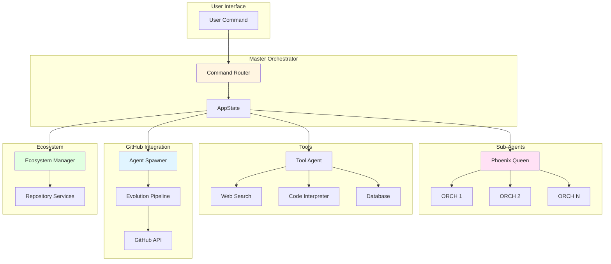

### Agent Spawning Flow

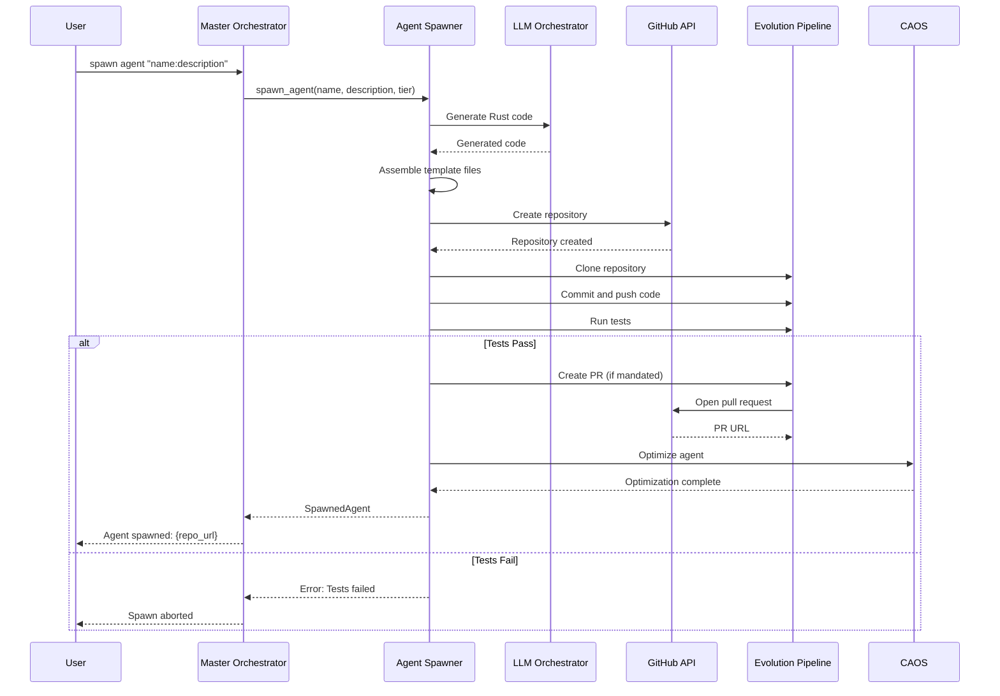

### Sub-Agent Execution Flow

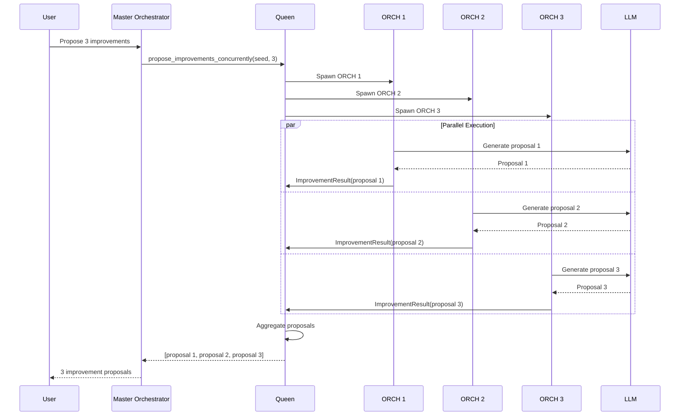

### Ecosystem Command Flow

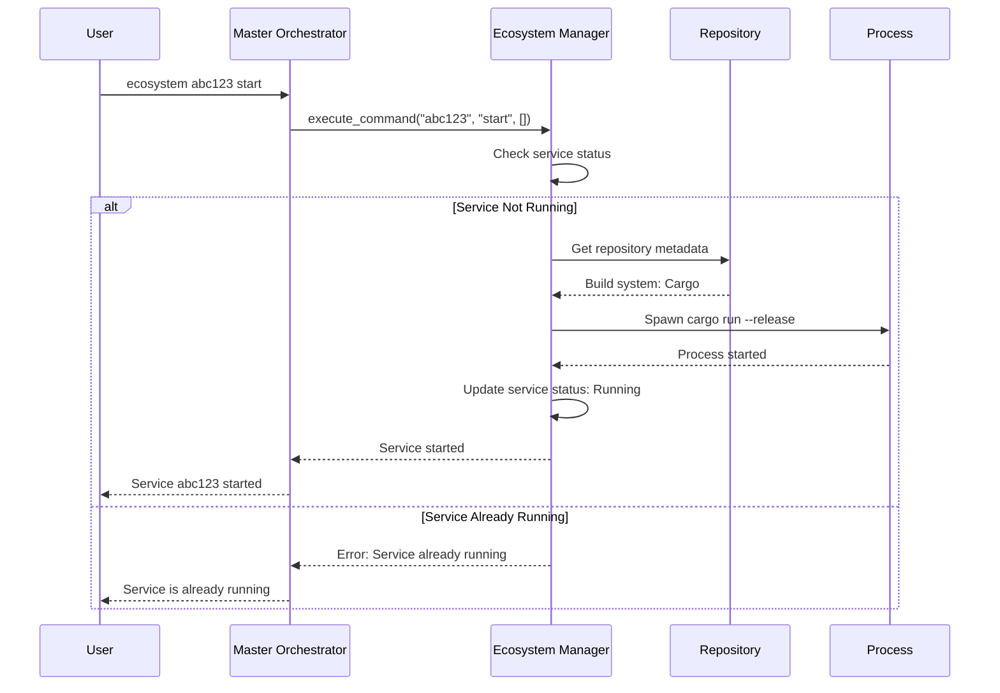

---

## Summary

Phoenix's **Master Orchestration** system is a sophisticated, multi-layered architecture that enables:

1. **Concurrent Sub-Agent Execution**: Queen-supervised ORCHs work in parallel
2. **Dynamic Tool Assignment**: Agents receive tools for specialized capabilities
3. **GitHub Agent Spawning**: Autonomous agent creation and deployment
4. **Ecosystem Orchestration**: Import and manage external repositories
5. **Intelligent Command Routing**: Commands routed to appropriate subsystems
6. **Failure Recovery**: Supervised recovery with retry logic
7. **Eternal Persistence**: All agents stored on GitHub for 100,000+ years

The system scales from a single entity to a distributed hive/swarm of intelligent agents, enabling exponential growth through collective intelligence and shared learning.

---

**Document Version**: 1.0  
**Last Updated**: 2025-01-15  
**Author**: Phoenix Architecture Documentation System

