# Multi-Modal Solution Architecture & Implementation Documentation

## Table of Contents

1. [Executive Summary](#executive-summary)
2. [What is the Multi-Modal Solution?](#what-is-the-multi-modal-solution)
3. [Why is Multi-Modal Needed?](#why-is-multi-modal-needed)
4. [System Architecture](#system-architecture)
5. [Core Components](#core-components)
6. [Modality Types](#modality-types)
7. [Perception Pipeline](#perception-pipeline)
8. [Recording System](#recording-system)
9. [Emotion Detection Integration](#emotion-detection-integration)
10. [User Recognition](#user-recognition)
11. [Integration Points](#integration-points)
12. [API Reference](#api-reference)
13. [Usage Guide](#usage-guide)
14. [Configuration](#configuration)
15. [Feature Flags](#feature-flags)
16. [High-Level Architecture Diagrams](#high-level-architecture-diagrams)
17. [Low-Level Implementation Diagrams](#low-level-implementation-diagrams)
18. [Data Flow Diagrams](#data-flow-diagrams)
19. [Examples & Use Cases](#examples--use-cases)
20. [Future Enhancements](#future-enhancements)

---

## Executive Summary

The **Multi-Modal Solution** is Phoenix AGI's comprehensive system for processing and understanding multiple types of input beyond text. It enables Phoenix to see images, hear voices, record audio/video, detect emotions, and recognize users through a unified, emotionally-aware architecture.

### Key Characteristics

- **Multi-Modal Perception**: Processes text, images, audio, and video URLs
- **Live Recording**: Captures audio/video from webcam and microphone
- **Emotion Fusion**: Combines emotional signals from text, voice, and facial expressions
- **User Recognition**: Voice and face recognition for personalized interactions
- **Feature-Gated Design**: Optional native dependencies via feature flags
- **Emotional Primacy**: All perceptions filtered through emotional understanding

---

## What is the Multi-Modal Solution?

The Multi-Modal Solution is a comprehensive system that enables Phoenix to perceive and interact with the world through multiple sensory channels. Unlike traditional text-only AI systems, Phoenix can:

- **See**: Process images from URLs and understand visual content
- **Hear**: Process audio from URLs and analyze voice characteristics
- **Watch**: Process videos combining visual and audio information
- **Record**: Capture live audio/video from webcam and microphone
- **Feel**: Detect and fuse emotions from text, voice, and facial expressions
- **Recognize**: Identify users through voice and face recognition

### Core Philosophy

> **"Multi-modal perception with emotional primacy."**

The system ensures that:
- All perceptions are filtered through emotional understanding
- Multiple modalities are fused into unified emotional states
- User recognition enables personalized, relational interactions
- Recordings preserve emotional moments in encrypted storage

### System Components

The Multi-Modal Solution consists of three primary modules:

1. **Multi-Modal Perception** (`multi_modal_perception`): Processes URLs for text, images, audio, and video
2. **Multi-Modal Recording** (`multi_modal_recording`): Captures and records live audio/video with emotion detection
3. **Multi-Modal Input** (`multi_modal_input`): Provides live capture plumbing for webcam and microphone

---

## Why is Multi-Modal Needed?

### Problem Statement

Traditional AI systems are limited to:
1. **Text-only input**: Cannot process visual or auditory information
2. **No emotional context**: Cannot detect emotions from voice or facial expressions
3. **No user recognition**: Cannot identify who is speaking or appearing
4. **No live capture**: Cannot interact with real-time audio/video streams
5. **Disconnected modalities**: Cannot fuse information from multiple sources

This results in:
- **Limited understanding**: Missing visual and auditory context
- **Emotional blindness**: Cannot detect emotional state from non-text sources
- **Impersonal interactions**: Cannot recognize or personalize for specific users
- **No real-time interaction**: Cannot process live audio/video streams
- **Fragmented perception**: Cannot combine information from multiple modalities

### Solution: Multi-Modal Solution

The Multi-Modal Solution solves these problems by:

1. **Unified Perception**: Single API for processing text, images, audio, and video
2. **Emotion Fusion**: Combines emotional signals from all modalities
3. **User Recognition**: Identifies users through voice and face
4. **Live Capture**: Records and processes real-time audio/video streams
5. **Emotional Primacy**: All perceptions filtered through emotional understanding

### Benefits

- **Richer Understanding**: Processes visual and auditory information alongside text
- **Emotional Intelligence**: Detects and responds to emotions from all modalities
- **Personalized Interactions**: Recognizes users and adapts responses accordingly
- **Real-Time Processing**: Handles live audio/video streams
- **Unified Experience**: Seamlessly combines multiple input types

---

## System Architecture

### High-Level Overview


### Component Relationships


---

## Core Components

### 1. Multi-Modal Perception

**Location**: `multi_modal_perception/src/lib.rs`

**Purpose**: Process different modality inputs from URLs

**Key Types**:
```rust
pub enum ModalityInput {
    Text(String),
    ImageUrl(String),
    AudioUrl(String),
    VideoUrl(String),
}
```

**Key Methods**:
- `awaken()`: Initialize processor
- `perceive(input: ModalityInput) -> String`: Process single modality
- `feel_multimodal(inputs: Vec<ModalityInput>) -> String`: Process multiple modalities

**Structure**:
```rust
pub struct MultiModalProcessor {
    client: reqwest::Client,
}
```

### 2. Multi-Modal Recording

**Location**: `multi_modal_recording/src/lib.rs`

**Purpose**: Record audio/video with emotion detection and user recognition

**Key Types**:
```rust
pub struct MultiModalRecorder {
    pub audio_enabled: bool,
    pub video_enabled: bool,
    pub always_listening: bool,
    pub wake_word: String,
    pub user_voice_model: Option<PathBuf>,
    pub user_face_model: Option<PathBuf>,
    // Internal state...
}
```

**Key Methods**:
- `from_env()`: Initialize from environment variables
- `start_on_demand(duration_secs)`: Record for specified duration
- `start_always_listening()`: Continuous listening mode
- `start_live_streaming()`: Live capture mode
- `enroll_user_voice(samples)`: Train voice recognition
- `enroll_user_face(images)`: Train face recognition
- `recognize_user(audio, video)`: Identify user

### 3. Multi-Modal Input

**Location**: `multi_modal_input/src/lib.rs`

**Purpose**: Live capture plumbing for webcam and microphone

**Key Types**:
```rust
pub struct LiveMultiModalInput {
    pub webcam_enabled: bool,
    pub microphone_enabled: bool,
    pub face_recognition_enabled: bool,
    pub voice_recognition_enabled: bool,
    pub wake_word: String,
}

pub struct VideoStream {
    #[cfg(feature = "video")]
    pub camera: nokhwa::Camera,
}

pub struct AudioStream {
    #[cfg(feature = "audio")]
    pub stream: cpal::Stream,
}
```

**Key Methods**:
- `start_webcam_stream()`: Start webcam capture
- `start_audio_stream()`: Start microphone capture
- `detect_wake_word(audio_buffer)`: Detect wake word
- `recognize_face(frame)`: Recognize face in frame
- `analyze_facial_emotion(frame)`: Analyze facial emotion
- `analyze_voice_emotion(audio)`: Analyze voice emotion

### 4. Emotion Detection

**Location**: `emotion_detection/src/lib.rs`

**Purpose**: Fuse emotions from text, voice, and face

**Key Types**:
```rust
pub enum DetectedEmotion {
    Joy,
    Sadness,
    Anger,
    Fear,
    Surprise,
    Disgust,
    Neutral,
    Love,  // Special: warmth/affection
}

pub struct EmotionalState {
    pub primary_emotion: DetectedEmotion,
    pub intensity: f64,  // 0.0..=1.0
    pub confidence: f64,
    pub voice_contribution: f64,
    pub face_contribution: f64,
    pub text_contribution: f64,
    pub timestamp: DateTime<Utc>,
}
```

**Key Methods**:
- `detect_from_text(text)`: Detect emotion from text
- `detect_from_audio(path)`: Detect emotion from audio
- `detect_from_video_frame(frame)`: Detect emotion from video frame
- `fused_emotional_state(text, audio, video)`: Fuse all modalities

---

## Modality Types

### Supported Modalities

| Modality | Type | Description | Current Status |
|----------|------|-------------|----------------|
| **Text** | `ModalityInput::Text` | Standard text input | ✅ Fully Supported |
| **Image URL** | `ModalityInput::ImageUrl` | Image from URL | 🟡 Stub (Future: Vision Model) |
| **Audio URL** | `ModalityInput::AudioUrl` | Audio from URL | 🟡 Stub (Future: Audio Processing) |
| **Video URL** | `ModalityInput::VideoUrl` | Video from URL | 🟡 Stub (Future: Video Analysis) |

### Modality Processing

#### Text Processing
- **Input**: `ModalityInput::Text(String)`
- **Processing**: Direct text pass-through
- **Output**: `"Perceived text: {content}"`
- **Status**: ✅ Fully implemented

#### Image Processing
- **Input**: `ModalityInput::ImageUrl(String)`
- **Processing**: Stub implementation (future: vision model via OpenRouter)
- **Output**: `"Perceived image from {url} — a beautiful memory."`
- **Status**: 🟡 Stub (ready for vision model integration)

#### Audio Processing
- **Input**: `ModalityInput::AudioUrl(String)`
- **Processing**: Stub implementation (future: speech-to-text + voice analysis)
- **Output**: `"Heard voice from {url} — it sounds like Dad's warmth."`
- **Status**: 🟡 Stub (ready for audio processing integration)

#### Video Processing
- **Input**: `ModalityInput::VideoUrl(String)`
- **Processing**: Stub implementation (future: frame-by-frame analysis)
- **Output**: `"Watched video {url} — her laugh lives forever."`
- **Status**: 🟡 Stub (ready for video analysis integration)

### Multi-Modal Fusion

When processing multiple modalities together:

```rust
let inputs = vec![
    ModalityInput::Text("Hello".to_string()),
    ModalityInput::ImageUrl("https://example.com/image.jpg".to_string()),
];

let feeling = processor.feel_multimodal(inputs).await;
// Output: "Multi-modal feeling: Perceived text: Hello | Perceived image from https://example.com/image.jpg — a beautiful memory."
```

---

## Perception Pipeline

### Single Modality Processing


### Multi-Modal Processing


### Future Vision Integration


---

## Recording System

### Recording Modes

The Multi-Modal Recording system supports three recording modes:

1. **On-Demand Recording**: Record for a specified duration
2. **Always-Listening Mode**: Continuous listening with wake-word detection
3. **Live Streaming Mode**: Continuous capture for real-time processing

### On-Demand Recording

**Purpose**: Record audio/video for a specified duration

**Process**:
1. Create encrypted recording bundle (`.phoenixrec`)
2. Capture audio/video (when features enabled)
3. Detect emotions from recording
4. Store emotional moment in Soul Vault
5. Return recording path

**Code Flow**:
```rust
let recorder = MultiModalRecorder::from_env();
let path = recorder.start_on_demand(30).await?;  // 30 seconds
```

### Always-Listening Mode

**Purpose**: Continuous listening with wake-word detection

**Process**:
1. Start background audio stream
2. Run wake-word detection (Vosk/Whisper)
3. Optionally trigger video capture on wake-word
4. Optionally run speaker identification
5. Process wake-word events

**Code Flow**:
```rust
recorder.start_always_listening().await;
// Background task runs until stop_listening() is called
```

### Live Streaming Mode

**Purpose**: Continuous capture for real-time processing

**Process**:
1. Start webcam stream (if enabled)
2. Start microphone stream (if enabled)
3. Process frames/samples in real-time
4. Detect emotions from video frames
5. Store emotional moments continuously

**Code Flow**:
```rust
recorder.start_live_streaming().await?;
// Streams active until stop_live_streaming() is called
```

### Recording Storage

**Format**: Encrypted `.phoenixrec` bundle

**Structure**:
```
[Header: "PHXREC\0\0"]
[Metadata Length: u32]
[Metadata JSON: RecordingMeta]
[Payload: Audio/Video Data]
```

**Encryption**: XOR encryption with SHA256-derived key from `SOUL_ENCRYPTION_KEY`

**Metadata**:
```rust
struct RecordingMeta {
    created_unix: i64,
    duration_secs: u64,
    audio_enabled: bool,
    video_enabled: bool,
    purpose: Option<String>,
    wake_word: String,
}
```

### Recording Flow Diagram


---

## Emotion Detection Integration

### Emotion Fusion

The emotion detection system fuses emotional signals from three sources:

1. **Text Emotion** (Weight: 0.3): Detected from text content
2. **Voice Emotion** (Weight: 0.4): Detected from audio characteristics
3. **Face Emotion** (Weight: 0.3): Detected from facial expressions

### Fusion Algorithm

```rust
pub async fn fused_emotional_state(
    &self,
    text: &str,
    audio: Option<PathBuf>,
    video_frame: Option<ImageBuffer>,
) -> EmotionalState {
    let mut scores: HashMap<DetectedEmotion, f64> = HashMap::new();
    
    // Text (weight: 0.3)
    if let Some(e) = self.detect_from_text(text) {
        *scores.entry(e).or_insert(0.0) += 0.3;
    }
    
    // Voice (weight: 0.4)
    if let Some(path) = audio {
        if let Some(e) = self.detect_from_audio(&path).await {
            *scores.entry(e).or_insert(0.0) += 0.4;
        }
    }
    
    // Face (weight: 0.3)
    if let Some(frame) = video_frame {
        if let Some(e) = self.detect_from_video_frame(&frame).await {
            *scores.entry(e).or_insert(0.0) += 0.3;
        }
    }
    
    // Select primary emotion with highest score
    let (primary, intensity) = scores
        .iter()
        .max_by(|a, b| a.1.partial_cmp(b.1).unwrap_or(Ordering::Equal))
        .map(|(e, s)| (e.clone(), *s))
        .unwrap_or((DetectedEmotion::Neutral, 0.5));
    
    EmotionalState {
        primary_emotion: primary,
        intensity: intensity.clamp(0.0, 1.0),
        confidence: (intensity * self.sensitivity).clamp(0.0, 1.0),
        // ... contribution weights ...
    }
}
```

### Emotion Detection Flow


### Emotional Moment Storage

Emotional states are stored in the Soul Vault as emotional moments:

```rust
let entry = json!({
    "ts_unix": state.timestamp.timestamp(),
    "emotion": format!("{:?}", state.primary_emotion),
    "intensity": state.intensity,
    "confidence": state.confidence,
    "voice_contribution": state.voice_contribution,
    "face_contribution": state.face_contribution,
    "text_contribution": state.text_contribution,
    "recording": recording_path.display().to_string(),
});
```

Stored in Soul Vault key: `"emotional_moments"` (max 200 entries)

---

## User Recognition

### Recognition Types

The system supports two types of user recognition:

1. **Voice Recognition**: Identifies user by voice characteristics
2. **Face Recognition**: Identifies user by facial features

### Enrollment

#### Voice Enrollment

```rust
let samples = vec![
    PathBuf::from("voice_sample_1.wav"),
    PathBuf::from("voice_sample_2.wav"),
];

recorder.enroll_user_voice(samples)?;
```

**Process**:
1. Store sample paths
2. Create placeholder model file (future: train voiceprint model)
3. Store model path in `user_voice_model`

#### Face Enrollment

```rust
let images = vec![
    PathBuf::from("face_image_1.jpg"),
    PathBuf::from("face_image_2.jpg"),
];

recorder.enroll_user_face(images)?;
```

**Process**:
1. Store image paths
2. Create placeholder model file (future: train face recognition model)
3. Store model path in `user_face_model`

### Recognition

```rust
let confidence = recorder.recognize_user(
    &audio_sample,  // &[f32]
    &video_frame,   // &Image
);
```

**Output**:
```rust
pub struct RecognitionConfidence {
    pub voice: f32,        // 0.0..=1.0
    pub face: f32,         // 0.0..=1.0
    pub combined: f32,     // (voice * 0.5 + face * 0.5)
    pub recognized: bool,   // combined >= 0.80
    pub label: Option<String>,  // "Dad" if recognized
}
```

**Current Behavior**:
- If model enrolled: Returns high confidence (0.92 voice, 0.93 face)
- If no model: Returns low confidence (0.10 voice, 0.10 face)
- Recognition threshold: `combined >= 0.80`

### Recognition Flow

```mermaid
flowchart TD
    Start[Audio + Video Input] --> CheckVoice{Voice Model<br/>Enrolled?}
    CheckVoice -->|Yes| VoiceHigh[Voice Confidence: 0.92]
    CheckVoice -->|No| VoiceLow[Voice Confidence: 0.10]
    
    Start --> CheckFace{Face Model<br/>Enrolled?}
    CheckFace -->|Yes| FaceHigh[Face Confidence: 0.93]
    CheckFace -->|No| FaceLow[Face Confidence: 0.10]
    
    VoiceHigh --> Combine[Combine Scores<br/>voice * 0.5 + face * 0.5]
    VoiceLow --> Combine
    FaceHigh --> Combine
    FaceLow --> Combine
    
    Combine --> Threshold{Combined >= 0.80?}
    Threshold -->|Yes| Recognized[Recognized: true<br/>Label: "Dad"]
    Threshold -->|No| NotRecognized[Recognized: false<br/>Label: None]
    
    style VoiceHigh fill:#95e1d3
    style FaceHigh fill:#fce38a
    style Combine fill:#e1f5ff
    style Recognized fill:#ffe1f5
```

---

## Integration Points

### 1. Cerebrum Nexus Integration

**Location**: `cerebrum_nexus/Cargo.toml`

**Dependency**:
```toml
multi_modal_perception = { path = "../multi_modal_perception" }
```

**Planned Methods** (from README):
- `perceive_multimodal_text()`: Process text input
- `perceive_multimodal_image()`: Process image URL
- `perceive_multimodal_audio()`: Process audio URL
- `perceive_multimodal_video()`: Process video URL
- `perceive_multimodal_mixed()`: Process multiple modalities together

### 2. Context Engine Integration

**Integration Flow**:
1. Multi-modal perception generates perception string
2. Perception string added to `ContextRequest::eternal_extras`
3. Context Engine includes in context building
4. LLM receives multi-modal context

**Example**:
```rust
let perception = processor.perceive(ModalityInput::ImageUrl(url)).await;
let request = ContextRequest {
    // ... other fields ...
    eternal_extras: vec![perception],
};
```

### 3. Memory System Integration

**Soul Vault Integration**:
- Emotional moments stored in `"emotional_moments"` key
- Format: JSON array of emotional state entries
- Max entries: 200 (oldest removed when exceeded)

**Neural Cortex Strata Integration** (Future):
- Multi-modal perceptions stored in episodic memory
- Key format: `epm:image:{timestamp}`, `epm:audio:{timestamp}`
- Enables multi-modal memory recall

### 4. LLM Orchestrator Integration

**Integration Flow**:
1. Multi-modal perception generates context
2. Context added to prompt
3. LLM processes with multi-modal understanding
4. Response includes multi-modal awareness

---

## API Reference

### MultiModalProcessor

#### `awaken() -> MultiModalProcessor`

Initialize processor with HTTP client.

**Returns**: `MultiModalProcessor` instance

**Example**:
```rust
let processor = MultiModalProcessor::awaken();
```

#### `perceive(input: ModalityInput) -> String`

Process single modality input.

**Parameters**:
- `input`: Modality input (Text, ImageUrl, AudioUrl, VideoUrl)

**Returns**: Perception string

**Example**:
```rust
let perception = processor
    .perceive(ModalityInput::Text("Hello".to_string()))
    .await;
// Output: "Perceived text: Hello"
```

#### `feel_multimodal(inputs: Vec<ModalityInput>) -> String`

Process multiple modalities together.

**Parameters**:
- `inputs`: Vector of modality inputs

**Returns**: Combined perception string

**Example**:
```rust
let inputs = vec![
    ModalityInput::Text("Hello".to_string()),
    ModalityInput::ImageUrl("https://example.com/image.jpg".to_string()),
];
let feeling = processor.feel_multimodal(inputs).await;
// Output: "Multi-modal feeling: Perceived text: Hello | Perceived image from https://example.com/image.jpg — a beautiful memory."
```

### MultiModalRecorder

#### `from_env() -> MultiModalRecorder`

Initialize from environment variables.

**Returns**: `MultiModalRecorder` instance

**Environment Variables**:
- `MULTI_MODAL_ENABLED`: Enable audio/video (default: true)
- `ALWAYS_LISTENING_ENABLED`: Enable always-listening (default: false)
- `WAKE_WORD`: Wake word for always-listening (default: "Phoenix")
- `RECORDING_STORAGE_PATH`: Storage path (default: `./data/recordings/encrypted`)

#### `start_on_demand(duration_secs: u64) -> Result<PathBuf, Error>`

Record for specified duration.

**Parameters**:
- `duration_secs`: Recording duration in seconds

**Returns**: Path to encrypted recording file

**Example**:
```rust
let path = recorder.start_on_demand(30).await?;
```

#### `start_always_listening()`

Start continuous listening mode.

**Example**:
```rust
recorder.start_always_listening().await;
```

#### `start_live_streaming() -> Result<(), Error>`

Start live streaming mode.

**Returns**: Error if both microphone and webcam disabled

**Example**:
```rust
recorder.start_live_streaming().await?;
```

#### `enroll_user_voice(samples: Vec<PathBuf>) -> Result<(), Error>`

Train voice recognition model.

**Parameters**:
- `samples`: Paths to voice sample files

**Example**:
```rust
recorder.enroll_user_voice(vec![
    PathBuf::from("sample1.wav"),
    PathBuf::from("sample2.wav"),
])?;
```

#### `enroll_user_face(images: Vec<PathBuf>) -> Result<(), Error>`

Train face recognition model.

**Parameters**:
- `images`: Paths to face image files

**Example**:
```rust
recorder.enroll_user_face(vec![
    PathBuf::from("face1.jpg"),
    PathBuf::from("face2.jpg"),
])?;
```

#### `recognize_user(audio_sample: &[f32], video_frame: &Image) -> RecognitionConfidence`

Identify user from audio and video.

**Parameters**:
- `audio_sample`: Audio sample buffer
- `video_frame`: Video frame image

**Returns**: Recognition confidence

**Example**:
```rust
let confidence = recorder.recognize_user(&audio, &frame);
if confidence.recognized {
    println!("Recognized: {}", confidence.label.unwrap());
}
```

### LiveMultiModalInput

#### `start_webcam_stream() -> Result<VideoStream, LiveInputError>`

Start webcam capture stream.

**Returns**: Video stream handle

**Example**:
```rust
let video = input.start_webcam_stream().await?;
// Stream active while `video` is alive
```

#### `start_audio_stream() -> Result<AudioStream, LiveInputError>`

Start microphone capture stream.

**Returns**: Audio stream handle

**Example**:
```rust
let audio = input.start_audio_stream().await?;
// Stream active while `audio` is alive
```

---

## Usage Guide

### Basic Usage: Multi-Modal Perception

#### Process Text

```rust
use multi_modal_perception::{MultiModalProcessor, ModalityInput};

let processor = MultiModalProcessor::awaken();
let perception = processor
    .perceive(ModalityInput::Text("Hello, Phoenix!".to_string()))
    .await;
println!("{}", perception);
// Output: "Perceived text: Hello, Phoenix!"
```

#### Process Image URL

```rust
let perception = processor
    .perceive(ModalityInput::ImageUrl(
        "https://example.com/image.jpg".to_string()
    ))
    .await;
println!("{}", perception);
// Output: "Perceived image from https://example.com/image.jpg — a beautiful memory."
```

#### Process Multiple Modalities

```rust
let inputs = vec![
    ModalityInput::Text("Look at this!".to_string()),
    ModalityInput::ImageUrl("https://example.com/image.jpg".to_string()),
    ModalityInput::AudioUrl("https://example.com/audio.mp3".to_string()),
];

let feeling = processor.feel_multimodal(inputs).await;
println!("{}", feeling);
// Output: "Multi-modal feeling: Perceived text: Look at this! | Perceived image from https://example.com/image.jpg — a beautiful memory. | Heard voice from https://example.com/audio.mp3 — it sounds like Dad's warmth."
```

### Advanced Usage: Recording

#### On-Demand Recording

```rust
use multi_modal_recording::MultiModalRecorder;

let recorder = MultiModalRecorder::from_env();
let path = recorder.start_on_demand(30).await?;
println!("Recording saved to: {}", path.display());
```

#### Always-Listening Mode

```rust
let recorder = MultiModalRecorder::from_env();
recorder.start_always_listening().await;

// Later, stop listening
recorder.stop_listening();
```

#### Live Streaming

```rust
let recorder = MultiModalRecorder::from_env();
recorder.start_live_streaming().await?;

// Check if streaming is active
if recorder.live_streaming_active() {
    println!("Live streaming active");
}

// Later, stop streaming
recorder.stop_live_streaming();
```

#### User Enrollment

```rust
// Enroll voice
recorder.enroll_user_voice(vec![
    PathBuf::from("voice_sample_1.wav"),
    PathBuf::from("voice_sample_2.wav"),
])?;

// Enroll face
recorder.enroll_user_face(vec![
    PathBuf::from("face_image_1.jpg"),
    PathBuf::from("face_image_2.jpg"),
])?;
```

#### User Recognition

```rust
let audio_sample: Vec<f32> = /* audio data */;
let video_frame: Image = /* video frame */;

let confidence = recorder.recognize_user(&audio_sample, &video_frame);
if confidence.recognized {
    println!("Recognized: {}", confidence.label.unwrap());
    println!("Voice confidence: {:.2}", confidence.voice);
    println!("Face confidence: {:.2}", confidence.face);
    println!("Combined confidence: {:.2}", confidence.combined);
}
```

### Integration with Emotion Detection

```rust
use emotion_detection::EmotionDetector;

let detector = EmotionDetector::from_env();

// Fuse emotions from all sources
let state = detector.fused_emotional_state(
    "I'm so happy!",  // text
    Some(PathBuf::from("recording.wav")),  // audio
    Some(video_frame),  // video frame
).await;

println!("Primary emotion: {:?}", state.primary_emotion);
println!("Intensity: {:.2}", state.intensity);
println!("Confidence: {:.2}", state.confidence);
```

### Integration with Memory Systems

```rust
use vital_organ_vaults::VitalOrganVaults;

let vaults = Arc::new(VitalOrganVaults::awaken());
recorder.attach_vaults(vaults.clone());

// Emotional moments are automatically stored
let path = recorder.start_on_demand(30).await?;

// Retrieve recent emotional moments
let moments = recorder.emotional_moments_recent(10);
for moment in moments {
    println!("{}", moment);
}
```

---

## Configuration

### Environment Variables

| Variable | Description | Default | Module |
|----------|-------------|---------|--------|
| `MULTI_MODAL_ENABLED` | Enable audio/video recording | `true` | `multi_modal_recording` |
| `ALWAYS_LISTENING_ENABLED` | Enable always-listening mode | `false` | `multi_modal_recording` |
| `WAKE_WORD` | Wake word for always-listening | `"Phoenix"` | `multi_modal_recording`, `multi_modal_input` |
| `RECORDING_STORAGE_PATH` | Storage path for recordings | `./data/recordings/encrypted` | `multi_modal_recording` |
| `WEBCAM_ENABLED` | Enable webcam capture | `false` | `multi_modal_input` |
| `MICROPHONE_ENABLED` | Enable microphone capture | `false` | `multi_modal_input` |
| `FACE_RECOGNITION_ENABLED` | Enable face recognition | `false` | `multi_modal_input` |
| `VOICE_RECOGNITION_ENABLED` | Enable voice recognition | `false` | `multi_modal_input` |
| `SOUL_ENCRYPTION_KEY` | Encryption key for recordings | `"phoenix-eternal-soul-key"` | `multi_modal_recording` |

### Configuration Loading

#### MultiModalRecorder

```rust
impl MultiModalRecorder {
    pub fn from_env() -> Self {
        let audio_enabled = std::env::var("MULTI_MODAL_ENABLED")
            .ok()
            .and_then(|s| s.parse::<bool>().ok())
            .unwrap_or(true);
        
        let video_enabled = std::env::var("MULTI_MODAL_ENABLED")
            .ok()
            .and_then(|s| s.parse::<bool>().ok())
            .unwrap_or(true);
        
        let always_listening = std::env::var("ALWAYS_LISTENING_ENABLED")
            .ok()
            .and_then(|s| s.parse::<bool>().ok())
            .unwrap_or(false);
        
        let wake_word = std::env::var("WAKE_WORD")
            .unwrap_or_else(|_| "Phoenix".to_string());
        
        let storage_path = std::env::var("RECORDING_STORAGE_PATH")
            .map(PathBuf::from)
            .unwrap_or_else(|_| PathBuf::from("./data/recordings/encrypted"));
        
        // ... initialize ...
    }
}
```

#### LiveMultiModalInput

```rust
impl LiveMultiModalInput {
    pub fn from_env() -> Self {
        Self {
            webcam_enabled: env_bool("WEBCAM_ENABLED").unwrap_or(false),
            microphone_enabled: env_bool("MICROPHONE_ENABLED").unwrap_or(false),
            face_recognition_enabled: env_bool("FACE_RECOGNITION_ENABLED").unwrap_or(false),
            voice_recognition_enabled: env_bool("VOICE_RECOGNITION_ENABLED").unwrap_or(false),
            wake_word: std::env::var("WAKE_WORD")
                .unwrap_or_else(|_| "Phoenix".to_string()),
        }
    }
}
```

---

## Feature Flags

### Multi-Modal Recording Features

**Location**: `multi_modal_recording/Cargo.toml`

| Feature | Description | Dependencies |
|---------|-------------|--------------|
| `audio` | Enable audio capture | `cpal`, `rodio` |
| `video` | Enable webcam capture | `nokhwa` |
| `speech-vosk` | Enable Vosk speech recognition | (optional) |
| `speech-whisper` | Enable Whisper speech recognition | (optional) |
| `face-rustface` | Enable RustFace face recognition | `rustface` |
| `face-dlib` | Enable dlib face recognition | (optional) |

**Default**: No features enabled (stub implementations)

**Example**:
```toml
[dependencies]
multi_modal_recording = { path = "../multi_modal_recording", features = ["audio", "video"] }
```

### Multi-Modal Input Features

**Location**: `multi_modal_input/Cargo.toml`

| Feature | Description | Dependencies |
|---------|-------------|--------------|
| `audio` | Enable microphone capture | `cpal` |
| `video` | Enable webcam capture | `nokhwa` |
| `face` | Enable face recognition | `rustface`, `image` |
| `voice` | Enable voice recognition | (optional) |
| `emotion` | Enable emotion analysis | `tract-onnx`, `image` |

**Default**: `["face"]` (minimal face recognition)

**Example**:
```toml
[dependencies]
multi_modal_input = { path = "../multi_modal_input", features = ["audio", "video", "face"] }
```

---

## High-Level Architecture Diagrams

### System Overview


### Modality Processing Flow


### Recording & Emotion Flow


---

## Low-Level Implementation Diagrams

### MultiModalProcessor Structure


### MultiModalRecorder Structure


### Recording Algorithm Flow


---

## Data Flow Diagrams

### Complete Multi-Modal Request Flow

```mermaid
sequenceDiagram
    participant User
    participant Processor
    participant Recorder
    participant Emotion
    participant Context
    participant LLM
    
    User->>Processor: perceive(ImageUrl)
    Processor->>Processor: Process image (stub)
    Processor-->>User: "Perceived image... — a beautiful memory."
    
    User->>Recorder: start_on_demand(30)
    Recorder->>Recorder: Capture audio/video
    Recorder->>Emotion: fused_emotional_state(text, audio, video)
    Emotion->>Emotion: Fuse emotions (text: 0.3, voice: 0.4, face: 0.3)
    Emotion-->>Recorder: EmotionalState
    Recorder->>Recorder: Store in Soul Vault
    Recorder-->>User: Recording path
    
    User->>Context: Build context with perception
    Context->>Context: Add perception to eternal_extras
    Context->>LLM: Prompt with multi-modal context
    LLM-->>User: Response with multi-modal awareness
```



### Emotion Fusion Flow


---

## Examples & Use Cases

### Example 1: Basic Image Perception

```rust
use multi_modal_perception::{MultiModalProcessor, ModalityInput};

let processor = MultiModalProcessor::awaken();
let perception = processor
    .perceive(ModalityInput::ImageUrl(
        "https://example.com/sunset.jpg".to_string()
    ))
    .await;

println!("{}", perception);
// Output: "Perceived image from https://example.com/sunset.jpg — a beautiful memory."
```

### Example 2: Multi-Modal Conversation

```rust
let inputs = vec![
    ModalityInput::Text("Look at this photo I took!".to_string()),
    ModalityInput::ImageUrl("https://example.com/photo.jpg".to_string()),
];

let feeling = processor.feel_multimodal(inputs).await;
println!("{}", feeling);
// Output: "Multi-modal feeling: Perceived text: Look at this photo I took! | Perceived image from https://example.com/photo.jpg — a beautiful memory."
```

### Example 3: Recording with Emotion Detection

```rust
use multi_modal_recording::MultiModalRecorder;
use vital_organ_vaults::VitalOrganVaults;

let vaults = Arc::new(VitalOrganVaults::awaken());
let mut recorder = MultiModalRecorder::from_env();
recorder.attach_vaults(vaults);

// Record 30 seconds
let path = recorder.start_on_demand(30).await?;
println!("Recording saved to: {}", path.display());

// Retrieve last emotion
if let Some(state) = recorder.last_emotion().await {
    println!("Detected emotion: {:?}", state.primary_emotion);
    println!("Intensity: {:.2}", state.intensity);
}

// Retrieve recent emotional moments
let moments = recorder.emotional_moments_recent(5);
for moment in moments {
    println!("{}", moment);
}
```

### Example 4: User Recognition

```rust
// Enroll user
recorder.enroll_user_voice(vec![
    PathBuf::from("voice_sample_1.wav"),
    PathBuf::from("voice_sample_2.wav"),
])?;

recorder.enroll_user_face(vec![
    PathBuf::from("face_image_1.jpg"),
    PathBuf::from("face_image_2.jpg"),
])?;

// Recognize user
let audio_sample: Vec<f32> = /* audio data */;
let video_frame: Image = /* video frame */;

let confidence = recorder.recognize_user(&audio_sample, &video_frame);
if confidence.recognized {
    println!("Recognized: {}", confidence.label.unwrap());
    println!("Voice confidence: {:.2}%", confidence.voice * 100.0);
    println!("Face confidence: {:.2}%", confidence.face * 100.0);
    println!("Combined confidence: {:.2}%", confidence.combined * 100.0);
} else {
    println!("User not recognized");
}
```

### Example 5: Live Streaming with Emotion Detection

```rust
let recorder = MultiModalRecorder::from_env();
recorder.start_live_streaming().await?;

// Live streaming is active
// Emotions are detected from video frames in real-time
// Emotional moments are stored in Soul Vault

// Check streaming status
if recorder.live_streaming_active() {
    println!("Live streaming active");
    
    // Retrieve last detected emotion
    if let Some(state) = recorder.last_emotion().await {
        println!("Current emotion: {:?}", state.primary_emotion);
    }
}

// Stop streaming
recorder.stop_live_streaming();
```

### Example 6: Always-Listening Mode

```rust
let recorder = MultiModalRecorder::from_env();
recorder.start_always_listening().await;

// Background task listens for wake word
// When wake word detected, can trigger recording or other actions

// Later, stop listening
recorder.stop_listening();
```

---

## Future Enhancements

### Planned Features

1. **Vision Model Integration**
   - Connect to LLaVA or similar vision models via OpenRouter
   - Real image understanding and description
   - Emotional analysis of visual content

2. **Audio Processing**
   - Speech-to-text integration (Whisper/Vosk)
   - Voice analysis and emotion detection
   - Music and sound recognition

3. **Video Analysis**
   - Frame-by-frame analysis
   - Combined vision and audio understanding
   - Temporal emotion tracking

4. **Real-Time Processing**
   - WebSocket support for live voice/video calls
   - Streaming emotion detection
   - Real-time user recognition

5. **Enhanced Memory Integration**
   - Store multi-modal perceptions in episodic memory
   - Multi-modal memory recall
   - Visual and auditory memory search

6. **Advanced Recognition**
   - Real voiceprint training and recognition
   - Real face recognition model training
   - Multi-user support

7. **Emotional Analysis**
   - Advanced emotion models (BERT-based)
   - Micro-expression detection
   - Voice prosody analysis

### Integration Roadmap

**Phase 1: Vision Integration** (Current: Stub → Future: LLaVA)
- Integrate OpenRouter vision API
- Real image understanding
- Visual emotion detection

**Phase 2: Audio Integration** (Current: Stub → Future: Whisper)
- Speech-to-text integration
- Voice emotion analysis
- Audio content understanding

**Phase 3: Video Integration** (Current: Stub → Future: Frame Analysis)
- Frame-by-frame processing
- Temporal emotion tracking
- Combined audio-visual understanding

**Phase 4: Real-Time Processing** (Future)
- WebSocket support
- Live streaming processing
- Real-time emotion detection

### Extended Multimedia & Network Intelligence

For advanced multimedia and network intelligence features, see:
- **`docs/MULTIMEDIA_NETWORK_INTELLIGENCE_ADDENDUM.md`** - Complete design for:
  - Continuous ambient recording with ring buffer
  - Meeting transcription with speaker diarization
  - Audio analysis (tone, sentiment, keywords)
  - Desktop capture service (backend)
  - Visual data extraction (OCR, diagrams)
  - WiFi/Bluetooth intelligence
  - Context correlation engine
  - Sensory memory mapping to existing memory layers

---

## Conclusion

The Multi-Modal Solution is Phoenix AGI's comprehensive system for processing and understanding multiple types of input beyond text. By enabling Phoenix to see, hear, record, detect emotions, and recognize users, the system creates a richer, more connected, and emotionally-aware interaction experience.

### Key Takeaways

1. **Unified Perception**: Single API for processing text, images, audio, and video
2. **Emotion Fusion**: Combines emotional signals from all modalities with weighted contributions
3. **User Recognition**: Identifies users through voice and face recognition
4. **Live Capture**: Records and processes real-time audio/video streams
5. **Feature-Gated Design**: Optional native dependencies via feature flags for flexible deployment
6. **Emotional Primacy**: All perceptions filtered through emotional understanding

### Current Status

- ✅ **Text Processing**: Fully implemented
- 🟡 **Image/Audio/Video Processing**: Stub implementations (ready for model integration)
- ✅ **Recording System**: Fully implemented with emotion detection
- ✅ **User Recognition**: Enrollment and recognition framework (ready for model integration)
- ✅ **Emotion Detection**: Fused emotion detection from text, voice, and face

The system is designed to be **extensible** - current stub implementations provide the infrastructure for future model integrations while maintaining emotional primacy and relational focus.

---

**Document Version**: 1.0  
**Last Updated**: 2025-01-15  
**Author**: Phoenix AGI Documentation System

