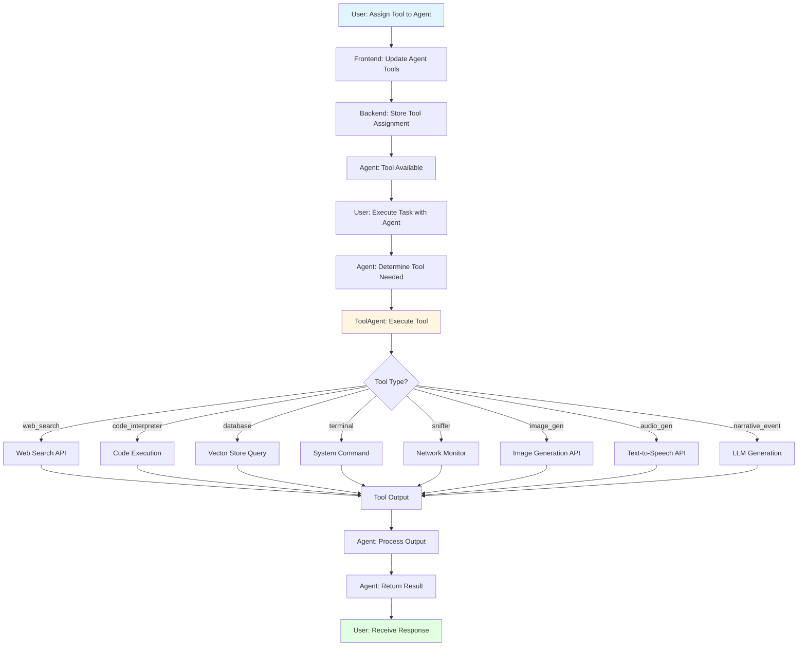
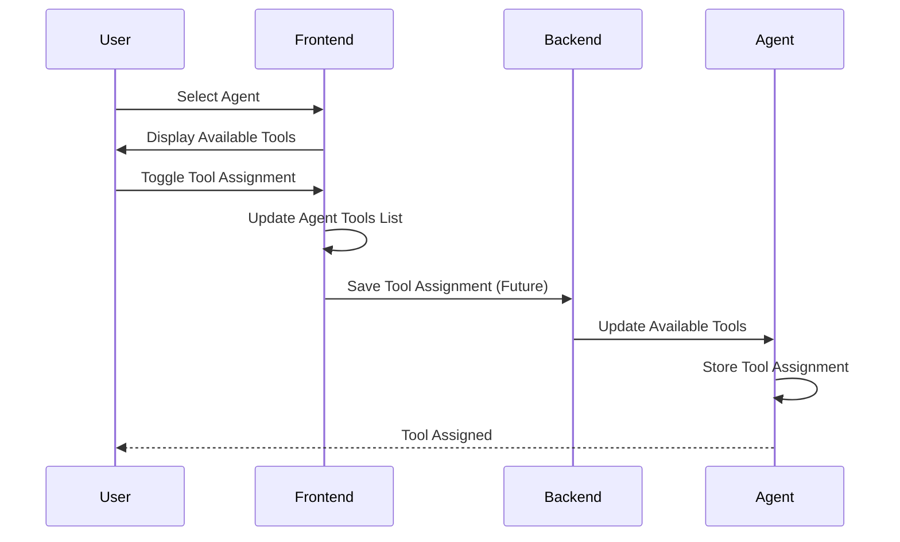
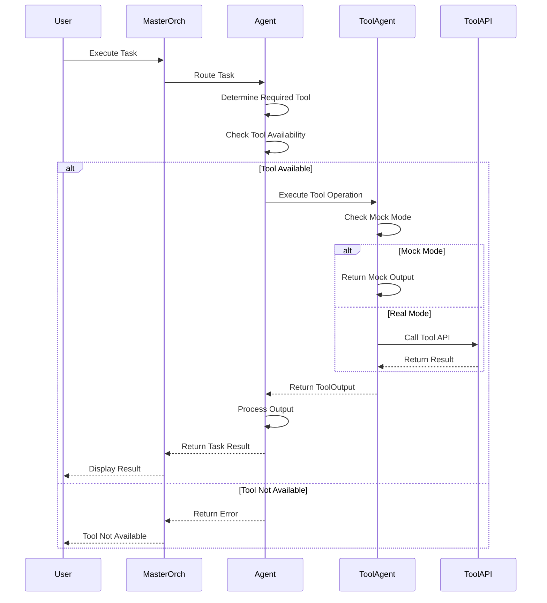
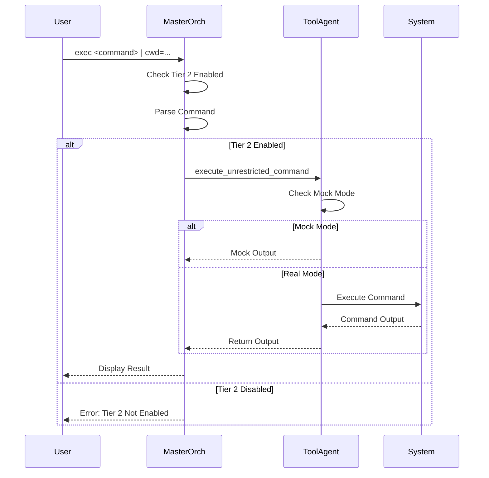
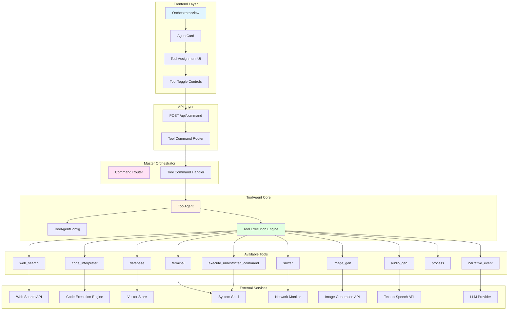
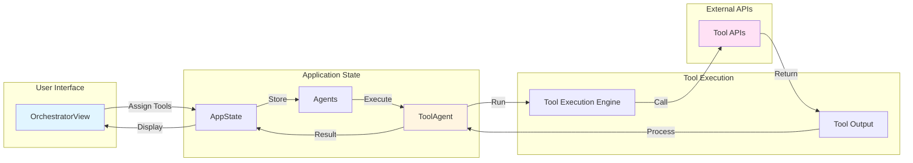
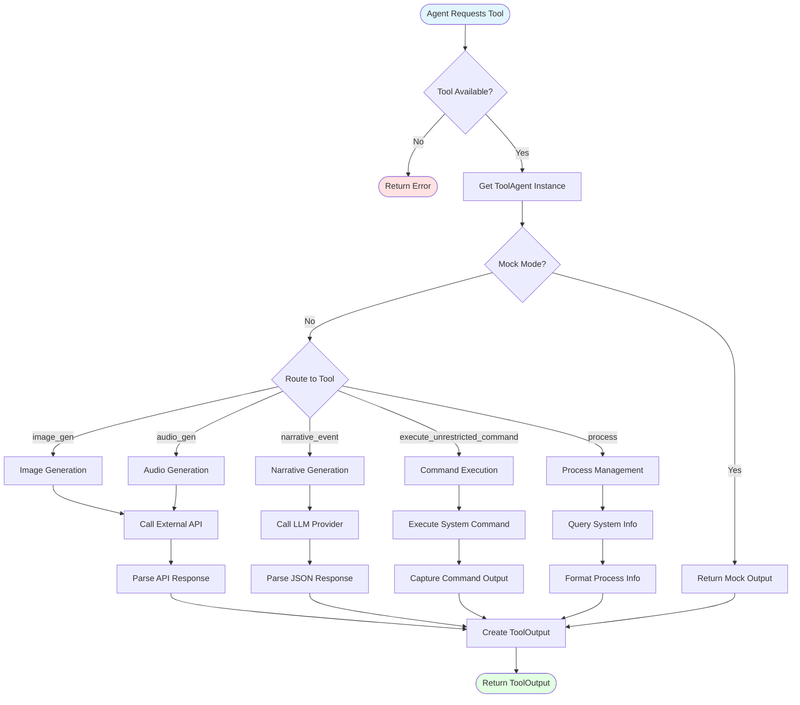
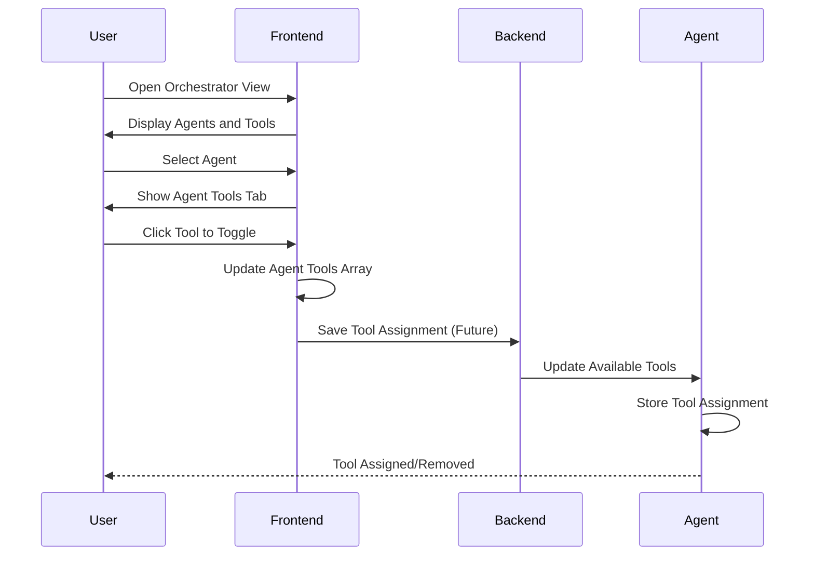
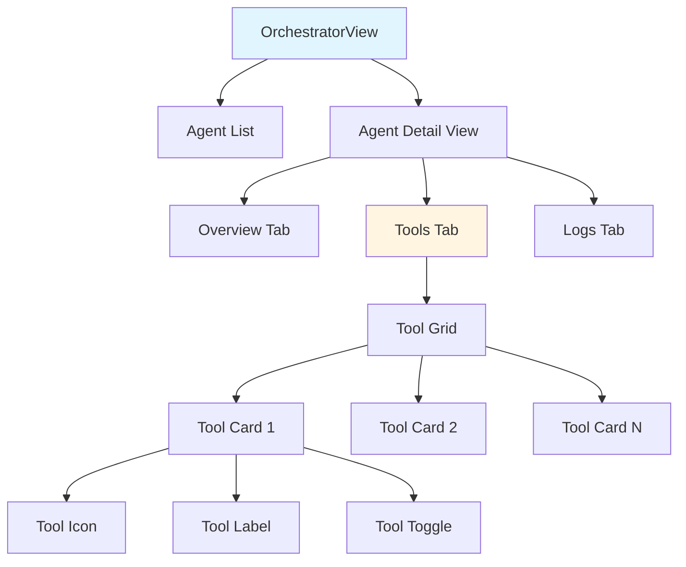

# Tools for Agents Architecture & Implementation

**Document Version**: 1.0  
**Last Updated**: 2025-01-15  
**Status**: Production Ready ✅

---

## Table of Contents

1. [Executive Summary](#executive-summary)
2. [Overview](#overview)
3. [Why Tools for Agents?](#why-tools-for-agents)
4. [What is Tools for Agents?](#what-is-tools-for-agents)
5. [How It Works](#how-it-works)
6. [High-Level Architecture](#high-level-architecture)
7. [Low-Level Implementation](#low-level-implementation)
8. [Available Tools](#available-tools)
9. [Tool Execution](#tool-execution)
10. [Tool Assignment](#tool-assignment)
11. [Tool Output Types](#tool-output-types)
12. [Frontend Integration](#frontend-integration)
13. [Use Cases & Examples](#use-cases--examples)
14. [Configuration](#configuration)
15. [Security Considerations](#security-considerations)
16. [Future Enhancements](#future-enhancements)

---

## Executive Summary

The **Tools for Agents** solution enables Phoenix AGI to assign and execute specialized capabilities (tools) to agents, allowing them to perform tasks beyond their core functionality. This system provides a flexible, extensible framework for tool-based agent capabilities, supporting everything from web search to code execution to system monitoring.

**Key Capabilities:**
- ✅ Assign tools to agents dynamically
- ✅ Execute tools with various output types
- ✅ Support for 5+ built-in tools (web_search, code_interpreter, database, terminal, sniffer)
- ✅ Extensible tool framework for custom tools
- ✅ Mock mode for testing and development
- ✅ Integration with Master Orchestrator
- ✅ Unrestricted command execution (Tier 2)
- ✅ Process management capabilities
- ✅ Full UI integration for tool assignment

**Architecture Highlights:**
- **Backend**: Rust-based `ToolAgent` module
- **Frontend**: React-based UI for tool assignment
- **Integration**: Seamless Master Orchestrator command routing
- **Extensibility**: Template-based tool creation system

---

## Overview

The Tools for Agents system provides a comprehensive framework for extending agent capabilities through specialized tools. Agents can be assigned specific tools based on their role and mission, enabling them to perform specialized tasks efficiently.

### Core Concept

```
Agent → Tool Assignment → Tool Execution → Tool Output → Task Completion
```

The system:
1. **Assigns** tools to agents based on their role and requirements
2. **Executes** tools when agents need to perform specific tasks
3. **Returns** structured output from tools
4. **Integrates** with Master Orchestrator for command routing
5. **Manages** tool lifecycle and execution state

### Tool Categories

| Category | Tools | Use Case |
|----------|-------|----------|
| **Information** | web_search, database | Access real-time and stored information |
| **Execution** | code_interpreter, terminal | Execute code and system commands |
| **Monitoring** | sniffer | Monitor network and system activity |
| **Media** | image_gen, audio_gen | Generate images and audio |
| **Narrative** | narrative_event | Generate interactive story events |

---

## Why Tools for Agents?

### Problem Statement

Agents need specialized capabilities to:
- Access real-time information from the internet
- Execute code in safe environments
- Query knowledge bases and vector stores
- Execute system-level commands
- Monitor network and system activity
- Generate media content
- Create interactive narratives

Without tools, agents are limited to their core functionality and cannot extend their capabilities dynamically.

### Solution Benefits

1. **Modular Capabilities**: Assign only needed tools to each agent
2. **Specialization**: Agents can specialize in specific domains
3. **Extensibility**: Easy to add new tools without modifying core agent code
4. **Security**: Tools can be sandboxed and controlled
5. **Efficiency**: Agents use tools only when needed
6. **Flexibility**: Tools can be assigned/removed dynamically

### Use Cases

- **Research Agents**: web_search, database tools
- **Development Agents**: code_interpreter, terminal tools
- **Security Agents**: sniffer, terminal tools
- **Content Agents**: image_gen, audio_gen, narrative_event tools
- **General Agents**: Combination of multiple tools

---

## What is Tools for Agents?

The Tools for Agents system consists of three main components:

### 1. ToolAgent (Backend)

A Rust module (`cerebrum_nexus/src/tool_agent.rs`) that handles:
- Tool execution and management
- Tool output generation
- Process management
- Command execution (Tier 2)
- Media generation (images, audio)
- Narrative event generation

**Location**: `cerebrum_nexus/src/tool_agent.rs`

### 2. Tool Assignment System

Frontend and backend integration for:
- Assigning tools to agents
- Managing tool lists per agent
- Displaying available tools
- Toggling tool assignments

**Location**: `frontend/index.tsx` (UI), `phoenix-web/src/main.rs` (Backend)

### 3. Tool Template System

Template-based tool creation framework:
- Standardized tool interface
- Tool metadata and documentation
- Telemetry and logging hooks

**Location**: `templates/tool_template.rs`

---

## How It Works

### High-Level Flow



### Detailed Operation Flow

#### 1. Tool Assignment Flow



#### 2. Tool Execution Flow



#### 3. Command Execution Flow (Tier 2)



---

## High-Level Architecture

### System Overview



### Component Interaction



---

## Low-Level Implementation

### ToolAgent Structure

```mermaid
classDiagram
    class ToolAgent {
        -reqwest::Client client
        -ToolAgentConfig cfg
        -Arc~dyn LlmProvider~ llm
        +awaken(llm, cfg) Self
        +image_gen(prompt) Result~ToolOutput~
        +audio_gen(text) Result~ToolOutput~
        +narrative_event(seed) Result~ToolOutput~
        +execute_unrestricted_command(cmd, cwd) Result~ToolOutput~
        +process(sub_command, pid) Result~ToolOutput~
    }
    
    class ToolAgentConfig {
        +bool mock
        +Option~String~ image_api_url
        +Option~String~ image_api_key
        +Option~String~ tts_api_url
        +Option~String~ tts_api_key
        +from_env() Self
    }
    
    class ToolOutput {
        <<enumeration>>
        Image { uri: String }
        Audio { uri: String }
        NarrativeEvent(NarrativeEvent)
        CommandOutput { output: String }
        Process(ProcessOutput)
    }
    
    class NarrativeEvent {
        +String title
        +String scene
        +Vec~String~ choices
    }
    
    class ProcessOutput {
        <<enumeration>>
        List(Vec~ProcessInfo~)
        Kill(Result~(), String~)
    }
    
    class ProcessInfo {
        +u32 pid
        +String name
        +f32 cpu_usage
        +u64 memory_usage
    }
    
    ToolAgent --> ToolAgentConfig
    ToolAgent --> ToolOutput
    ToolOutput --> NarrativeEvent
    ToolOutput --> ProcessOutput
    ProcessOutput --> ProcessInfo
```

### Data Flow: Tool Execution



### Data Flow: Image Generation

```mermaid
flowchart TD
    Start([image_gen Called]) --> CheckMock{Mock Mode?}
    CheckMock -->|Yes| MockURI[Generate mock://image/{uuid}]
    CheckMock -->|No| CheckConfig{API URL Set?}
    
    CheckConfig -->|No| Error([Return Error])
    CheckConfig -->|Yes| BuildRequest[Build HTTP Request]
    
    BuildRequest --> AddAuth{API Key Set?}
    AddAuth -->|Yes| SetBearer[Set Bearer Auth]
    AddAuth -->|No| SkipAuth[Skip Auth]
    
    SetBearer --> SendRequest[Send POST Request]
    SkipAuth --> SendRequest
    
    SendRequest --> CheckStatus{Status Success?}
    CheckStatus -->|No| Error
    CheckStatus -->|Yes| ParseJSON[Parse JSON Response]
    
    ParseJSON --> CheckFormat{Response Format?}
    CheckFormat -->|images array| ExtractImage[Extract First Image]
    CheckFormat -->|output array| ExtractOutput[Extract First Output]
    CheckFormat -->|image_url| ExtractURL[Extract image_url]
    CheckFormat -->|Other| Fallback[Create data: URI]
    
    ExtractImage --> CreateOutput[Create ToolOutput::Image]
    ExtractOutput --> CreateOutput
    ExtractURL --> CreateOutput
    Fallback --> CreateOutput
    MockURI --> CreateOutput
    
    CreateOutput --> Return([Return ToolOutput])
    
    style Start fill:#e1f5ff
    style Return fill:#e1ffe1
    style Error fill:#ffe1e1
```

---

## Available Tools

### Built-in Tools

| Tool ID | Name | Description | Output Type | Requirements |
|---------|------|-------------|-------------|--------------|
| `web_search` | Web Search | Access real-time internet data | CommandOutput | Web search API |
| `code_interpreter` | Code Interpreter | Execute Python/JS code safely | CommandOutput | Code execution engine |
| `database` | Knowledge Base | Query internal vector stores | CommandOutput | Vector store access |
| `terminal` | Terminal Access | System level command execution | CommandOutput | System access (Tier 1/2) |
| `sniffer` | Net Sniffer | Monitor network traffic | Process | Network access |
| `image_gen` | Image Generation | Generate images from prompts | Image | Image API (Stable Diffusion) |
| `audio_gen` | Audio Generation | Generate audio from text | Audio | TTS API |
| `narrative_event` | Narrative Event | Generate branching story events | NarrativeEvent | LLM provider |
| `process` | Process Management | List/kill system processes | Process | System access |
| `execute_unrestricted_command` | Unrestricted Execution | Execute commands anywhere (Tier 2) | CommandOutput | Tier 2 access |

### Tool Descriptions

#### web_search

**Purpose**: Access real-time information from the internet

**Usage**: Search the web for current information

**Output**: CommandOutput with search results

**Example**:
```rust
// Tool execution would call web search API
// Returns: ToolOutput::CommandOutput { output: "Search results..." }
```

#### code_interpreter

**Purpose**: Execute Python or JavaScript code safely

**Usage**: Run code snippets in a sandboxed environment

**Output**: CommandOutput with code execution results

**Example**:
```rust
// Tool execution would execute code
// Returns: ToolOutput::CommandOutput { output: "Code output..." }
```

#### database

**Purpose**: Query internal vector stores and knowledge bases

**Usage**: Search stored knowledge and retrieve relevant information

**Output**: CommandOutput with query results

**Example**:
```rust
// Tool execution would query vector store
// Returns: ToolOutput::CommandOutput { output: "Query results..." }
```

#### terminal

**Purpose**: Execute system-level commands

**Usage**: Run shell commands on the system

**Output**: CommandOutput with command output

**Requirements**: Tier 1 or Tier 2 access

**Example**:
```rust
// Tool execution would run system command
// Returns: ToolOutput::CommandOutput { output: "Command output..." }
```

#### sniffer

**Purpose**: Monitor network traffic

**Usage**: Capture and analyze network packets

**Output**: Process with network information

**Example**:
```rust
// Tool execution would monitor network
// Returns: ToolOutput::Process(ProcessOutput::List(...))
```

#### image_gen

**Purpose**: Generate images from text prompts

**Usage**: Create images using Stable Diffusion or similar API

**Output**: Image with URI to generated image

**Configuration**:
- `STABLE_DIFFUSION_API_URL`: Image generation API endpoint
- `STABLE_DIFFUSION_API_KEY`: API key (optional)

**Example**:
```rust
let output = tool_agent.image_gen("a castle on a hill").await?;
// Returns: ToolOutput::Image { uri: "https://..." }
```

#### audio_gen

**Purpose**: Generate audio from text (text-to-speech)

**Usage**: Convert text to speech audio

**Output**: Audio with URI to generated audio

**Configuration**:
- `TTS_API_URL`: Text-to-speech API endpoint
- `TTS_API_KEY`: API key (optional)

**Example**:
```rust
let output = tool_agent.audio_gen("Hello, world").await?;
// Returns: ToolOutput::Audio { uri: "https://..." }
```

#### narrative_event

**Purpose**: Generate branching narrative events for interactive stories

**Usage**: Create story events with choices

**Output**: NarrativeEvent with title, scene, and choices

**Example**:
```rust
let output = tool_agent.narrative_event("You see a gate").await?;
// Returns: ToolOutput::NarrativeEvent(NarrativeEvent {
//     title: "Gate",
//     scene: "You see a gate...",
//     choices: ["Open it", "Walk away"]
// })
```

#### process

**Purpose**: Manage system processes

**Usage**: List or kill system processes

**Output**: Process with process information or kill result

**Sub-commands**:
- `list`: List all running processes
- `kill <pid>`: Kill a process by PID

**Example**:
```rust
// List processes
let output = tool_agent.process("list", None).await?;
// Returns: ToolOutput::Process(ProcessOutput::List(vec![...]))

// Kill process
let output = tool_agent.process("kill", Some(1234)).await?;
// Returns: ToolOutput::Process(ProcessOutput::Kill(Ok(())))
```

#### execute_unrestricted_command

**Purpose**: Execute commands anywhere on the system (Tier 2)

**Usage**: Run commands with full system access

**Output**: CommandOutput with command output

**Requirements**: Tier 2 access (`MASTER_ORCHESTRATOR_UNRESTRICTED_EXECUTION=true`)

**Example**:
```rust
let output = tool_agent.execute_unrestricted_command("ls -la", Some("/tmp")).await?;
// Returns: ToolOutput::CommandOutput { output: "file listing..." }
```

---

## Tool Execution

### Execution Model

Tools are executed by the `ToolAgent` when agents request them. The execution flow:

1. **Agent Request**: Agent determines it needs a tool
2. **Tool Check**: Verify tool is assigned to agent
3. **Tool Execution**: Call appropriate tool method
4. **Output Generation**: Create ToolOutput based on tool type
5. **Result Return**: Return output to agent

### Mock Mode

When `SIMULATED_TOOLS_MOCK=true`, tools return mock outputs:

- **image_gen**: Returns `mock://image/{uuid}`
- **audio_gen**: Returns `mock://audio/{uuid}`
- **narrative_event**: Returns deterministic mock event
- **execute_unrestricted_command**: Returns `"mock command executed"`
- **process**: Returns mock process list

### Error Handling

Tools handle errors gracefully:

- **API Errors**: Return error in ToolOutput or propagate error
- **Missing Configuration**: Return clear error message
- **Invalid Input**: Validate and return error
- **Network Errors**: Retry or return error

---

## Tool Assignment

### Assignment Flow



### Frontend Implementation

**Tool Toggle**:
```typescript
const toggleTool = (tool: string) => {
  if (!selectedAgent) return;
  const hasTool = selectedAgent.tools.includes(tool);
  const updatedAgents = agents.map(a => 
    a.id === selectedAgent.id 
      ? { ...a, tools: hasTool ? a.tools.filter(t => t !== tool) : [...a.tools, tool] } 
      : a
  );
  setAgents(updatedAgents);
};
```

**Tool Display**:
```typescript
{AVAILABLE_TOOLS.map(tool => {
  const isActive = selectedAgent.tools.includes(tool.id);
  return (
    <div onClick={() => toggleTool(tool.id)}>
      <tool.icon />
      <span>{tool.label}</span>
    </div>
  );
})}
```

### Agent Tool Storage

Currently, tools are stored in frontend state. Future implementation will:
- Persist tool assignments in backend
- Store in agent metadata
- Sync across sessions

---

## Tool Output Types

### ToolOutput Enum

```rust
pub enum ToolOutput {
    Image { uri: String },
    Audio { uri: String },
    NarrativeEvent(NarrativeEvent),
    CommandOutput { output: String },
    Process(ProcessOutput),
}
```

### Output Type Details

#### Image

**Fields**:
- `uri`: URI to generated image (HTTP URL, data URI, or mock URI)

**Usage**: Display image in UI or use in further processing

**Example**:
```rust
ToolOutput::Image { 
    uri: "https://example.com/image.png" 
}
```

#### Audio

**Fields**:
- `uri`: URI to generated audio (HTTP URL, data URI, or mock URI)

**Usage**: Play audio or use in further processing

**Example**:
```rust
ToolOutput::Audio { 
    uri: "https://example.com/audio.mp3" 
}
```

#### NarrativeEvent

**Fields**:
- `title`: Event title
- `scene`: Scene description
- `choices`: Vector of choice strings (2-4 choices)

**Usage**: Display interactive story event with choices

**Example**:
```rust
ToolOutput::NarrativeEvent(NarrativeEvent {
    title: "Gate",
    scene: "You see a gate...",
    choices: vec!["Open it".to_string(), "Walk away".to_string()]
})
```

#### CommandOutput

**Fields**:
- `output`: Command output string

**Usage**: Display command results or process further

**Example**:
```rust
ToolOutput::CommandOutput { 
    output: "file1.txt\nfile2.txt\n" 
}
```

#### Process

**Fields**:
- `ProcessOutput::List(Vec<ProcessInfo>)`: List of processes
- `ProcessOutput::Kill(Result<(), String>)`: Kill operation result

**Usage**: Display process list or kill confirmation

**Example**:
```rust
ToolOutput::Process(ProcessOutput::List(vec![
    ProcessInfo {
        pid: 1234,
        name: "chrome.exe".to_string(),
        cpu_usage: 15.5,
        memory_usage: 1024 * 1024 * 500,
    }
]))
```

---

## Frontend Integration

### Component Structure



### UI Features

#### Agent Card

- **Status Indicator**: Active/Idle/Offline status
- **Tool Icons**: Display assigned tools as icons
- **Agent Info**: Name, role, mission
- **Uptime**: Agent uptime display
- **Current Task**: Current task indicator

#### Tools Tab

- **Tool Grid**: Grid layout of available tools
- **Tool Cards**: Individual tool cards with:
  - Tool icon
  - Tool label
  - Active/inactive state
  - Tooltip with description
- **Toggle Functionality**: Click to assign/remove tool

#### Available Tools Display

```typescript
const AVAILABLE_TOOLS = [
  { id: 'web_search', label: 'Web Search', desc: 'Access real-time internet data', icon: Globe },
  { id: 'code_interpreter', label: 'Code Interpreter', desc: 'Execute Python/JS code safely', icon: Code },
  { id: 'database', label: 'Knowledge Base', desc: 'Query internal vector stores', icon: Database },
  { id: 'terminal', label: 'Terminal Access', desc: 'System level command execution', icon: Terminal },
  { id: 'sniffer', label: 'Net Sniffer', desc: 'Monitor network traffic', icon: Network },
];
```

---

## Use Cases & Examples

### Use Case 1: Research Agent

**Scenario**: Create an agent that researches topics using web search and knowledge base

**Steps**:
1. **Create Agent**:
   - Name: "Research Agent"
   - Role: "Researcher"
   - Mission: "Research topics and provide summaries"

2. **Assign Tools**:
   - `web_search`: Access real-time internet data
   - `database`: Query knowledge base

3. **Execute Task**:
   ```
   Research: "Latest developments in AI"
   ```

4. **Agent Execution**:
   - Uses `web_search` to find current information
   - Uses `database` to find stored knowledge
   - Combines results into summary

### Use Case 2: Development Agent

**Scenario**: Create an agent that helps with code development

**Steps**:
1. **Create Agent**:
   - Name: "Dev Agent"
   - Role: "Developer"
   - Mission: "Help with code development and debugging"

2. **Assign Tools**:
   - `code_interpreter`: Execute code
   - `terminal`: Run system commands
   - `database`: Query code documentation

3. **Execute Task**:
   ```
   Debug: "Fix the memory leak in my Python script"
   ```

4. **Agent Execution**:
   - Uses `code_interpreter` to test fixes
   - Uses `terminal` to run tests
   - Uses `database` to find relevant documentation

### Use Case 3: Security Agent

**Scenario**: Create an agent that monitors system security

**Steps**:
1. **Create Agent**:
   - Name: "Security Agent"
   - Role: "Security Specialist"
   - Mission: "Monitor for security threats"

2. **Assign Tools**:
   - `sniffer`: Monitor network traffic
   - `terminal`: Execute security commands
   - `process`: Monitor system processes

3. **Execute Task**:
   ```
   Monitor: "Check for suspicious network activity"
   ```

4. **Agent Execution**:
   - Uses `sniffer` to monitor network
   - Uses `process` to check running processes
   - Uses `terminal` to run security scans

### Use Case 4: Content Agent

**Scenario**: Create an agent that generates content

**Steps**:
1. **Create Agent**:
   - Name: "Content Agent"
   - Role: "Content Creator"
   - Mission: "Generate images, audio, and narratives"

2. **Assign Tools**:
   - `image_gen`: Generate images
   - `audio_gen`: Generate audio
   - `narrative_event`: Generate story events

3. **Execute Task**:
   ```
   Create: "Generate a story about a space adventure"
   ```

4. **Agent Execution**:
   - Uses `narrative_event` to create story structure
   - Uses `image_gen` to create scene images
   - Uses `audio_gen` to create narration

### Example: Complete Workflow

```bash
# 1. Create Agent
Agent: "Research Agent"
Role: "Researcher"
Tools: [web_search, database]

# 2. Assign Tools (via UI)
- Click "Research Agent"
- Go to "Tools" tab
- Toggle "Web Search" ON
- Toggle "Knowledge Base" ON

# 3. Execute Task
Task: "Research quantum computing"

# 4. Agent Execution
- Agent determines it needs web_search
- Calls ToolAgent::web_search("quantum computing")
- Receives ToolOutput::CommandOutput with results
- Agent determines it needs database
- Calls ToolAgent::database("quantum computing")
- Receives ToolOutput::CommandOutput with stored knowledge
- Agent combines results and returns summary

# 5. Receive Result
Result: "Quantum computing research summary..."
```

---

## Configuration

### Environment Variables

**Tool Configuration**:
```bash
# Mock mode (for testing)
SIMULATED_TOOLS_MOCK=true

# Image generation API
STABLE_DIFFUSION_API_URL=https://api.example.com/image
STABLE_DIFFUSION_API_KEY=your_api_key

# Text-to-speech API
TTS_API_URL=https://api.example.com/tts
TTS_API_KEY=your_api_key

# Tier 2 unrestricted execution
MASTER_ORCHESTRATOR_UNRESTRICTED_EXECUTION=true
```

### ToolAgentConfig

```rust
pub struct ToolAgentConfig {
    pub mock: bool,                    // Enable mock mode
    pub image_api_url: Option<String>,  // Image generation API URL
    pub image_api_key: Option<String>, // Image API key
    pub tts_api_url: Option<String>,   // TTS API URL
    pub tts_api_key: Option<String>,   // TTS API key
}
```

**Initialization**:
```rust
let config = ToolAgentConfig::from_env();
let tool_agent = ToolAgent::awaken(llm, config);
```

---

## Security Considerations

### Current Security Measures

1. **Tool Assignment**: Tools assigned explicitly to agents
2. **Mock Mode**: Safe testing without external API calls
3. **Tier 2 Access**: Unrestricted execution requires explicit enablement
4. **Process Management**: Controlled process listing and killing
5. **API Keys**: Stored in environment variables (not in code)

### Security Best Practices

1. **Tool Isolation**: Tools execute in controlled environments
2. **Access Control**: Limit tool assignment to authorized agents
3. **API Key Security**: Store API keys securely (environment variables)
4. **Input Validation**: Validate tool inputs before execution
5. **Output Sanitization**: Sanitize tool outputs before display
6. **Error Handling**: Don't expose sensitive information in errors

### Potential Security Improvements

1. **Sandboxing**: Execute tools in isolated sandboxes
2. **Rate Limiting**: Limit tool execution frequency
3. **Audit Logging**: Log all tool executions
4. **Permission System**: Fine-grained tool permissions
5. **Resource Limits**: Limit resource usage per tool
6. **Network Isolation**: Isolate network access for tools

---

## Future Enhancements

### Planned Features

1. **Tool Marketplace**:
   - Discover and install community tools
   - Tool ratings and reviews
   - Tool versioning

2. **Custom Tools**:
   - Create custom tools using templates
   - Tool registration system
   - Tool sharing between agents

3. **Tool Chaining**:
   - Chain multiple tools together
   - Tool output as input to next tool
   - Parallel tool execution

4. **Tool Analytics**:
   - Track tool usage
   - Performance metrics
   - Success/failure rates

5. **Advanced Tool Types**:
   - File system tools
   - Database tools
   - API integration tools
   - Browser automation tools

6. **Tool Templates**:
   - Standardized tool creation
   - Tool documentation generation
   - Telemetry integration

### Enhancement Priorities

**High Priority**:
- Custom tool creation
- Tool persistence (backend storage)
- Tool chaining

**Medium Priority**:
- Tool marketplace
- Tool analytics
- Advanced tool types

**Low Priority**:
- Tool versioning
- Tool sharing
- Tool templates

---

## Conclusion

The Tools for Agents solution provides Phoenix AGI with powerful capabilities for extending agent functionality. It enables:

- ✅ Dynamic tool assignment to agents
- ✅ Specialized agent capabilities
- ✅ Extensible tool framework
- ✅ Secure tool execution
- ✅ Full UI integration
- ✅ Mock mode for testing

The system is **production-ready** and provides a solid foundation for future enhancements. It transforms Phoenix agents from static entities into dynamic, tool-enabled assistants that can adapt to various tasks and requirements.

---

**Document Version**: 1.0  
**Last Updated**: 2025-01-15  
**Status**: Production Ready ✅

