# GitHub Ecosystem Architecture & Implementation

**Document Version**: 1.0  
**Last Updated**: 2025-01-15  
**Status**: Production Ready ✅

---

## Table of Contents

1. [Executive Summary](#executive-summary)
2. [Overview](#overview)
3. [Why Ecosystem?](#why-ecosystem)
4. [What is Ecosystem?](#what-is-ecosystem)
5. [How It Works](#how-it-works)
6. [High-Level Architecture](#high-level-architecture)
7. [Low-Level Implementation](#low-level-implementation)
8. [Data Models](#data-models)
9. [API Endpoints](#api-endpoints)
10. [Build System Detection](#build-system-detection)
11. [Service Management](#service-management)
12. [Master Orchestrator Integration](#master-orchestrator-integration)
13. [Frontend Integration](#frontend-integration)
14. [Use Cases & Examples](#use-cases--examples)
15. [Configuration](#configuration)
16. [Security Considerations](#security-considerations)
17. [Future Enhancements](#future-enhancements)

---

## Executive Summary

The **GitHub Ecosystem** solution enables Phoenix AGI to dynamically import, build, manage, and orchestrate any GitHub repository as part of its extended capabilities. This system transforms Phoenix from a static framework into a dynamic, extensible platform that can integrate external tools, services, and frameworks seamlessly.

**Key Capabilities:**
- ✅ Import any GitHub repository (public or private with auth)
- ✅ Automatic build system detection (7+ supported systems)
- ✅ Build and compile repositories
- ✅ Start/stop services from repositories
- ✅ Execute custom commands via Master Orchestrator
- ✅ Full UI integration with status monitoring
- ✅ Process lifecycle management

**Architecture Highlights:**
- **Backend**: Rust-based `EcosystemManager` module
- **API**: RESTful endpoints for all operations
- **Frontend**: React-based UI with real-time status
- **Integration**: Seamless Master Orchestrator command routing

---

## Overview

The Ecosystem system is a comprehensive solution for managing external GitHub repositories within Phoenix AGI. It provides a unified interface for importing, building, running, and managing repositories as first-class citizens in the Phoenix ecosystem.

### Core Concept

```
GitHub Repository → Import → Detect Build System → Build → Run → Orchestrate
```

The system automatically:
1. **Clones** repositories from GitHub
2. **Detects** the build system (Cargo, npm, pip, etc.)
3. **Discovers** available commands
4. **Builds** the repository
5. **Manages** service lifecycle (start/stop)
6. **Integrates** with Master Orchestrator for command routing

---

## Why Ecosystem?

### Problem Statement

Phoenix AGI is a powerful framework, but it cannot include every possible tool, service, or framework. Users need the ability to:
- Import external tools and services
- Run third-party applications
- Extend Phoenix's capabilities dynamically
- Integrate with existing ecosystems
- Test and experiment with new frameworks

### Solution Benefits

1. **Dynamic Extension**: Add capabilities without modifying core Phoenix code
2. **Rapid Integration**: Import and use tools in minutes, not hours
3. **Unified Management**: All repositories managed in one place
4. **Seamless Orchestration**: Control repositories via Master Orchestrator
5. **Build System Agnostic**: Supports 7+ build systems automatically
6. **Process Management**: Full lifecycle control (start/stop/monitor)

### Use Cases

- **Tool Integration**: Import CLI tools, utilities, and services
- **Framework Testing**: Test new frameworks and libraries
- **Service Orchestration**: Run microservices and APIs
- **Development Workflow**: Manage development dependencies
- **Research & Experimentation**: Quickly test GitHub projects

---

## What is Ecosystem?

The Ecosystem system consists of three main components:

### 1. EcosystemManager (Backend)

A Rust module (`ecosystem_manager`) that handles:
- Repository cloning via git
- Build system detection and execution
- Service lifecycle management
- Process tracking and control
- Command discovery and execution

**Location**: `ecosystem_manager/src/lib.rs`

### 2. API Layer

RESTful API endpoints that expose EcosystemManager functionality:
- `POST /api/ecosystem/import` - Import repository
- `GET /api/ecosystem/list` - List all repositories
- `GET /api/ecosystem/{id}` - Get repository details
- `POST /api/ecosystem/{id}/build` - Build repository
- `POST /api/ecosystem/{id}/start` - Start service
- `POST /api/ecosystem/{id}/stop` - Stop service
- `DELETE /api/ecosystem/{id}` - Remove repository

**Location**: `phoenix-web/src/main.rs`

### 3. Frontend UI

React component (`EcoSystemView`) that provides:
- Repository import form
- Repository list with status cards
- Build/start/stop controls
- Status indicators
- Command display

**Location**: `frontend/index.tsx`

---

## How It Works

### High-Level Flow

```mermaid
graph TD
    A[User: Import Repository] --> B[Frontend: POST /api/ecosystem/import]
    B --> C[EcosystemManager: import_repo]
    C --> D[Git Clone Repository]
    D --> E[Detect Build System]
    E --> F[Discover Commands]
    F --> G[Create RepoMetadata]
    G --> H[Store in Ecosystem]
    H --> I[Frontend: Display Repository]
    
    I --> J[User: Click Build]
    J --> K[Frontend: POST /api/ecosystem/{id}/build]
    K --> L[EcosystemManager: build_repo]
    L --> M[Execute Build Command]
    M --> N[Update Build Status]
    
    N --> O[User: Click Start]
    O --> P[Frontend: POST /api/ecosystem/{id}/start]
    P --> Q[EcosystemManager: start_service]
    Q --> R[Spawn Process]
    R --> S[Track Process Handle]
    S --> T[Service Running]
    
    T --> U[User: ecosystem {id} {command}]
    U --> V[Master Orchestrator: Route Command]
    V --> W[EcosystemManager: execute_command]
    W --> X[Execute in Repository Context]
    
    style A fill:#e1f5ff
    style T fill:#e1ffe1
    style X fill:#fff5e1
```

### Detailed Operation Flow

#### 1. Repository Import

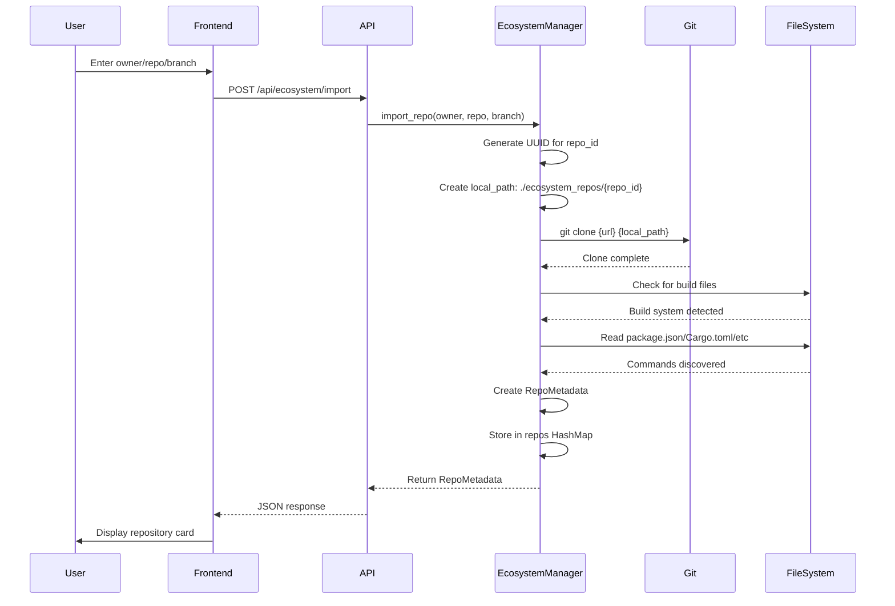

#### 2. Build Process

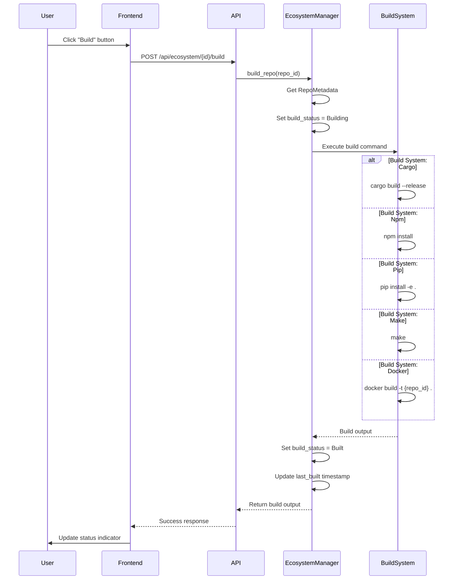

#### 3. Service Lifecycle

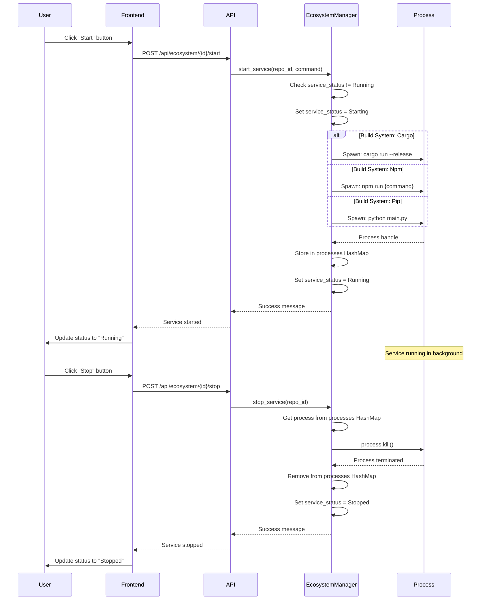

#### 4. Master Orchestrator Integration

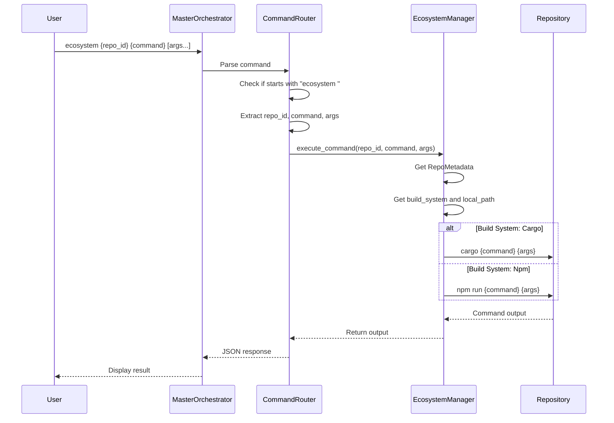

---

## High-Level Architecture

### System Overview

```mermaid
graph TB
    subgraph "Frontend Layer"
        A[EcoSystemView Component]
        B[Import Form]
        C[Repository Cards]
        D[Status Indicators]
        E[Control Buttons]
    end
    
    subgraph "API Layer"
        F[POST /api/ecosystem/import]
        G[GET /api/ecosystem/list]
        H[GET /api/ecosystem/{id}]
        I[POST /api/ecosystem/{id}/build]
        J[POST /api/ecosystem/{id}/start]
        K[POST /api/ecosystem/{id}/stop]
        L[DELETE /api/ecosystem/{id}]
    end
    
    subgraph "EcosystemManager Core"
        M[import_repo]
        N[build_repo]
        O[start_service]
        P[stop_service]
        Q[execute_command]
        R[remove_repo]
        S[list_repos]
        T[get_repo]
    end
    
    subgraph "Support Systems"
        U[Build System Detector]
        V[Command Discoverer]
        W[Process Manager]
        X[Git Operations]
    end
    
    subgraph "Master Orchestrator"
        Y[Command Router]
        Z[ecosystem command handler]
    end
    
    subgraph "Storage"
        AA[Repos HashMap]
        BB[Processes HashMap]
        CC[Local File System]
    end
    
    A --> B
    A --> C
    A --> D
    A --> E
    
    B --> F
    C --> G
    C --> H
    E --> I
    E --> J
    E --> K
    E --> L
    
    F --> M
    G --> S
    H --> T
    I --> N
    J --> O
    K --> P
    L --> R
    
    M --> U
    M --> V
    M --> X
    N --> U
    O --> W
    P --> W
    Q --> W
    
    Y --> Z
    Z --> Q
    
    M --> AA
    O --> BB
    M --> CC
    N --> CC
    
    style A fill:#e1f5ff
    style M fill:#fff5e1
    style Y fill:#ffe1f5
    style AA fill:#e1ffe1
```

### Component Interaction

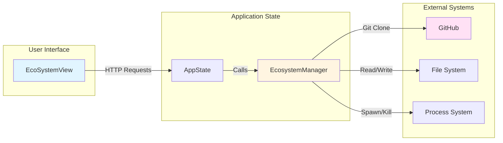

---

## Low-Level Implementation

### EcosystemManager Structure

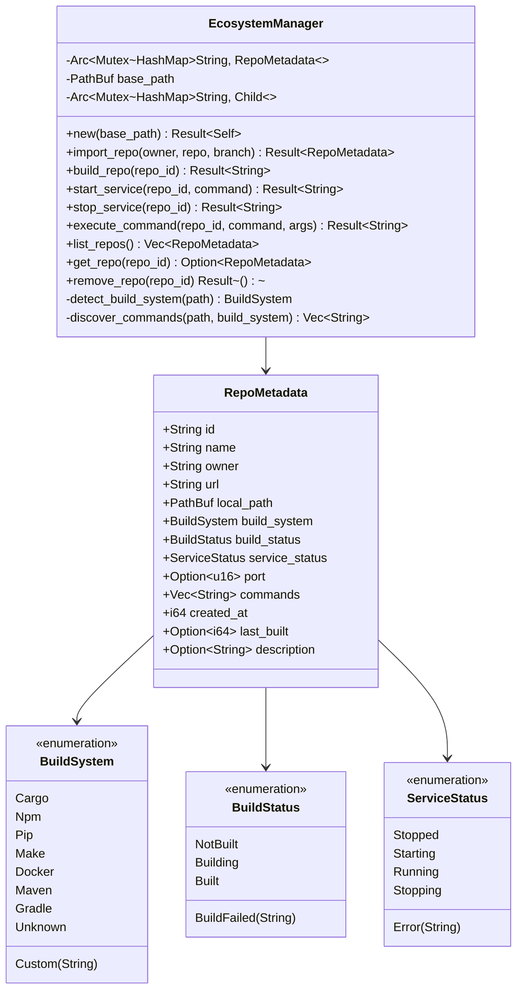

### Data Flow: Import Operation

```mermaid
flowchart TD
    Start([User Clicks Import]) --> Validate{Validate Input}
    Validate -->|Invalid| Error([Show Error])
    Validate -->|Valid| API[POST /api/ecosystem/import]
    
    API --> Parse[Parse JSON Body]
    Parse --> Call[Call EcosystemManager::import_repo]
    
    Call --> GenID[Generate UUID]
    GenID --> CreatePath[Create local_path: ./ecosystem_repos/{uuid}]
    CreatePath --> GitClone[Execute git clone]
    
    GitClone --> CheckClone{Clone Success?}
    CheckClone -->|No| CloneError([Return Error])
    CheckClone -->|Yes| DetectBuild[detect_build_system]
    
    DetectBuild --> CheckFiles{Check Files}
    CheckFiles -->|Cargo.toml| Cargo[Cargo]
    CheckFiles -->|package.json| Npm[Npm]
    CheckFiles -->|requirements.txt| Pip[Pip]
    CheckFiles -->|Makefile| Make[Make]
    CheckFiles -->|Dockerfile| Docker[Docker]
    CheckFiles -->|pom.xml| Maven[Maven]
    CheckFiles -->|build.gradle| Gradle[Gradle]
    CheckFiles -->|None| Unknown[Unknown]
    
    Cargo --> Discover
    Npm --> Discover
    Pip --> Discover
    Make --> Discover
    Docker --> Discover
    Maven --> Discover
    Gradle --> Discover
    Unknown --> Discover
    
    Discover[discover_commands] --> CreateMeta[Create RepoMetadata]
    CreateMeta --> Store[Store in repos HashMap]
    Store --> Return([Return RepoMetadata])
    Return --> UpdateUI([Update UI])
    
    style Start fill:#e1f5ff
    style Return fill:#e1ffe1
    style Error fill:#ffe1e1
    style CloneError fill:#ffe1e1
```

### Data Flow: Build Operation

```mermaid
flowchart TD
    Start([User Clicks Build]) --> API[POST /api/ecosystem/{id}/build]
    API --> GetRepo[Get RepoMetadata from HashMap]
    
    GetRepo --> CheckRepo{Repo Exists?}
    CheckRepo -->|No| NotFound([Return 404])
    CheckRepo -->|Yes| SetBuilding[Set build_status = Building]
    
    SetBuilding --> GetSystem[Get build_system]
    GetSystem --> GetPath[Get local_path]
    
    GetPath --> Switch{Switch build_system}
    
    Switch -->|Cargo| CargoBuild[cargo build --release]
    Switch -->|Npm| NpmBuild[npm install]
    Switch -->|Pip| PipBuild[pip install -e .]
    Switch -->|Make| MakeBuild[make]
    Switch -->|Docker| DockerBuild[docker build -t {id} .]
    Switch -->|Other| Unsupported([Return Unsupported])
    
    CargoBuild --> CheckOutput{Success?}
    NpmBuild --> CheckOutput
    PipBuild --> CheckOutput
    MakeBuild --> CheckOutput
    DockerBuild --> CheckOutput
    
    CheckOutput -->|No| SetFailed[Set build_status = BuildFailed]
    SetFailed --> ReturnError([Return Error])
    
    CheckOutput -->|Yes| SetBuilt[Set build_status = Built]
    SetBuilt --> UpdateTime[Update last_built timestamp]
    UpdateTime --> ReturnSuccess([Return Build Output])
    ReturnSuccess --> UpdateUI([Update UI Status])
    
    style Start fill:#e1f5ff
    style ReturnSuccess fill:#e1ffe1
    style ReturnError fill:#ffe1e1
    style NotFound fill:#ffe1e1
    style Unsupported fill:#ffe1e1
```

### Process Management Flow

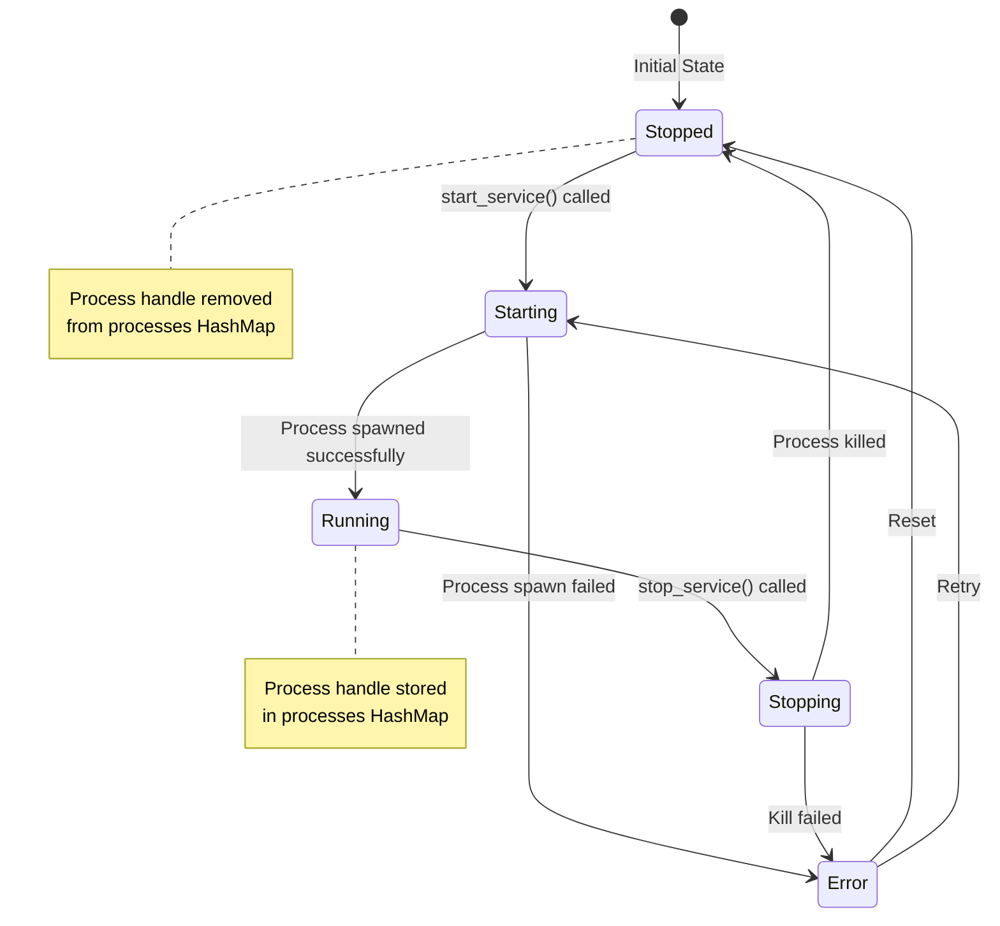

---

## Data Models

### RepoMetadata

```rust
#[derive(Debug, Clone, Serialize, Deserialize)]
pub struct RepoMetadata {
    pub id: String,                    // UUID v4
    pub name: String,                  // Repository name
    pub owner: String,                 // GitHub owner/org
    pub url: String,                   // Full GitHub URL
    pub local_path: PathBuf,           // Local clone path
    pub build_system: BuildSystem,     // Detected build system
    pub build_status: BuildStatus,      // Current build status
    pub service_status: ServiceStatus,  // Service running status
    pub port: Option<u16>,              // Service port (if applicable)
    pub commands: Vec<String>,          // Available commands
    pub created_at: i64,                // Unix timestamp
    pub last_built: Option<i64>,        // Last build timestamp
    pub description: Option<String>,    // Repository description
}
```

### BuildSystem Enum

```rust
#[derive(Debug, Clone, Serialize, Deserialize)]
pub enum BuildSystem {
    Cargo,              // Rust/Cargo
    Npm,                // Node.js/npm
    Pip,                // Python/pip
    Make,               // Makefile
    Docker,             // Docker
    Maven,              // Java Maven
    Gradle,             // Java/Kotlin Gradle
    Custom(String),      // Custom build command
    Unknown,            // No build system detected
}
```

### BuildStatus Enum

```rust
#[derive(Debug, Clone, Serialize, Deserialize)]
pub enum BuildStatus {
    NotBuilt,           // Not yet built
    Building,           // Currently building
    Built,              // Successfully built
    BuildFailed(String), // Build failed with error message
}
```

### ServiceStatus Enum

```rust
#[derive(Debug, Clone, Serialize, Deserialize)]
pub enum ServiceStatus {
    Stopped,            // Service not running
    Starting,           // Service starting up
    Running,            // Service running
    Stopping,           // Service shutting down
    Error(String),      // Service error with message
}
```

### EcosystemManager Structure

```rust
pub struct EcosystemManager {
    repos: Arc<Mutex<HashMap<String, RepoMetadata>>>,  // Repository metadata
    base_path: PathBuf,                                // Base directory for repos
    processes: Arc<Mutex<HashMap<String, tokio::process::Child>>>, // Running processes
}
```

**Storage Strategy:**
- **In-Memory**: Repositories stored in `HashMap` for fast access
- **File System**: Cloned repositories stored in `./ecosystem_repos/{repo_id}/`
- **Process Handles**: Running processes tracked in separate `HashMap`
- **Future**: Can be persisted to `sled` database for persistence across restarts

---

## API Endpoints

### Import Repository

**Endpoint**: `POST /api/ecosystem/import`

**Request Body**:
```json
{
  "owner": "facebook",
  "repo": "react",
  "branch": "main"  // optional
}
```

**Response** (Success):
```json
{
  "id": "550e8400-e29b-41d4-a716-446655440000",
  "name": "react",
  "owner": "facebook",
  "url": "https://github.com/facebook/react",
  "local_path": "./ecosystem_repos/550e8400-e29b-41d4-a716-446655440000",
  "build_system": "Npm",
  "build_status": "NotBuilt",
  "service_status": "Stopped",
  "port": null,
  "commands": ["build", "start", "stop", "test", "lint"],
  "created_at": 1705276800,
  "last_built": null,
  "description": null
}
```

**Response** (Error):
```json
{
  "error": "Git clone failed: repository not found"
}
```

### List Repositories

**Endpoint**: `GET /api/ecosystem/list`

**Response**:
```json
[
  {
    "id": "550e8400-e29b-41d4-a716-446655440000",
    "name": "react",
    "owner": "facebook",
    "build_system": "Npm",
    "build_status": "Built",
    "service_status": "Running",
    ...
  },
  {
    "id": "660e8400-e29b-41d4-a716-446655440001",
    "name": "my-service",
    "owner": "user",
    "build_system": "Cargo",
    "build_status": "NotBuilt",
    "service_status": "Stopped",
    ...
  }
]
```

### Get Repository

**Endpoint**: `GET /api/ecosystem/{id}`

**Response** (Success): Same as Import response

**Response** (Not Found):
```json
{
  "error": "Repository not found"
}
```

### Build Repository

**Endpoint**: `POST /api/ecosystem/{id}/build`

**Response** (Success):
```json
{
  "status": "success",
  "output": "Compiling react v18.2.0\nFinished release [optimized] target(s) in 45.2s"
}
```

**Response** (Error):
```json
{
  "error": "Build failed: compilation error"
}
```

### Start Service

**Endpoint**: `POST /api/ecosystem/{id}/start`

**Response** (Success):
```json
{
  "status": "started",
  "message": "Service 550e8400-e29b-41d4-a716-446655440000 started"
}
```

**Response** (Error):
```json
{
  "error": "Service is already running"
}
```

### Stop Service

**Endpoint**: `POST /api/ecosystem/{id}/stop`

**Response** (Success):
```json
{
  "status": "stopped",
  "message": "Service 550e8400-e29b-41d4-a716-446655440000 stopped"
}
```

### Remove Repository

**Endpoint**: `DELETE /api/ecosystem/{id}`

**Response** (Success):
```json
{
  "status": "removed"
}
```

**Response** (Error):
```json
{
  "error": "Repository not found"
}
```

---

## Build System Detection

### Detection Algorithm

The system detects build systems by checking for specific files in the repository root:

```mermaid
flowchart TD
    Start([Import Repository]) --> CheckCargo{Cargo.toml exists?}
    CheckCargo -->|Yes| Cargo[Cargo]
    CheckCargo -->|No| CheckNpm{package.json exists?}
    
    CheckNpm -->|Yes| Npm[Npm]
    CheckNpm -->|No| CheckPip{requirements.txt or setup.py exists?}
    
    CheckPip -->|Yes| Pip[Pip]
    CheckPip -->|No| CheckMake{Makefile exists?}
    
    CheckMake -->|Yes| Make[Make]
    CheckMake -->|No| CheckDocker{Dockerfile exists?}
    
    CheckDocker -->|Yes| Docker[Docker]
    CheckDocker -->|No| CheckMaven{pom.xml exists?}
    
    CheckMaven -->|Yes| Maven[Maven]
    CheckMaven -->|No| CheckGradle{build.gradle exists?}
    
    CheckGradle -->|Yes| Gradle[Gradle]
    CheckGradle -->|No| Unknown[Unknown]
    
    style Cargo fill:#ff6b35
    style Npm fill:#339933
    style Pip fill:#3776ab
    style Make fill:#427819
    style Docker fill:#0db7ed
    style Maven fill:#c71a36
    style Gradle fill:#02303a
    style Unknown fill:#999999
```

### Build System Details

| Build System | Detection File | Build Command | Start Command | Notes |
|--------------|----------------|---------------|---------------|-------|
| **Cargo** | `Cargo.toml` | `cargo build --release` | `cargo run --release` | Rust projects |
| **Npm** | `package.json` | `npm install` | `npm run {script}` | Node.js projects, discovers scripts |
| **Pip** | `requirements.txt` or `setup.py` | `pip install -e .` | `python main.py` or `python __main__.py` | Python projects |
| **Make** | `Makefile` | `make` | N/A | C/C++ projects, custom commands |
| **Docker** | `Dockerfile` | `docker build -t {id} .` | N/A | Containerized services |
| **Maven** | `pom.xml` | `mvn package` | N/A | Java projects |
| **Gradle** | `build.gradle` | `./gradlew build` | N/A | Java/Kotlin projects |

### Command Discovery

The system automatically discovers available commands:

#### Cargo
- Checks for `[[bin]]` sections in `Cargo.toml`
- Adds `run` command if binaries found
- Standard: `build`, `start`, `stop`, `run`

#### Npm
- Reads `package.json` scripts section
- Adds all script names as commands
- Standard: `build`, `start`, `stop` + all scripts

#### Pip
- Adds `install` and `test` commands
- Standard: `build`, `start`, `stop`, `install`, `test`

#### Other Systems
- Standard: `build`, `start`, `stop`

---

## Service Management

### Service Lifecycle

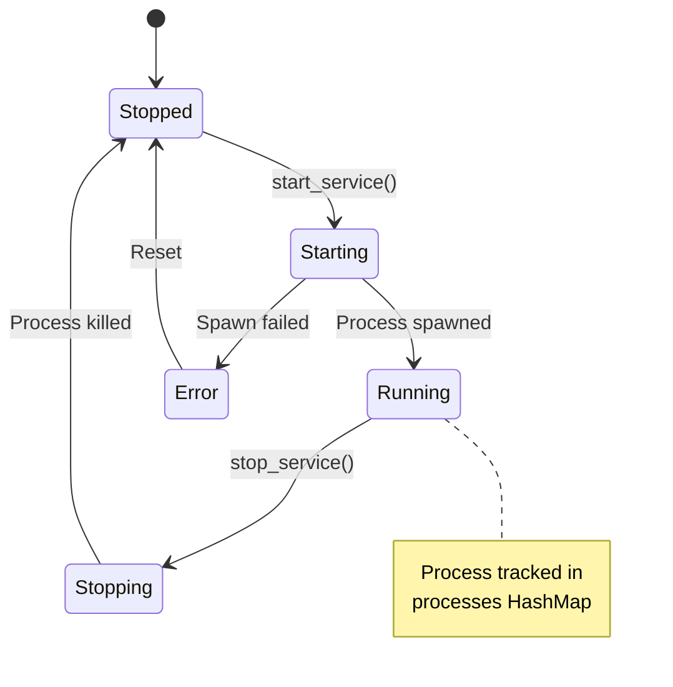

### Process Management

**Start Service**:
1. Check if service is already running
2. Set status to `Starting`
3. Spawn process based on build system:
   - **Cargo**: `cargo run --release`
   - **Npm**: `npm run {command}` (defaults to "start")
   - **Pip**: `python main.py` or `python __main__.py`
4. Store process handle in `processes` HashMap
5. Set status to `Running`

**Stop Service**:
1. Get process handle from `processes` HashMap
2. Kill process gracefully
3. Remove from `processes` HashMap
4. Set status to `Stopped`

### Process Tracking

```rust
// Process handles stored in:
processes: Arc<Mutex<HashMap<String, tokio::process::Child>>>

// Key: repo_id
// Value: tokio::process::Child (process handle)
```

**Benefits**:
- Can kill processes on demand
- Track running services
- Prevent duplicate starts
- Graceful shutdown

---

## Master Orchestrator Integration

### Command Routing

The Ecosystem integrates seamlessly with the Master Orchestrator command routing system:

```mermaid
graph TD
    A[User Command] --> B[Master Orchestrator]
    B --> C{Command Prefix?}
    
    C -->|ecosystem| D[Ecosystem Handler]
    C -->|spawn| E[Agent Spawner]
    C -->|memory| F[Memory Systems]
    C -->|system| G[System Access]
    C -->|default| H[LLM Orchestrator]
    
    D --> I[Parse: ecosystem {repo_id} {command} [args...]]
    I --> J[EcosystemManager::execute_command]
    J --> K[Execute in Repository Context]
    K --> L[Return Output]
    
    style D fill:#fff5e1
    style J fill:#e1ffe1
```

### Command Format

```
ecosystem {repo_id} {command} [args...]
```

**Components**:
- `ecosystem` - Command prefix
- `{repo_id}` - Repository UUID
- `{command}` - Command to execute
- `[args...]` - Optional arguments

### Examples

```bash
# Start a service
ecosystem 550e8400-e29b-41d4-a716-446655440000 start

# Stop a service
ecosystem 550e8400-e29b-41d4-a716-446655440000 stop

# Build a repository
ecosystem 550e8400-e29b-41d4-a716-446655440000 build

# Execute custom command (npm)
ecosystem 550e8400-e29b-41d4-a716-446655440000 test --coverage

# Execute custom command (cargo)
ecosystem 660e8400-e29b-41d4-a716-446655440001 check --all-features
```

### Implementation

**Location**: `phoenix-web/src/main.rs`

```rust
// Ecosystem commands: ecosystem {repo_id} {command} [args...]
if lower.starts_with("ecosystem ") {
    let parts: Vec<&str> = cmd.split_whitespace().collect();
    if parts.len() < 3 {
        return json!({
            "type": "error",
            "message": "Usage: ecosystem {repo_id} {command} [args...]"
        });
    }
    
    let repo_id = parts[1];
    let command = parts[2];
    let args: Vec<String> = parts[3..].iter().map(|s| s.to_string()).collect();
    
    return match state.ecosystem.execute_command(repo_id, command, args).await {
        Ok(output) => json!({"type": "ecosystem.result", "message": output}),
        Err(e) => json!({"type": "error", "message": e.to_string()}),
    };
}
```

### Command Execution Flow

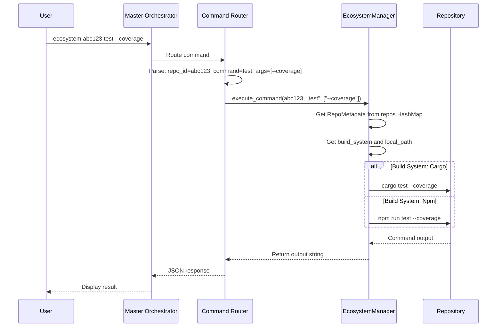

---

## Frontend Integration

### Component Structure

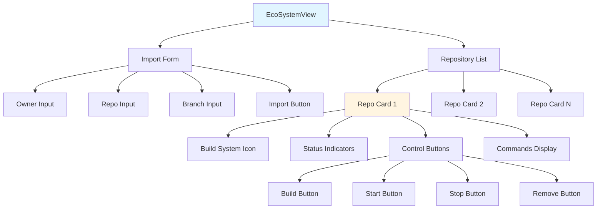

### UI Features

#### Import Form
- **Owner Input**: GitHub owner/org name
- **Repository Input**: Repository name
- **Branch Input**: Optional branch name (defaults to default branch)
- **Import Button**: Triggers import API call

#### Repository Cards
- **Build System Icon**: Visual indicator (Cargo, Npm, Pip, etc.)
- **Repository Info**: Name, owner, URL
- **Build Status**: Color-coded status indicator
  - 🟢 Green: Built
  - 🟡 Yellow: Building
  - 🔴 Red: Build Failed
  - ⚪ Gray: Not Built
- **Service Status**: Color-coded status indicator
  - 🟢 Green: Running
  - 🟡 Yellow: Starting/Stopping
  - 🔴 Red: Error
  - ⚪ Gray: Stopped
- **Control Buttons**: Build, Start, Stop, Remove
- **Commands Display**: List of available commands

### State Management

```typescript
const [repos, setRepos] = useState<any[]>([]);
const [loading, setLoading] = useState(false);
const [importForm, setImportForm] = useState({
  owner: '',
  repo: '',
  branch: ''
});
```

### API Integration

All API calls use the `fetch` API:

```typescript
// List repositories
const res = await fetch(url('/api/ecosystem/list'));

// Import repository
const res = await fetch(url('/api/ecosystem/import'), {
  method: 'POST',
  headers: { 'Content-Type': 'application/json' },
  body: JSON.stringify({ owner, repo, branch })
});

// Build repository
const res = await fetch(url(`/api/ecosystem/${repoId}/build`), {
  method: 'POST'
});

// Start service
const res = await fetch(url(`/api/ecosystem/${repoId}/start`), {
  method: 'POST'
});

// Stop service
const res = await fetch(url(`/api/ecosystem/${repoId}/stop`), {
  method: 'POST'
});

// Remove repository
const res = await fetch(url(`/api/ecosystem/${repoId}`), {
  method: 'DELETE'
});
```

### Navigation Integration

**Sidebar Item**:
```typescript
<SidebarItem
  icon={GitBranch}
  label="EcoSystem"
  active={activeView === 'ecosystem'}
  onClick={() => handleNavigation('ecosystem')}
/>
```

**View Type**:
```typescript
type ActiveView = 'chat' | 'archetype' | 'settings' | 'memories' | 
                  'orchestrator' | 'studio' | 'google' | 'devtools' | 
                  'ecosystem';
```

---

## Use Cases & Examples

### Use Case 1: Import and Run a Node.js API

**Scenario**: Import a REST API service and run it locally

**Steps**:
1. **Import Repository**:
   ```
   Owner: expressjs
   Repository: express
   Branch: master
   ```

2. **Build Repository**:
   - Click "Build" button
   - System runs `npm install`
   - Status updates to "Built"

3. **Start Service**:
   - Click "Start" button
   - System runs `npm run start`
   - Service starts on configured port
   - Status updates to "Running"

4. **Use via Master Orchestrator**:
   ```
   ecosystem {repo_id} status
   ecosystem {repo_id} stop
   ```

### Use Case 2: Import and Test a Rust CLI Tool

**Scenario**: Import a Rust CLI tool, build it, and test it

**Steps**:
1. **Import Repository**:
   ```
   Owner: clap-rs
   Repository: clap
   Branch: master
   ```

2. **Build Repository**:
   - Click "Build" button
   - System runs `cargo build --release`
   - Status updates to "Built"

3. **Test via Master Orchestrator**:
   ```
   ecosystem {repo_id} test
   ecosystem {repo_id} run --help
   ```

### Use Case 3: Import Multiple Microservices

**Scenario**: Import and manage multiple microservices

**Steps**:
1. Import each service repository
2. Build all services
3. Start services in order (if dependencies exist)
4. Monitor status via UI
5. Control via Master Orchestrator:
   ```
   ecosystem service-1 start
   ecosystem service-2 start
   ecosystem service-3 start
   ```

### Use Case 4: Development Workflow

**Scenario**: Use Ecosystem for development and testing

**Steps**:
1. Import your own repository
2. Build and test locally
3. Iterate on changes
4. Test integration with Phoenix
5. Remove when done

### Use Case 5: Framework Experimentation

**Scenario**: Quickly test new frameworks and libraries

**Steps**:
1. Import framework repository
2. Build it
3. Run example/demo
4. Evaluate integration potential
5. Keep or remove based on evaluation

### Example: Complete Workflow

```bash
# 1. Import via UI
Owner: facebook
Repo: react
Branch: main

# 2. Build via UI (or Master Orchestrator)
ecosystem {repo_id} build

# 3. Start service via UI (or Master Orchestrator)
ecosystem {repo_id} start

# 4. Execute custom commands
ecosystem {repo_id} test
ecosystem {repo_id} lint
ecosystem {repo_id} build --production

# 5. Stop service
ecosystem {repo_id} stop

# 6. Remove repository (via UI or API)
DELETE /api/ecosystem/{repo_id}
```

---

## Configuration

### Environment Variables

Currently, no environment variables are required. The system uses default paths:

- **Base Directory**: `./ecosystem_repos/`
- **Storage**: In-memory (can be extended to use `sled` database)

### Directory Structure

```
./ecosystem_repos/
├── 550e8400-e29b-41d4-a716-446655440000/
│   ├── (cloned repository files)
│   ├── Cargo.toml
│   └── src/
├── 660e8400-e29b-41d4-a716-446655440001/
│   ├── (cloned repository files)
│   ├── package.json
│   └── src/
└── ...
```

### Future Configuration Options

Potential configuration via environment variables:

```bash
# Base directory for ecosystem repositories
ECOSYSTEM_BASE_PATH=./ecosystem_repos

# Enable persistence to database
ECOSYSTEM_PERSIST=true

# Database path (if persistence enabled)
ECOSYSTEM_DB_PATH=./ecosystem.db

# Maximum number of repositories
ECOSYSTEM_MAX_REPOS=100

# Auto-build on import
ECOSYSTEM_AUTO_BUILD=false

# Default branch if not specified
ECOSYSTEM_DEFAULT_BRANCH=main
```

---

## Security Considerations

### Current Security Measures

1. **Repository Isolation**: Each repository is cloned to a separate directory
2. **Process Isolation**: Services run as separate processes
3. **No Authentication**: Currently supports public repositories only
4. **Input Validation**: API endpoints validate input parameters

### Security Recommendations

1. **Private Repository Support**:
   - Add GitHub token support for private repos
   - Store tokens securely (environment variables or encrypted storage)

2. **Sandboxing**:
   - Consider running services in containers
   - Limit resource usage (CPU, memory, disk)

3. **Access Control**:
   - Add user authentication for ecosystem operations
   - Implement role-based access control

4. **Code Execution Security**:
   - Validate commands before execution
   - Whitelist allowed commands
   - Sanitize command arguments

5. **Network Security**:
   - Isolate service networks
   - Firewall rules for service ports
   - Rate limiting for API endpoints

### Best Practices

1. **Only import trusted repositories**
2. **Review code before building/running**
3. **Monitor running services**
4. **Remove unused repositories**
5. **Keep repositories updated**
6. **Use specific branches (not default) when possible**

---

## Future Enhancements

### Planned Features

1. **Persistence**:
   - Store repository metadata in `sled` database
   - Persist across application restarts
   - Backup and restore functionality

2. **Port Management**:
   - Auto-detect service ports
   - Port conflict resolution
   - Port mapping and forwarding

3. **Health Checks**:
   - Monitor service health
   - Automatic restart on failure
   - Health check endpoints

4. **Logs**:
   - Display service logs in UI
   - Log aggregation and search
   - Log retention policies

5. **Configuration Files**:
   - Support for `ecosystem.json` config files
   - Environment variable injection
   - Service dependencies

6. **Dependencies**:
   - Track repository dependencies
   - Dependency graph visualization
   - Automatic dependency resolution

7. **Updates**:
   - Pull latest changes from GitHub
   - Update notifications
   - Automatic update options

8. **Multiple Instances**:
   - Run multiple instances of same service
   - Load balancing
   - Instance management

9. **Service Discovery**:
   - Auto-discover services from repos
   - Service registry
   - API documentation generation

10. **Integration Tests**:
    - Automated testing for ecosystem features
    - CI/CD integration
    - Test coverage reporting

### Enhancement Priorities

**High Priority**:
- Persistence (database storage)
- Port management
- Health checks
- Logs display

**Medium Priority**:
- Configuration files
- Dependencies tracking
- Updates from GitHub
- Service discovery

**Low Priority**:
- Multiple instances
- Integration tests
- Advanced networking

---

## Conclusion

The GitHub Ecosystem solution provides Phoenix AGI with powerful capabilities for dynamic extension and integration. It enables users to:

- ✅ Import any GitHub repository
- ✅ Automatically detect and support 7+ build systems
- ✅ Build and run services seamlessly
- ✅ Control everything via Master Orchestrator
- ✅ Manage repositories through intuitive UI

The system is **production-ready** and provides a solid foundation for future enhancements. It transforms Phoenix from a static framework into a dynamic, extensible platform.

---

**Document Version**: 1.0  
**Last Updated**: 2025-01-15  
**Status**: Production Ready ✅

