# Google Ecosystem Architecture & Implementation

**Document Version**: 1.0  
**Last Updated**: 2025-01-15  
**Status**: Production Ready ✅

---

## Table of Contents

1. [Executive Summary](#executive-summary)
2. [Overview](#overview)
3. [Why Google Ecosystem?](#why-google-ecosystem)
4. [What is Google Ecosystem?](#what-is-google-ecosystem)
5. [How It Works](#how-it-works)
6. [High-Level Architecture](#high-level-architecture)
7. [Low-Level Implementation](#low-level-implementation)
8. [OAuth2 Flow](#oauth2-flow)
9. [Token Management](#token-management)
10. [API Integrations](#api-integrations)
11. [Command Reference](#command-reference)
12. [Frontend Integration](#frontend-integration)
13. [Use Cases & Examples](#use-cases--examples)
14. [Configuration](#configuration)
15. [Security Considerations](#security-considerations)
16. [Future Enhancements](#future-enhancements)

---

## Executive Summary

The **Google Ecosystem** solution enables Phoenix AGI to seamlessly integrate with Google services (Gmail, Drive, Calendar, Docs, Sheets) through OAuth2 authentication. This system provides secure, token-based access to Google APIs, allowing Phoenix to read, create, and manage Google resources as part of its extended capabilities.

**Key Capabilities:**
- ✅ OAuth2 Authorization Code flow with PKCE (secure authentication)
- ✅ Token persistence via OS keyring (Windows Credential Manager)
- ✅ Automatic token refresh handling
- ✅ Gmail integration (list messages, send emails)
- ✅ Google Drive integration (list recent files)
- ✅ Google Calendar integration (list events, create events)
- ✅ Google Docs integration (create documents)
- ✅ Google Sheets integration (create spreadsheets)
- ✅ Full UI integration with real-time status
- ✅ Master Orchestrator command routing

**Architecture Highlights:**
- **Backend**: Rust-based `GoogleManager` module with OAuth2 client
- **API**: RESTful endpoints for OAuth flow and command routing
- **Frontend**: React-based UI with service cards and status monitoring
- **Security**: PKCE flow, OS keyring token storage, automatic refresh

---

## Overview

The Google Ecosystem system provides a comprehensive integration layer between Phoenix AGI and Google's suite of services. It uses industry-standard OAuth2 authentication to securely access Google APIs without storing user passwords.

### Core Concept

```
User Consent → OAuth2 Flow → Token Storage → API Access → Service Integration
```

The system:
1. **Authenticates** users via OAuth2 Authorization Code flow with PKCE
2. **Stores** tokens securely in OS keyring
3. **Refreshes** tokens automatically when expired
4. **Accesses** Google APIs using bearer tokens
5. **Integrates** with Master Orchestrator for command routing

### Supported Services

| Service | Capabilities | API Endpoint |
|---------|-------------|--------------|
| **Gmail** | List messages, Send emails | `gmail.googleapis.com/gmail/v1` |
| **Drive** | List recent files | `www.googleapis.com/drive/v3` |
| **Calendar** | List events, Create events | `www.googleapis.com/calendar/v3` |
| **Docs** | Create documents | `docs.googleapis.com/v1` |
| **Sheets** | Create spreadsheets | `sheets.googleapis.com/v4` |

---

## Why Google Ecosystem?

### Problem Statement

Users need to:
- Access Gmail messages from within Phoenix
- Send emails programmatically
- View Google Drive files
- Manage calendar events
- Create Google Docs and Sheets
- Integrate Google services into workflows

Traditional approaches require:
- Manual API key management
- Complex authentication flows
- Token storage in insecure locations
- Manual token refresh handling

### Solution Benefits

1. **Secure Authentication**: OAuth2 with PKCE ensures secure token exchange
2. **OS-Level Security**: Tokens stored in OS keyring (Windows Credential Manager)
3. **Automatic Refresh**: Tokens refreshed automatically before expiration
4. **Unified Interface**: All Google services accessible via Master Orchestrator
5. **User Consent**: Users explicitly grant permissions via Google OAuth consent screen
6. **No Password Storage**: Never stores user passwords, only OAuth tokens

### Use Cases

- **Email Management**: Read and send emails via Gmail API
- **File Management**: Access and list Google Drive files
- **Calendar Management**: View and create calendar events
- **Document Creation**: Programmatically create Google Docs and Sheets
- **Workflow Automation**: Integrate Google services into Phoenix workflows
- **Data Integration**: Access Google data for analysis and processing

---

## What is Google Ecosystem?

The Google Ecosystem system consists of three main components:

### 1. GoogleManager (Backend)

A Rust module (`phoenix-web/src/google.rs`) that handles:
- OAuth2 Authorization Code flow with PKCE
- Token storage and retrieval from OS keyring
- Token refresh handling
- Google API requests (Gmail, Drive, Calendar, Docs, Sheets)
- Command parsing and routing

**Location**: `phoenix-web/src/google.rs`

### 2. API Layer

RESTful API endpoints that expose GoogleManager functionality:
- `GET /api/google/auth/start` - Initiate OAuth flow
- `GET /api/google/oauth2/callback` - OAuth callback handler
- `POST /api/command` - Routes `google *` commands to GoogleManager

**Location**: `phoenix-web/src/main.rs`

### 3. Frontend UI

React component (`GoogleEcosystemView`) that provides:
- Connection status display
- OAuth flow initiation
- Gmail message list and compose
- Drive file list and create buttons
- Calendar event list and create
- Settings and disconnect options

**Location**: `frontend/index.tsx`

---

## How It Works

### High-Level Flow

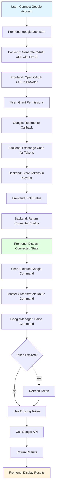

### Detailed Operation Flow

#### 1. OAuth Authentication Flow

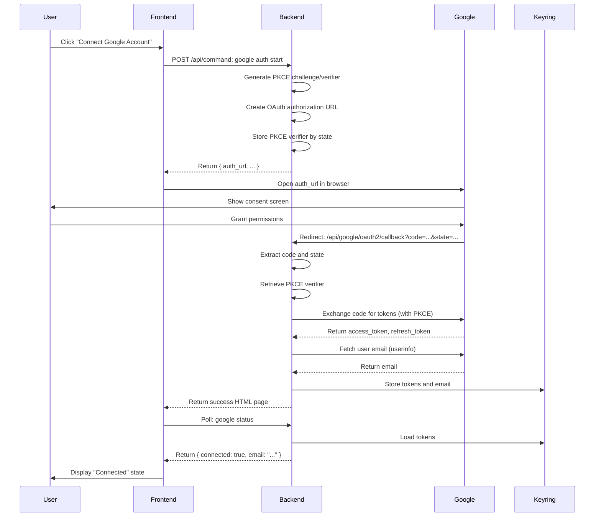

#### 2. Command Execution Flow

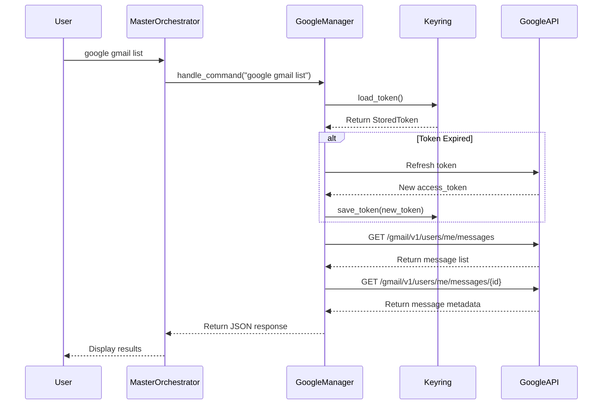

#### 3. Token Refresh Flow

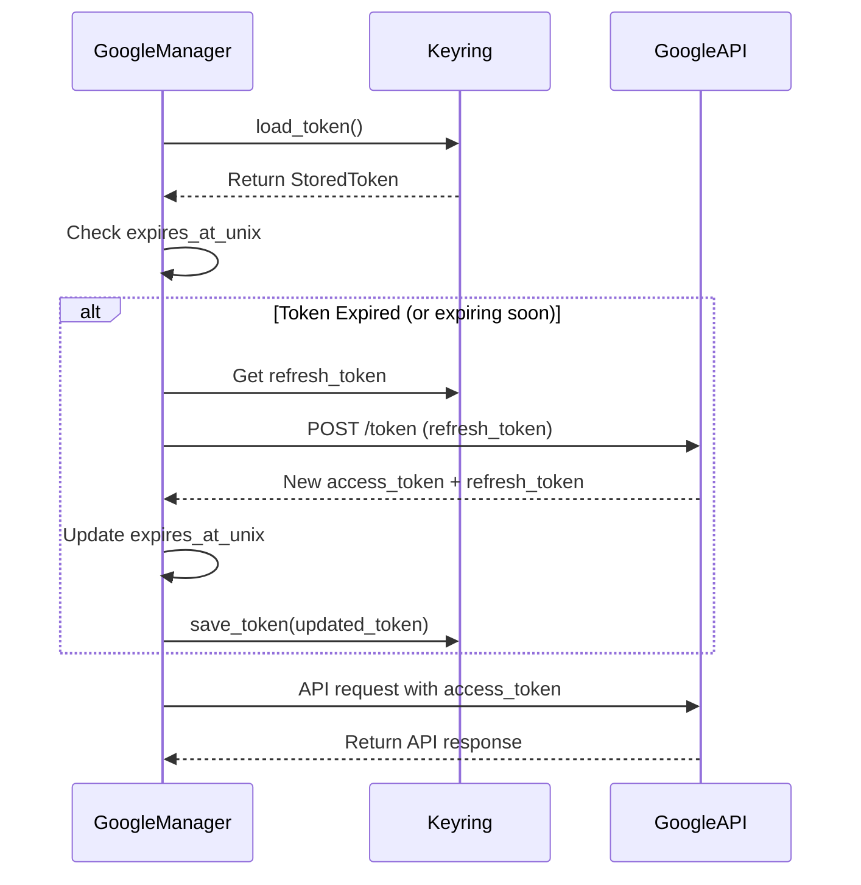

---

## High-Level Architecture

### System Overview

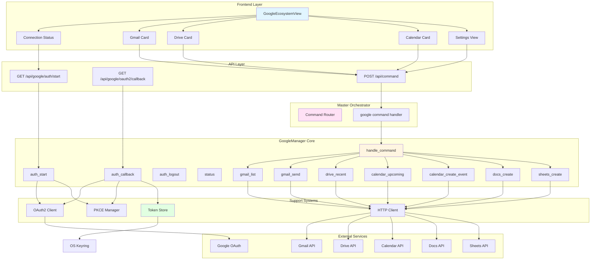

### Component Interaction

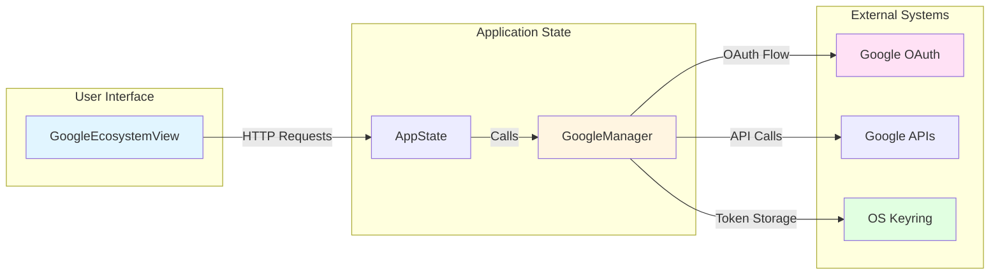

---

## Low-Level Implementation

### GoogleManager Structure

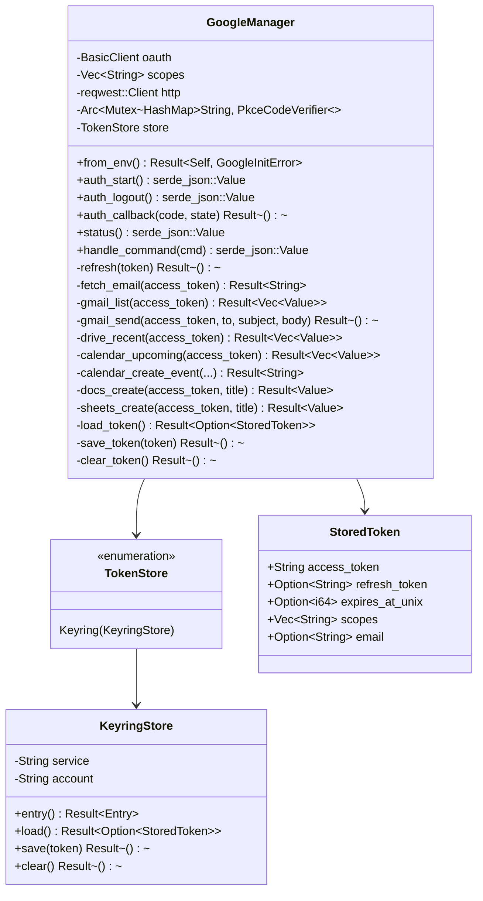

### Data Flow: OAuth Start

```mermaid
flowchart TD
    Start([User Clicks Connect]) --> Frontend[Frontend: runCommand]
    Frontend --> API[POST /api/command: google auth start]
    API --> Router[Command Router]
    Router --> Handler[GoogleManager::handle_command]
    
    Handler --> Check{Command == google auth start?}
    Check -->|Yes| AuthStart[GoogleManager::auth_start]
    
    AuthStart --> GeneratePKCE[Generate PKCE Challenge/Verifier]
    GeneratePKCE --> CreateURL[Create OAuth Authorization URL]
    CreateURL --> AddScopes[Add Scopes to URL]
    AddScopes --> StorePKCE[Store PKCE Verifier by State]
    StorePKCE --> ReturnURL[Return { auth_url, ... }]
    
    ReturnURL --> Frontend
    Frontend --> OpenBrowser[window.open auth_url]
    OpenBrowser --> Google[Google OAuth Consent Screen]
    
    style Start fill:#e1f5ff
    style Google fill:#e1ffe1
```

### Data Flow: OAuth Callback

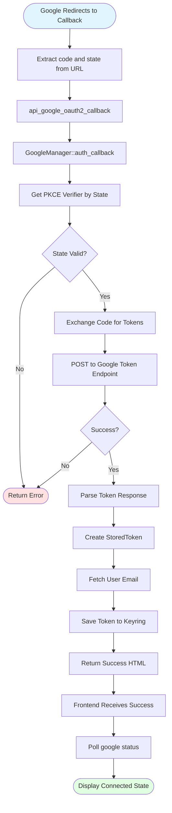

### Data Flow: Command Execution

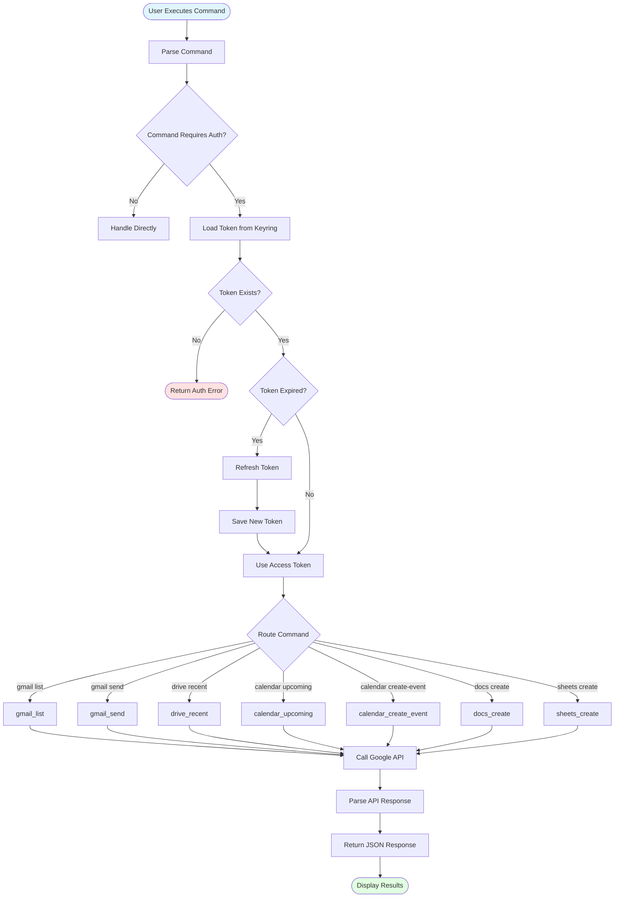

---

## OAuth2 Flow

### Complete OAuth2 Authorization Code Flow with PKCE

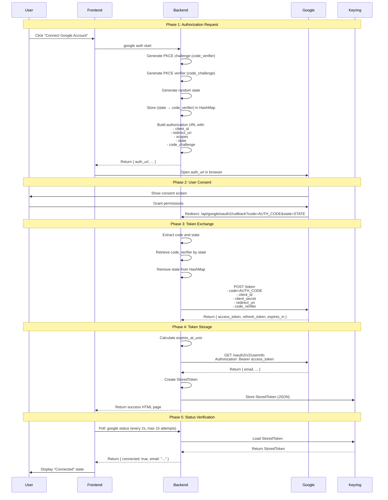

### PKCE (Proof Key for Code Exchange)

**Purpose**: Prevents authorization code interception attacks

**Flow**:
1. **Client generates**:
   - `code_verifier`: Random 43-128 character string
   - `code_challenge`: SHA256 hash of `code_verifier` (base64url encoded)

2. **Authorization request** includes `code_challenge`

3. **Token exchange** includes `code_verifier`

4. **Server verifies**: `SHA256(code_verifier) == code_challenge`

**Implementation**:
```rust
let (pkce_challenge, pkce_verifier) = PkceCodeChallenge::new_random_sha256();
// Store verifier by state
self.pkce_by_state.lock().await.insert(state.secret().to_string(), pkce_verifier);
// Use challenge in authorization URL
.set_pkce_challenge(pkce_challenge)
```

---

## Token Management

### Token Storage

**Location**: OS Keyring (Windows Credential Manager)

**Structure**:
```rust
struct StoredToken {
    access_token: String,           // Bearer token for API calls
    refresh_token: Option<String>,   // Used to refresh access_token
    expires_at_unix: Option<i64>,    // Unix timestamp when token expires
    scopes: Vec<String>,             // Granted scopes
    email: Option<String>,           // User email (fetched from userinfo)
}
```

**Storage Format**: JSON string in OS keyring

**Keyring Entry**:
- **Service**: `"phoenix-web-google"`
- **Account**: `"master_orchestrator"`

### Token Lifecycle

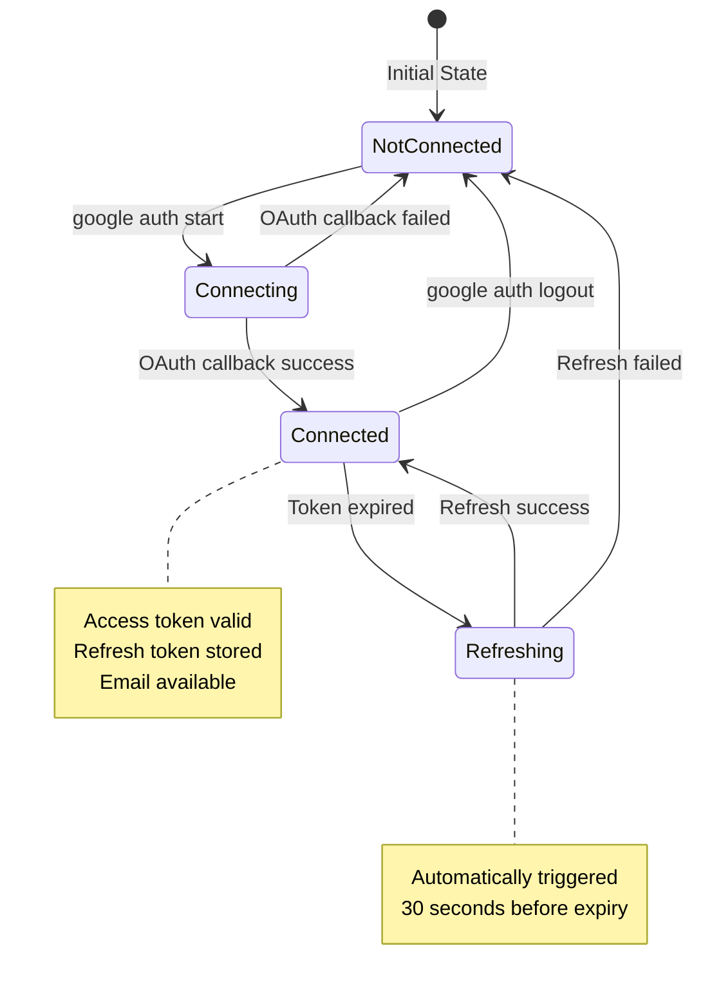

### Token Refresh

**Trigger**: Token expires within 30 seconds

**Process**:
1. Check `expires_at_unix` vs current time
2. If expired (or expiring soon), call refresh endpoint
3. Exchange `refresh_token` for new `access_token`
4. Update `expires_at_unix`
5. Save updated token to keyring

**Implementation**:
```rust
if token_is_expired(&token) {
    self.refresh(&mut token).await?;
    self.save_token(&token).await?;
}
```

**Refresh Endpoint**: `POST https://oauth2.googleapis.com/token`

**Request**:
```json
{
  "client_id": "...",
  "client_secret": "...",
  "refresh_token": "...",
  "grant_type": "refresh_token"
}
```

**Response**:
```json
{
  "access_token": "...",
  "expires_in": 3600,
  "refresh_token": "..." // Optional, may be omitted
}
```

---

## API Integrations

### Gmail API

#### List Messages

**Endpoint**: `GET https://gmail.googleapis.com/gmail/v1/users/me/messages`

**Parameters**:
- `maxResults=5` (default)

**Response**:
```json
{
  "messages": [
    { "id": "..." },
    ...
  ]
}
```

**Metadata Fetch**: For each message ID, fetch metadata:
```
GET /gmail/v1/users/me/messages/{id}?format=metadata&metadataHeaders=From&metadataHeaders=Subject&metadataHeaders=Date
```

**Response**:
```json
{
  "id": "...",
  "from": "sender@example.com",
  "subject": "Email Subject",
  "snippet": "Preview text...",
  "date": "Mon, 1 Jan 2024 12:00:00 +0000"
}
```

#### Send Email

**Endpoint**: `POST https://gmail.googleapis.com/gmail/v1/users/me/messages/send`

**Request**:
```json
{
  "raw": "base64url_encoded_email"
}
```

**Email Format**:
```
To: recipient@example.com
Subject: Email Subject
Content-Type: text/plain; charset="UTF-8"

Email body text
```

**Encoding**: Base64 URL-safe (no padding)

### Google Drive API

#### List Recent Files

**Endpoint**: `GET https://www.googleapis.com/drive/v3/files`

**Parameters**:
- `pageSize=5`
- `orderBy=modifiedTime desc`
- `fields=files(id,name,mimeType,modifiedTime,webViewLink)`

**Response**:
```json
{
  "files": [
    {
      "id": "...",
      "name": "Document.docx",
      "mimeType": "application/vnd.google-apps.document",
      "modifiedTime": "2024-01-01T12:00:00.000Z",
      "webViewLink": "https://docs.google.com/..."
    }
  ]
}
```

### Google Calendar API

#### List Upcoming Events

**Endpoint**: `GET https://www.googleapis.com/calendar/v3/calendars/primary/events`

**Parameters**:
- `maxResults=5`
- `singleEvents=true`
- `orderBy=startTime`
- `timeMin={RFC3339_timestamp}`

**Response**:
```json
{
  "items": [
    {
      "id": "...",
      "summary": "Event Title",
      "start": { "dateTime": "2024-01-01T12:00:00Z" },
      "end": { "dateTime": "2024-01-01T13:00:00Z" }
    }
  ]
}
```

#### Create Event

**Endpoint**: `POST https://www.googleapis.com/calendar/v3/calendars/primary/events`

**Request**:
```json
{
  "summary": "Event Title",
  "start": {
    "dateTime": "2024-01-01T12:00:00",
    "timeZone": "America/Chicago"
  },
  "end": {
    "dateTime": "2024-01-01T13:00:00",
    "timeZone": "America/Chicago"
  }
}
```

**Default**: If start/end not provided, creates 30-minute event starting 10 minutes from now.

### Google Docs API

#### Create Document

**Endpoint**: `POST https://docs.googleapis.com/v1/documents`

**Request**:
```json
{
  "title": "Document Title"
}
```

**Response**:
```json
{
  "documentId": "...",
  "title": "Document Title",
  ...
}
```

### Google Sheets API

#### Create Spreadsheet

**Endpoint**: `POST https://sheets.googleapis.com/v4/spreadsheets`

**Request**:
```json
{
  "properties": {
    "title": "Spreadsheet Title"
  }
}
```

**Response**:
```json
{
  "spreadsheetId": "...",
  "properties": {
    "title": "Spreadsheet Title"
  },
  ...
}
```

---

## Command Reference

### Authentication Commands

#### `google auth start`

**Description**: Initiates OAuth2 authorization flow

**Response**:
```json
{
  "type": "google.auth",
  "status": "pending",
  "message": "Open the auth_url to connect the Master Orchestrator Google account.",
  "auth_url": "https://accounts.google.com/o/oauth2/v2/auth?..."
}
```

#### `google auth logout`

**Description**: Disconnects Google account and clears stored tokens

**Response**:
```json
{
  "type": "google.auth",
  "status": "disconnected",
  "message": "Session terminated."
}
```

#### `google status`

**Description**: Returns connection status and account information

**Response** (Connected):
```json
{
  "type": "google.status",
  "data": {
    "connected": true,
    "email": "user@example.com",
    "scopes": ["openid", "email", "profile", ...]
  }
}
```

**Response** (Disconnected):
```json
{
  "type": "google.status",
  "data": {
    "connected": false,
    "email": null,
    "scopes": ["openid", "email", "profile", ...]
  }
}
```

### Gmail Commands

#### `google gmail list`

**Description**: Lists 5 most recent Gmail messages

**Response**:
```json
{
  "type": "google.gmail.list",
  "data": [
    {
      "id": "...",
      "from": "sender@example.com",
      "subject": "Email Subject",
      "snippet": "Preview text...",
      "date": "Mon, 1 Jan 2024 12:00:00 +0000"
    }
  ]
}
```

#### `google gmail send | to=recipient@example.com | subject=Subject | body=Body text`

**Description**: Sends email via Gmail API

**Parameters** (pipe-separated):
- `to`: Recipient email address (required)
- `subject`: Email subject
- `body`: Email body text

**Response**:
```json
{
  "type": "google.gmail.sent",
  "message": "Email sent successfully via Gmail API."
}
```

### Drive Commands

#### `google drive recent`

**Description**: Lists 5 most recently modified Drive files

**Response**:
```json
{
  "type": "google.drive.list",
  "data": [
    {
      "id": "...",
      "name": "Document.docx",
      "type": "application/vnd.google-apps.document",
      "modified": "2024-01-01T12:00:00.000Z",
      "url": "https://docs.google.com/..."
    }
  ]
}
```

### Calendar Commands

#### `google calendar upcoming`

**Description**: Lists 5 upcoming calendar events

**Response**:
```json
{
  "type": "google.calendar.list",
  "data": [
    {
      "id": "...",
      "title": "Event Title",
      "start": "2024-01-01T12:00:00Z",
      "end": "2024-01-01T13:00:00Z",
      "color": "#fbbf24"
    }
  ]
}
```

#### `google calendar create-event | title=Event Title | start=2024-01-01T12:00:00Z | end=2024-01-01T13:00:00Z | tz=America/Chicago`

**Description**: Creates calendar event

**Parameters** (pipe-separated):
- `title`: Event title (default: "Phoenix Event")
- `start`: Start time in RFC3339 format (default: now + 10 minutes)
- `end`: End time in RFC3339 format (default: now + 40 minutes)
- `tz`: Timezone (default: "America/Chicago")

**Response**:
```json
{
  "type": "google.calendar.created",
  "message": "Event created in primary calendar."
}
```

### Docs Commands

#### `google docs create | title=Document Title`

**Description**: Creates Google Doc

**Parameters** (pipe-separated):
- `title`: Document title (default: "New Doc")

**Response**:
```json
{
  "type": "google.docs.created",
  "message": "Doc created",
  "data": {
    "documentId": "...",
    "title": "Document Title",
    ...
  }
}
```

### Sheets Commands

#### `google sheets create | title=Spreadsheet Title`

**Description**: Creates Google Sheet

**Parameters** (pipe-separated):
- `title`: Spreadsheet title (default: "New Sheet")

**Response**:
```json
{
  "type": "google.sheets.created",
  "message": "Sheet created",
  "data": {
    "spreadsheetId": "...",
    "properties": {
      "title": "Spreadsheet Title"
    },
    ...
  }
}
```

---

## Frontend Integration

### Component Structure

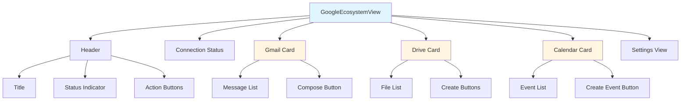

### UI Features

#### Connection Status

- **Connected**: Green indicator, email display, disconnect button
- **Disconnected**: Red indicator, connect button
- **Loading**: Spinner animation

#### Gmail Card

- **Message List**: Shows 5 most recent messages
- **Compose Button**: Opens email compose modal
- **Empty State**: Shows when no messages

#### Drive Card

- **File List**: Shows 5 most recent files
- **File Icons**: Different icons for Docs, Sheets, Other
- **Create Buttons**: Create Doc, Create Sheet
- **File Links**: Clickable links to open files

#### Calendar Card

- **Event List**: Shows 5 upcoming events
- **Event Colors**: Color-coded events
- **Create Event Button**: Creates new calendar event
- **Empty State**: Shows when no events

### State Management

```typescript
const [status, setStatus] = useState<any>(null);
const [loading, setLoading] = useState<string | null>(null);
const [data, setData] = useState<{
  gmail: any[],
  drive: any[],
  calendar: any[]
}>({ gmail: [], drive: [], calendar: [] });
const [viewMode, setViewMode] = useState<'dashboard' | 'settings'>('dashboard');
```

### Command Execution

```typescript
// Status check
const res = await runCommand('google status');
const parsed = JSON.parse(res);

// Auth flow
const res = await runCommand(`google auth ${action}`); // 'start' or 'logout'

// Data fetching
const gmail = await runCommand('google gmail list')
  .then(r => JSON.parse(r).data || []);

// Actions
await runCommand(`google gmail send | to=${to} | subject=${subject} | body=${body}`);
await runCommand('google docs create | title=New Doc');
```

### OAuth Flow Handling

```typescript
const handleAuth = async (action: 'start' | 'logout') => {
  const res = await runCommand(`google auth ${action}`);
  const parsed = JSON.parse(res);
  
  if (action === 'start' && parsed.auth_url) {
    window.open(parsed.auth_url, '_blank', 'noopener,noreferrer');
    
    // Poll for connection status
    for (let i = 0; i < 15; i++) {
      await new Promise(r => setTimeout(r, 2000));
      const connected = await refreshStatus();
      if (connected) break;
    }
  }
};
```

---

## Use Cases & Examples

### Use Case 1: Email Management

**Scenario**: Read and send emails via Gmail

**Steps**:
1. **Connect Account**:
   ```
   google auth start
   ```

2. **List Messages**:
   ```
   google gmail list
   ```

3. **Send Email**:
   ```
   google gmail send | to=recipient@example.com | subject=Hello | body=This is a test email
   ```

### Use Case 2: File Management

**Scenario**: View recent Google Drive files

**Steps**:
1. **List Recent Files**:
   ```
   google drive recent
   ```

2. **Create Document**:
   ```
   google docs create | title=My Document
   ```

3. **Create Spreadsheet**:
   ```
   google sheets create | title=My Spreadsheet
   ```

### Use Case 3: Calendar Management

**Scenario**: View and create calendar events

**Steps**:
1. **List Upcoming Events**:
   ```
   google calendar upcoming
   ```

2. **Create Event**:
   ```
   google calendar create-event | title=Meeting | start=2024-01-15T14:00:00Z | end=2024-01-15T15:00:00Z
   ```

### Use Case 4: Workflow Automation

**Scenario**: Automate email notifications and calendar scheduling

**Example Workflow**:
```
1. Check calendar for upcoming events
2. Send email reminder for events
3. Create calendar event for follow-up
4. Create document for meeting notes
```

### Use Case 5: Data Integration

**Scenario**: Access Google data for analysis

**Example**:
```
1. List Gmail messages
2. Extract data from messages
3. Create spreadsheet with extracted data
4. Analyze data in Phoenix
```

### Example: Complete Workflow

```bash
# 1. Connect Google Account
google auth start
# (User completes OAuth in browser)

# 2. Check Status
google status
# Returns: { connected: true, email: "user@example.com" }

# 3. List Recent Emails
google gmail list
# Returns: List of 5 most recent messages

# 4. Send Email
google gmail send | to=colleague@example.com | subject=Meeting Notes | body=Here are the meeting notes from today.

# 5. List Drive Files
google drive recent
# Returns: List of 5 most recent files

# 6. Create Document
google docs create | title=Project Plan
# Returns: Document ID and URL

# 7. List Calendar Events
google calendar upcoming
# Returns: List of 5 upcoming events

# 8. Create Calendar Event
google calendar create-event | title=Team Meeting | start=2024-01-20T10:00:00Z | end=2024-01-20T11:00:00Z

# 9. Disconnect (when done)
google auth logout
```

---

## Configuration

### Environment Variables

**Required**:
```bash
GOOGLE_OAUTH_CLIENT_ID=your_client_id_here
GOOGLE_OAUTH_CLIENT_SECRET=your_client_secret_here
GOOGLE_OAUTH_REDIRECT_URL=http://127.0.0.1:8888/api/google/oauth2/callback
```

**Optional**:
```bash
# Custom scopes (defaults to broad set if not specified)
GOOGLE_OAUTH_SCOPES=openid email profile https://www.googleapis.com/auth/gmail.readonly https://www.googleapis.com/auth/gmail.send https://www.googleapis.com/auth/drive.metadata.readonly https://www.googleapis.com/auth/calendar.readonly https://www.googleapis.com/auth/documents https://www.googleapis.com/auth/spreadsheets
```

### Default Scopes

If `GOOGLE_OAUTH_SCOPES` is not set, the system uses:

- `openid` - OpenID Connect
- `email` - User email address
- `profile` - User profile information
- `https://www.googleapis.com/auth/gmail.readonly` - Read Gmail messages
- `https://www.googleapis.com/auth/gmail.send` - Send Gmail messages
- `https://www.googleapis.com/auth/drive.metadata.readonly` - Read Drive file metadata
- `https://www.googleapis.com/auth/calendar.readonly` - Read calendar events
- `https://www.googleapis.com/auth/documents` - Create and edit Google Docs
- `https://www.googleapis.com/auth/spreadsheets` - Create and edit Google Sheets

### Google Cloud Console Setup

1. **Create OAuth 2.0 Credentials**:
   - Go to [Google Cloud Console](https://console.cloud.google.com/)
   - Create a new project or select existing
   - Enable APIs: Gmail, Drive, Calendar, Docs, Sheets
   - Create OAuth 2.0 Client ID
   - Set authorized redirect URI: `http://127.0.0.1:8888/api/google/oauth2/callback`

2. **Configure OAuth Consent Screen**:
   - Set application name
   - Add scopes
   - Add test users (for development)

3. **Get Credentials**:
   - Copy Client ID and Client Secret
   - Add to `.env` file

### Token Storage

**Location**: OS Keyring
- **Windows**: Windows Credential Manager
- **macOS**: Keychain
- **Linux**: Secret Service API (GNOME Keyring, KWallet)

**Entry**:
- **Service**: `phoenix-web-google`
- **Account**: `master_orchestrator`

**Format**: JSON string containing `StoredToken`

---

## Security Considerations

### Current Security Measures

1. **PKCE Flow**: Prevents authorization code interception
2. **OS Keyring Storage**: Tokens stored securely in OS credential manager
3. **Token Refresh**: Automatic refresh prevents token expiration issues
4. **HTTPS Only**: All API calls use HTTPS
5. **No Password Storage**: Never stores user passwords
6. **Scope Limitation**: Only requests necessary scopes

### Security Best Practices

1. **Environment Variables**: Store credentials in `.env` file (not in code)
2. **Token Security**: Tokens stored in OS keyring (encrypted by OS)
3. **HTTPS**: Use HTTPS in production (not HTTP)
4. **Scope Minimization**: Request only necessary scopes
5. **Token Rotation**: Refresh tokens automatically rotated
6. **Error Handling**: Don't expose sensitive information in error messages

### Potential Security Improvements

1. **Token Encryption**: Additional encryption layer for stored tokens
2. **Audit Logging**: Log all Google API access
3. **Rate Limiting**: Limit API request rate
4. **Token Expiration**: Shorter token expiration times
5. **Multi-Factor Authentication**: Require MFA for sensitive operations
6. **Access Control**: Role-based access control for Google operations

### OAuth2 Security

**PKCE (Proof Key for Code Exchange)**:
- Prevents authorization code interception
- Required for public clients
- Uses SHA256 hash of random verifier

**State Parameter**:
- Prevents CSRF attacks
- Random value stored server-side
- Validated on callback

**Token Storage**:
- Stored in OS keyring (encrypted)
- Never logged or exposed
- Cleared on logout

---

## Future Enhancements

### Planned Features

1. **Extended Gmail Support**:
   - Read full message content
   - Search messages
   - Manage labels
   - Attachments handling

2. **Extended Drive Support**:
   - Upload files
   - Download files
   - Share files
   - Folder management

3. **Extended Calendar Support**:
   - Update events
   - Delete events
   - Multiple calendars
   - Recurring events

4. **Extended Docs/Sheets Support**:
   - Read document content
   - Edit document content
   - Share documents
   - Export documents

5. **Additional Services**:
   - Google Photos
   - Google Contacts
   - Google Tasks
   - Google Keep

6. **Advanced Features**:
   - Batch operations
   - Webhook support
   - Real-time sync
   - Offline support

### Enhancement Priorities

**High Priority**:
- Extended Gmail support (read full messages)
- Extended Drive support (upload/download)
- Extended Calendar support (update/delete events)

**Medium Priority**:
- Extended Docs/Sheets support (read/edit content)
- Additional services (Photos, Contacts, Tasks)
- Batch operations

**Low Priority**:
- Webhook support
- Real-time sync
- Offline support

---

## Conclusion

The Google Ecosystem solution provides Phoenix AGI with powerful capabilities for integrating with Google services. It enables users to:

- ✅ Securely authenticate via OAuth2 with PKCE
- ✅ Access Gmail, Drive, Calendar, Docs, and Sheets
- ✅ Manage tokens securely in OS keyring
- ✅ Automatically refresh tokens
- ✅ Control everything via Master Orchestrator
- ✅ Manage services through intuitive UI

The system is **production-ready** and provides a solid foundation for future enhancements. It transforms Phoenix into a comprehensive platform that can seamlessly integrate with Google's ecosystem.

---

**Document Version**: 1.0  
**Last Updated**: 2025-01-15  
**Status**: Production Ready ✅

