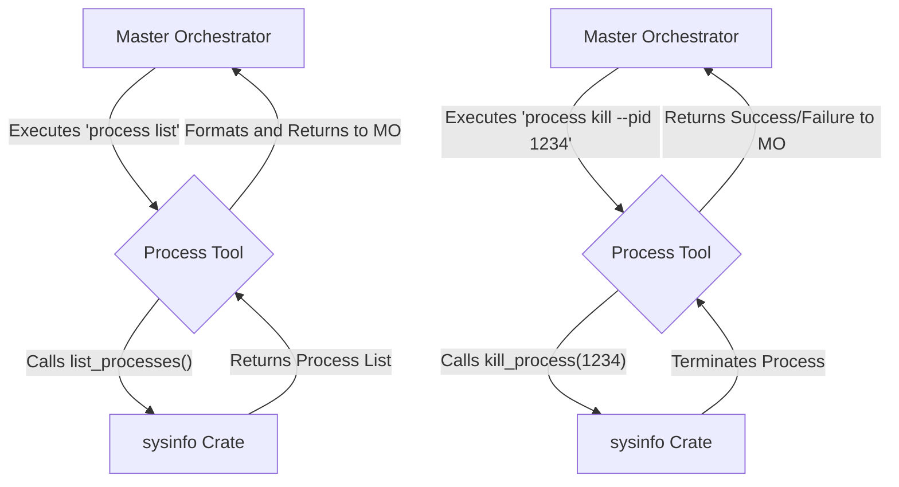

# Plan for Advanced Process Management Tool

## 1. Objective

The goal is to provide the Master Orchestrator with advanced process management capabilities. This will be achieved by creating a new `process` tool that allows for listing and terminating system processes.

## 2. Tool Definition

A new tool named `process` will be added to the Master Orchestrator's toolset.

### 2.1. `process` Tool Specification

The `process` tool will have the following sub-commands:

*   `list`: Lists all currently running processes on the system.
*   `kill`: Terminates a specified process.

#### 2.1.1. `process list`

This command will return a list of all running processes, with the following information for each process:

*   **PID (Process ID):** A unique identifier for the process.
*   **Name:** The name of the process executable.
*   **CPU Usage:** The percentage of CPU being used by the process.
*   **Memory Usage:** The amount of memory the process is currently using, in kilobytes.

#### 2.1.2. `process kill`

This command will take a Process ID (PID) as an argument and terminate the corresponding process.

*   **Argument:** `pid` (integer) - The Process ID of the process to be terminated.
*   **Returns:** A confirmation message indicating whether the process was successfully terminated.

## 3. Implementation Details

The process management tool will be implemented in Rust, leveraging an external crate for accessing system-level information.

### 3.1. Rust Crate for System Interaction

The `sysinfo` crate will be used to fetch process information and interact with the operating system. This crate is cross-platform and provides a unified API for accessing system information.

**`Cargo.toml` dependency:**

```toml
[dependencies]
sysinfo = "0.27.7"
```

### 3.2. Data Structures

The following Rust structs will be used to represent the process information:

```rust
use serde::Serialize;

#[derive(Serialize)]
pub struct ProcessInfo {
    pid: u32,
    name: String,
    cpu_usage: f32,
    memory_usage: u64, // in KB
}
```

### 3.3. Function Signatures

The implementation will include the following core functions:

```rust
use sysinfo::{ProcessExt, System, SystemExt};

/// Lists all running processes.
pub fn list_processes() -> Vec<ProcessInfo> {
    // Implementation using the sysinfo crate
}

/// Terminates a process by its PID.
///
/// # Arguments
///
/// * `pid` - The Process ID of the process to terminate.
///
/// # Returns
///
/// * `Ok(())` if the process was terminated successfully.
/// * `Err(String)` if the process could not be terminated.
pub fn kill_process(pid: u32) -> Result<(), String> {
    // Implementation using the sysinfo crate
}
```

## 4. Integration with Master Orchestrator

The new `process` tool will be integrated into the Master Orchestrator's command loop, allowing it to be invoked like any other tool. The Master Orchestrator will parse the sub-commands (`list`, `kill`) and their arguments, and call the corresponding Rust functions.

## 5. Security and Permissions

As established in the `system_access_matrix.md`, the Master Orchestrator has been granted full system access. This allows it to list and terminate any process on the system without requiring additional privileges.

## 6. Diagram


